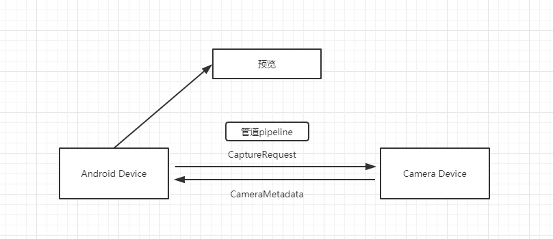

这是Android音视频的第一篇文章，终于回到了我的老本行上，后面音视频开发会基于Android平台（关键我也不太会其他平台，后面会慢慢学习。。。）

之前好像从来没有做过Camera相关的开发，这块对我来说还是有点陌生，所以从头开始学起。由于Google 现在已经不推荐使用Camera，所以就直接从Camera2开始咯。

## Camera2

在Android API21中Google发布了Camera2来取代原本的Camera，两者的变动也是比较大的。



Camera2中Google采用了pipeline（管道）的概念，将Camera Device相机设备和Android Device安卓设备连接起来， Android Device通过管道发送CaptureRequest请求给Camera Device，Camera Device通过管道返回CameraMetadata数据给Android Device，这一切建立在一个叫作CameraCaptureSession的会话中。


## Camera2主要类说明

在Camera2 架构在核心参与类角色有：CameraManager、CameraDevice、CameraCharacteristics、CameraRequest与CameraRequest.Builder、CameraCaptureSession以及CaptureResult。

### CameraManager

位于android.hardware.camera2.CameraManager下，也是Android 21(5.0)添加的，和其他系统服务一样通过 `Context.getSystemService(Context.CAMERA_SERVICE)` 来完成初始化，主要用于管理系统摄像头。

- `manager.getCameraIdList()` 获取Android设备的摄像头列表
- `manager.getCameraCharacteristics(cameraId)` 获取指定摄像头的相关特性
- `manager.openCamera(String cameraId, CameraDevice.StateCallback callback, Handler handler)` 打开指定Id的摄像头，StateCallback 是打开状态的一个监听回调，Handler 表示使用哪个线程处理回调，如果为null则表示当前线程。

### CameraDevice

CameraDevice是Camera2抽象出来的一个对象，直接与系统硬件摄像头相联系。

- 通过CameraDevice.StateCallback监听摄像头的状态

  ```java
  private final CameraDevice.StateCallback mStateCallback = new CameraDevice.StateCallback(){
  
      @Override
      public void onOpened(@NonNull CameraDevice camera) {
          //摄像头打开，可以创建会话，开始预览
      }
  
      @Override
      public void onDisconnected(@NonNull CameraDevice camera) {
  
      }
  
      @Override
      public void onError(@NonNull CameraDevice camera, int error) {
  
      }
  };
  ```

- 管理CameraCaptureSession会话，相当于Android Device和Camera Device之间的管道，后面的数据交流都在这个会话中完成。

- 管理CaptureRequest，主要包括通过createCaptureRequest（int templateType）创建捕获请求，在需要预览、拍照、再次预览的时候都需要通过创建请求来完成。

### CameraCaptureSession

正如前面所说，系统向摄像头发送 Capture 请求，而摄像头会返回 CameraMetadata，这一切都是在由对应的CameraDevice创建的CameraCaptureSession 会话完成，当程序需要预览、拍照、再次预览时，都需要先通过会话。CameraCaptureSession一旦被创建，直到对应的CameraDevice关闭才会死掉。虽然CameraCaptureSession会话用于从摄像头中捕获图像，但是只有同一个会话才能再次从同一摄像头中捕获图像。

- 管理CameraCaptureSession.StateCallback状态回调，用于接收有关CameraCaptureSession状态的更新的回调对象，主要回调方法有两个当CameraDevice 完成配置，对应的会话开始处理捕获请求时触发onConfigured(CameraCaptureSession session)方法，反之配置失败时候触发onConfigureFailed(CameraCaptureSession session)方法。
- 管理CameraCaptureSession.CaptureCallback捕获回调，用于接收捕获请求状态的回调，当请求触发捕获已启动时、捕获完成时、在捕获图像时发生错误的情况下都会触发该回调对应的方法。
- 通过调用方法capture(CaptureRequest request, CameraCaptureSession.CaptureCallback listener, Handler handler)提交捕获图像请求，即拍照。
- 通过调用方法setRepeatingRequest(CaptureRequest request, CameraCaptureSession.CaptureCallback listener, Handler handler)请求不断重复捕获图像，即实现预览。
- 通过方法调用stopRepeating()实现停止捕获图像，即停止预览。

### CameraCharacteristics

描述Cameradevice属性的对象，可以使用CameraManager通过getCameraCharacteristics（String cameraId）进行查询。

### CameraRequest与CameraRequest.Builder

CameraRequest代表了一次捕获请求

CameraRequest.Builder用于描述捕获图片的各种参数设置，包含捕获硬件（传感器，镜头，闪存），对焦模式、曝光模式，处理流水线，控制算法和输出缓冲区的配置，然后传递到对应的会话中进行设置。CameraRequest.Builder负责生成CameraRequest对象。

### CaptureResult

CaptureRequest描述是从图像传感器捕获单个图像的结果的子集的对象。


## 代码实现

谷歌有写两个示例程序，介绍如何使用Camera2

[android-Camera2Basic](https://github.com/googlesamples/android-Camera2Basic)

[android-Camera2Video](https://github.com/googlesamples/android-Camera2Video)

示例程序中有预览、拍照、录像等功能，非常好的入门学习代码。

在这里还是过一遍整个流程，加深理解。

### 1、 打开摄像头

```java
private void openCamera(int width, int height) {
        // 判断权限
        if (ContextCompat.checkSelfPermission(getActivity(), Manifest.permission.CAMERA)
                != PackageManager.PERMISSION_GRANTED) {
            requestCameraPermission();
            return;
        }
        // 设置参数，获取摄像头ID、设置预览宽高等
        setUpCameraOutputs(width, height);
        // 配置TextureView的纹理转换，解决Camera显示变形问题
        configureTransform(width, height);
        Activity activity = getActivity();
        CameraManager manager = (CameraManager) activity.getSystemService(Context.CAMERA_SERVICE);
        try {
            //Semaphore 信号量，保证只能有一条线程使用Camera设备
            if (!mCameraOpenCloseLock.tryAcquire(2500, TimeUnit.MILLISECONDS)) {
                throw new RuntimeException("Time out waiting to lock camera opening.");
            }
            //真正去打开摄像头，在mStateCallback中获取成功或失败的回调
            manager.openCamera(mCameraId, mStateCallback, mBackgroundHandler); 
        } catch (CameraAccessException e) {
            e.printStackTrace();
        } catch (InterruptedException e) {
            throw new RuntimeException("Interrupted while trying to lock camera opening.", e);
        }
    }


private final CameraDevice.StateCallback mStateCallback = new CameraDevice.StateCallback() {

        @Override
        public void onOpened(@NonNull CameraDevice cameraDevice) {
            // This method is called when the camera is opened.  We start camera preview here.
            mCameraOpenCloseLock.release();
            mCameraDevice = cameraDevice;
            //创建会话，开始预览
            createCameraPreviewSession();
        }

        @Override
        public void onDisconnected(@NonNull CameraDevice cameraDevice) {
            mCameraOpenCloseLock.release();
            cameraDevice.close();
            mCameraDevice = null;
        }

        @Override
        public void onError(@NonNull CameraDevice cameraDevice, int error) {
            mCameraOpenCloseLock.release();
            cameraDevice.close();
            mCameraDevice = null;
            Activity activity = getActivity();
            if (null != activity) {
                activity.finish();
            }
        }

    };

```

### 2、创建会话，开始预览

```java
private void createCameraPreviewSession() {
    try {
        SurfaceTexture texture = mTextureView.getSurfaceTexture();
        assert texture != null;

        // We configure the size of default buffer to be the size of camera preview we want.
        texture.setDefaultBufferSize(mPreviewSize.getWidth(), mPreviewSize.getHeight());

        // This is the output Surface we need to start preview.
        Surface surface = new Surface(texture);

        // We set up a CaptureRequest.Builder with the output Surface.
        mPreviewRequestBuilder
                = mCameraDevice.createCaptureRequest(CameraDevice.TEMPLATE_PREVIEW);
        //这里是指实时图像数据的输出目标，以后录制视频、直播等都需要在这里添加对应的Target
        mPreviewRequestBuilder.addTarget(surface);

        // Here, we create a CameraCaptureSession for camera preview.
        mCameraDevice.createCaptureSession(Arrays.asList(surface, mImageReader.getSurface()),
                new CameraCaptureSession.StateCallback() {

                    @Override
                    public void onConfigured(@NonNull CameraCaptureSession cameraCaptureSession) {
                        // The camera is already closed
                        if (null == mCameraDevice) {
                            return;
                        }

                        // When the session is ready, we start displaying the preview.
                        mCaptureSession = cameraCaptureSession;
                        try {
                            // 设置自动对焦
                            mPreviewRequestBuilder.set(CaptureRequest.CONTROL_AF_MODE,
                                    CaptureRequest.CONTROL_AF_MODE_CONTINUOUS_PICTURE);
                            // Flash is automatically enabled when necessary.
                            setAutoFlash(mPreviewRequestBuilder);

                            // Finally, we start displaying the camera preview.
                            mPreviewRequest = mPreviewRequestBuilder.build();
                            //不断捕获图像，显示预览图像
                            mCaptureSession.setRepeatingRequest(mPreviewRequest,
                                    mCaptureCallback, mBackgroundHandler);
                        } catch (CameraAccessException e) {
                            e.printStackTrace();
                        }
                    }

                    @Override
                    public void onConfigureFailed(
                            @NonNull CameraCaptureSession cameraCaptureSession) {
                        showToast("Failed");
                    }
                }, null
        );
    } catch (CameraAccessException e) {
        e.printStackTrace();
    }
}
```

### 3、拍照

```java
/**
 * Initiate a still image capture.
 */
private void takePicture() {
    lockFocus();
}

/**
 * Lock the focus as the first step for a still image capture.
 */
private void lockFocus() {
    try {
        // 告诉摄像机开始对焦
        mPreviewRequestBuilder.set(CaptureRequest.CONTROL_AF_TRIGGER,
                CameraMetadata.CONTROL_AF_TRIGGER_START);
        // Tell #mCaptureCallback to wait for the lock.
        mState = STATE_WAITING_LOCK;
        // 发送CaptureRequest要求摄像机捕捉图像
        mCaptureSession.capture(mPreviewRequestBuilder.build(), mCaptureCallback,
                mBackgroundHandler);
    } catch (CameraAccessException e) {
        e.printStackTrace();
    }
}
```

```java
private CameraCaptureSession.CaptureCallback mCaptureCallback
            = new CameraCaptureSession.CaptureCallback() {

        private void process(CaptureResult result) {
              //处理对焦、闪光灯等
              .......
             
              case STATE_WAITING_LOCK: {
                    .......
                    //对焦完成，保存一张图片
                    captureStillPicture()；
                    .......
                    break;
                }
              
        }
  }
```

```java
private void captureStillPicture() {
    try {
        final Activity activity = getActivity();
        if (null == activity || null == mCameraDevice) {
            return;
        }
        // This is the CaptureRequest.Builder that we use to take a picture.
        // 将mImageReader作为目标，获得的图片数据会交给mImageReader处理
        // 初始化时 mImageReader.setOnImageAvailableListener(mOnImageAvailableListener, mBackgroundHandler);
        // 所以数据最终会在mOnImageAvailableListener中处理
        final CaptureRequest.Builder captureBuilder =
                mCameraDevice.createCaptureRequest(CameraDevice.TEMPLATE_STILL_CAPTURE);
        captureBuilder.addTarget(mImageReader.getSurface());

        // Use the same AE and AF modes as the preview.
        captureBuilder.set(CaptureRequest.CONTROL_AF_MODE,
                CaptureRequest.CONTROL_AF_MODE_CONTINUOUS_PICTURE);
        setAutoFlash(captureBuilder);

        // Orientation
        int rotation = activity.getWindowManager().getDefaultDisplay().getRotation();
        captureBuilder.set(CaptureRequest.JPEG_ORIENTATION, getOrientation(rotation));

        // 拍照事件的最终回调，图片处理完后调用onCaptureCompleted
        CameraCaptureSession.CaptureCallback CaptureCallback
                = new CameraCaptureSession.CaptureCallback() {

            @Override
            public void onCaptureCompleted(@NonNull CameraCaptureSession session,
                                           @NonNull CaptureRequest request,
                                           @NonNull TotalCaptureResult result) {
                showToast("Saved: " + mFile);
                Log.d(TAG, mFile.toString());
                unlockFocus();
            }
        };

        mCaptureSession.stopRepeating();
        mCaptureSession.abortCaptures();
        mCaptureSession.capture(captureBuilder.build(), CaptureCallback, null);
    } catch (CameraAccessException e) {
        e.printStackTrace();
    }
}
```

```java
// 数据处理、保存
private final ImageReader.OnImageAvailableListener mOnImageAvailableListener
        = new ImageReader.OnImageAvailableListener() {

    @Override
    public void onImageAvailable(ImageReader reader) {
        //mBackgroundHandler.post(new ImageSaver(reader.acquireNextImage(), mFile));
        Image mImage = reader.acquireNextImage();
        ByteBuffer buffer = mImage.getPlanes()[0].getBuffer();
        byte[] bytes = new byte[buffer.remaining()];
        buffer.get(bytes);
        // 文件操作
        // ......
        // 这里获取到的是视频的原始数据，要对数据做进一步的算法处理、或者采用第三方的编码库进行压缩、以及网络传输等，都可以从这里拿到数据。
        mImage.close()；
    }
};
```

### 录像

主要看一下MediaRecorder录制视频相关代码

```java
private void startRecordingVideo() {
    if (null == mCameraDevice || !mTextureView.isAvailable() || null == mPreviewSize) {
        return;
    }
    try {
        // 关闭之前的会话，新的会话会添加录像的Target
        closePreviewSession();
        // 配置MediaRecorder，音频、视频来源，编码格式等
        setUpMediaRecorder();
        SurfaceTexture texture = mTextureView.getSurfaceTexture();
        assert texture != null;
        texture.setDefaultBufferSize(mPreviewSize.getWidth(), mPreviewSize.getHeight());
        // 创建一个适合视频录制的请求
        mPreviewBuilder = mCameraDevice.createCaptureRequest(CameraDevice.TEMPLATE_RECORD);
        List<Surface> surfaces = new ArrayList<>();

        // Set up Surface for the camera preview
        Surface previewSurface = new Surface(texture);
        surfaces.add(previewSurface);
        mPreviewBuilder.addTarget(previewSurface);

        // Set up Surface for the MediaRecorder 重要的一步，视频信息会交给mMediaRecorder处理
        Surface recorderSurface = mMediaRecorder.getSurface();
        surfaces.add(recorderSurface);
        mPreviewBuilder.addTarget(recorderSurface);

        // Start a capture session
        // Once the session starts, we can update the UI and start recording
        mCameraDevice.createCaptureSession(surfaces, new CameraCaptureSession.StateCallback() {

            @Override
            public void onConfigured(@NonNull CameraCaptureSession cameraCaptureSession) {
                mPreviewSession = cameraCaptureSession;
                updatePreview();
                getActivity().runOnUiThread(new Runnable() {
                    @Override
                    public void run() {
                        // UI
                        mButtonVideo.setText(R.string.stop);
                        mIsRecordingVideo = true;

                        // 开始录制
                        mMediaRecorder.start();
                    }
                });
            }

            @Override
            public void onConfigureFailed(@NonNull CameraCaptureSession cameraCaptureSession) {
                Activity activity = getActivity();
                if (null != activity) {
                    Toast.makeText(activity, "Failed", Toast.LENGTH_SHORT).show();
                }
            }
        }, mBackgroundHandler);
    } catch (CameraAccessException | IOException e) {
        e.printStackTrace();
    }

}
```


```java
// 配置MediaRecorder
private void setUpMediaRecorder() throws IOException {
    final Activity activity = getActivity();
    if (null == activity) {
        return;
    }
    // 设置要用于录制的音频源。
    mMediaRecorder.setAudioSource(MediaRecorder.AudioSource.MIC);
    // 设置要用于录制的视频源。
    mMediaRecorder.setVideoSource(MediaRecorder.VideoSource.SURFACE);
    // 设置录制期间生成的输出文件的格式。
    mMediaRecorder.setOutputFormat(MediaRecorder.OutputFormat.MPEG_4);
    
    // 生成MP4文件路径
    if (mNextVideoAbsolutePath == null || mNextVideoAbsolutePath.isEmpty()) {
        mNextVideoAbsolutePath = getVideoFilePath(getActivity());
    }
    mMediaRecorder.setOutputFile(mNextVideoAbsolutePath);
    
    // 设置用于录制的视频编码比特率。
    mMediaRecorder.setVideoEncodingBitRate(10000000);
    // 设置要捕获的视频的帧速率。
    mMediaRecorder.setVideoFrameRate(30);
    mMediaRecorder.setVideoSize(mVideoSize.getWidth(), mVideoSize.getHeight());
    // 设置要用于录制的视频编码器。
    mMediaRecorder.setVideoEncoder(MediaRecorder.VideoEncoder.H264);
    // 设置要用于录制的音频编码器。
    mMediaRecorder.setAudioEncoder(MediaRecorder.AudioEncoder.AAC);
    int rotation = activity.getWindowManager().getDefaultDisplay().getRotation();
    switch (mSensorOrientation) {
        case SENSOR_ORIENTATION_DEFAULT_DEGREES:
            mMediaRecorder.setOrientationHint(DEFAULT_ORIENTATIONS.get(rotation));
            break;
        case SENSOR_ORIENTATION_INVERSE_DEGREES:
            mMediaRecorder.setOrientationHint(INVERSE_ORIENTATIONS.get(rotation));
            break;
    }
    // 在调用start前必须的一步
    mMediaRecorder.prepare();
}
```


```
/**
 * 常规使用MediaRecorder去录制视频的例子如下：
 * MediaRecorder recorder = new MediaRecorder();
 * recorder.setAudioSource(MediaRecorder.AudioSource.MIC);
 * recorder.setOutputFormat(MediaRecorder.OutputFormat.THREE_GPP);
 * recorder.setAudioEncoder(MediaRecorder.AudioEncoder.AMR_NB);
 * recorder.setOutputFile(PATH_NAME);
 * recorder.prepare();
 * recorder.start();   // Recording is now started
 * ...
 * recorder.stop();
 * recorder.reset();   // You can reuse the object by going back to setAudioSource() step
 * recorder.release(); // Now the object cannot be reused
 **/
```


Camera2预览、拍照和录像的大概流程就是这样，相对来说挺复杂的，但也非常重要，后面会继续深入分析原理和源码。