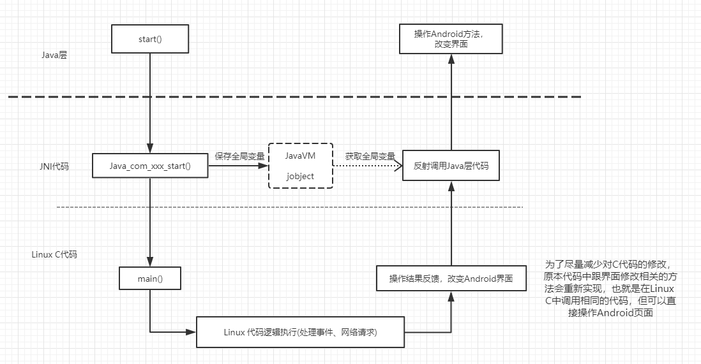

最近在公司做一个项目，想把之前Linux小组做了三四年的一个项目移植到Android平台上。如果让Android从头开始做，估计又是三四年时间去对接不同平台，而且还需要两个组同时维护，这样太不划算了。所以就打算把Linux上的程序移植到Android上，Android只需要提供一些特有的接口给C就好了，以后只维护一套代码，简单方便。


经过一天的尝试，最终成功完成了一个满足需求的Demo，整体结构如下：




整体来看也比较简单，Java调JNI，JNI启动Linux程序，Linux程序运行中需要操作界面时再用JNI的反射方法调用到Java层修改界面。


接下来看下具体实现：


### 代码结构


**LinuxHandler.java 定义native方法和等待反射调用方法**

**Androidhandle.c  Linux代码调用方法反射Java层**

**demo.c    Linux小组同事提供的测试代码，里面有他们简化的业务逻辑**

**linuxhandle.c   JNI方法**


#### LinuxHandler.java 

Java层启动

```Java
public class LinuxHandle {

    public native void startLinux();

    public void speak(String msg) {
        Log.e("TEST", "speak C-> " + msg);
    }

    public void showMsg(String msg) {
        Log.e("TEST", "showMsg C-> " + msg);
    }
}
```

定义了三个方法，native方法startLinux()从Java层启动Linux程序，另外两个是模拟等待反射调用的操作界面方法。


#### linuxhandle.c 

真正去启动Linux程序

```c
#include <jni.h>
#include "linuxhandle.h"
#include "demo.h" //Linux C 头文件，调用main()方法


JavaVM *local_jvm = NULL; 
jobject local_object = NULL;
/*
 * Class:     com_***_linuxdemo_LinuxHandle
 * Method:    startLinux
 * Signature: ()V
 */
JNIEXPORT void JNICALL Java_com_***_linuxdemo_LinuxHandle_startLinux
        (JNIEnv *env, jobject object) {
    (*env)->GetJavaVM(env, &local_jvm); //保存到全局变量JVM中
    local_object = (*env)->NewGlobalRef(env, object); /* 创建对象的本地变量 */
    main(); //启动Linux C程序
}
```

### Androidhandle.c

等待Linux程序调用

```
#include <jni.h>
#include "linuxhandle.h"

void showMessage_c(char *message) {
    extern JavaVM *local_jvm; //获取全局JVM，由它获取JNIEnv
    JNIEnv *env = NULL;
    extern jobject local_object;
    (*local_jvm)->AttachCurrentThread(local_jvm, &env, NULL);

    jclass jclass1 = (*env)->FindClass(env, "com/***/linuxdemo/LinuxHandle");
    
    jmethodID methodID = (*env)->GetMethodID(env, jclass1, "showMsg",
                                             "(Ljava/lang/String;)V");

    (*env)->CallVoidMethod(env, local_object, methodID, (*env)->NewStringUTF(env, message));
}

void speak_c(char *text) {
    LOGE("speak at C");
    //同样反射到Java层
}
```

### Demo.c

```c
#include "Androidhandle.h"

int main(void) {
    ......  //公司业务逻辑代码
    speak_c("1234");
    showMessage_c("adc");
}
```

我自己做完后也做了多次验证，并且导入第三方SO库测试也没有问题，但因为还只是个验证可行性的Demo，后面就要开始正式做移植的项目了，如果遇到了什么坑我会尽快补上。