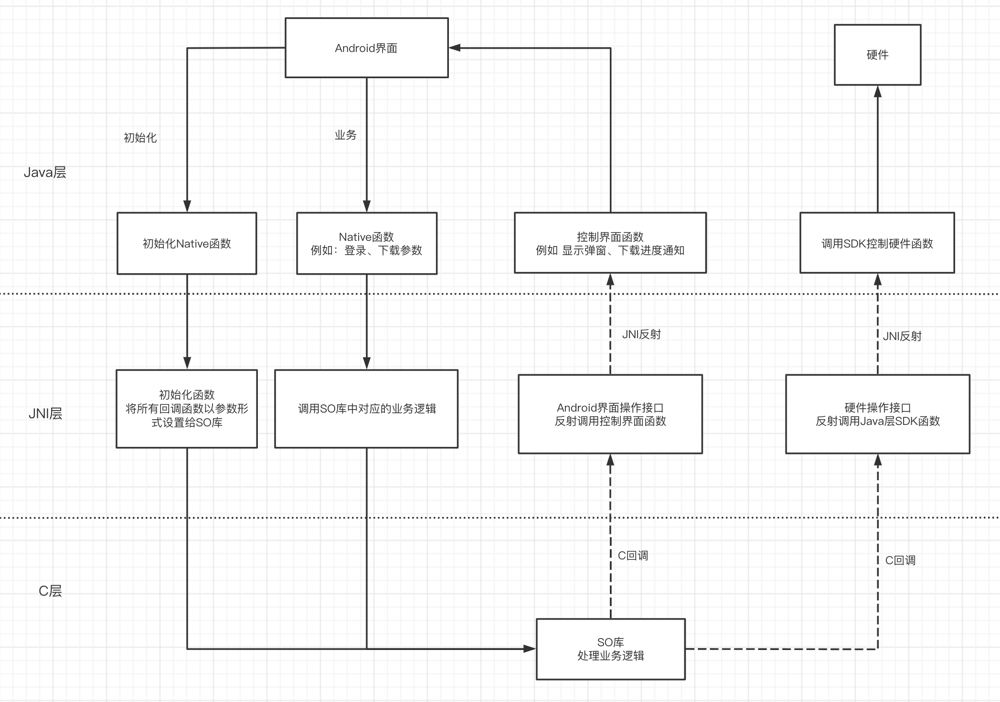

这篇文章想要介绍一下我之前做的一个真实项目，感觉比较有意思，记录一下。

## 项目介绍

这个项目比较有特点的是项目的主要业务逻辑由C语言开发同事完成，在他的SO库中去做初始化、网络操作、数据库存储、硬件设备操作等等的逻辑，我这边Android主要就是调用他的接口结合界面完成业务。

但是由于我们在第三方硬件设备操作，而第三方只提供了Android的SDK，在C层面无法调用，所以硬件操作的接口也需要由我进行封装，提供操作的接口([回调函数，不了解的请看这里](https://david1840.github.io/2018/12/23/C%E8%AF%AD%E8%A8%80%E5%9B%9E%E8%B0%83%E5%87%BD%E6%95%B0/))给C开发同事调用。这样就形成了下面的结构：



我在APP初始化的时候，就将所有有关界面操作和硬件操作的函数以参数的形式传给SO。SO库中实际业务中，如果需要修改界面，比如要显示黑名单下载进度，就调用传入downloadBlackListCallBack函数，这个函数中会以JNI反射的方式调用到Java层代码，再由Java层代码实现进度的更新。硬件操作接口同样的道理。

## 代码实现

### SO库函数定义

在一步中除了正常的参数传入，重要的就是传入回调函数了。

和同事做好协商，以显示进度为例，在SO库对外提供的函数中有这样一个函数，用来设置进度回调。

```c
void APi_SetProgressCallback(Processfun Callback);
```

在他的头文件中Processfun的定义如下，要求我们传入两个int类型的值，第一个参数为已下载数量，第二个参数为总数量。

```c
typedef void (*Processfun)(int,int);
```

这个是SO库中要求的函数形式，接下来我们就要写自己的实现函数

### Java层实现

我们首先实现一个Java层真正去控制进度显示的函数。

在JNIController类中实现函数：

```java
/**
     * 黑名单下载进度展示
     *
     * @param downloaded 已下载黑名单条数
     * @param all        总黑名单条数
     */

    private void downloadBlackListCallBack(int downloaded, int all) {
        Intent intent = new Intent();
        intent.setAction(DOWNLOAD_BLACKLIST_ACTION);
        intent.putExtra(BLACKLIST_DOWNLOADED, downloaded);
        intent.putExtra(BLACKLIST_ALL, all);
        Application.getInstance().sendBroadcast(intent);
    }
```

入参和上面定义的一样，已下载数量和总数量，当函数调用后通过广播的方式将传入的数量发送出去，广播接收器去修改界面。

### JNI层实现

然后要从JNI层以反射的方式调用Java层的downloadBlackListCallBack函数。

```c
void downloadBlackListCallBack(int downloaded, int all);

void downloadBlackListCallBack(int downloaded, int all) {
    JNIEnv *env = NULL;
    int status = (*local_jvm)->AttachCurrentThread(local_jvm, &env, NULL);

    if (status < 0) {
        LOGD("env is null");
        return;
    }

    jclass jclass1 = (*env)->FindClass(env, "com/.../controller/JNIController");
    if (jclass1 == 0) {
        LOGD("jclass1 = 0");
        return;
    }

    jmethodID downloadProcess = (*env)->GetMethodID(env, jclass1, "downloadBlackListCallBack",
                                                    "(II)V");
    if (downloadProcess == 0) {
        LOGD("methodID == 0");
        return;
    }

    //调用Java层，downloaded, all参数传入
    (*env)->CallVoidMethod(env, local_object, downloadProcess, downloaded, all);
  
    (*env)->DeleteLocalRef(env, jclass1);
}
```

在JNI中入参也是一致的形式，再通过反射的方式调用Java层代码，将downloaded, all参数传给Java函数。

### 传递函数

JNI层的downloadBlackListCallBack函数已经写好了，最后就在初始化的函数中，调用SO库提供的`APi_SetProgressCallback(Processfun Callback)`将函数以参数的形式传入

```c
APi_SetProgressCallback(downloadBlackListCallBack);
```

```C
Processfun processFun = null;
  
void APi_SetProgressCallback(Processfun Callback){
		if(Callback!=NULL){
				processFun = Callback;
		}	
}

//业务代码中
processFun(10,100);
```

这样就是一个完整的流程了。

设备的硬件操作接口也是同样的逻辑完成。


## 总结

整体而言，主要还是用了C语言回调函数的方式，将上层的操作封装成接口，交给底层逻辑自己控制，这样比较灵活，双方的代码量也减少，就是需要在前期双方梳理好需要的接口，完工！