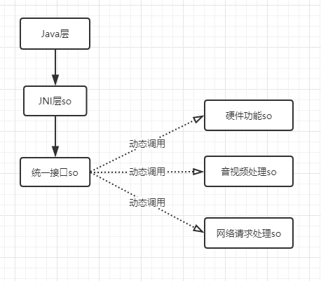

随着App功能的不断增多，Native层的代码规模也在迅速膨胀，为了Native层的代码结构清晰，会按照模块分别构建成独立的so库，使用一个JNI层so库引用其他实现具体功能的功能实现so库，Java层只加载这个JNI层so库，来间接调用功能实现so库。


so库之间通过引用头文件和运行时指定共享库依赖的方式形成了依赖关系。但是这样也会有一些问题。

1. 我们常常会用到第三方的 so 库，如果单个库可能没问题，如果多个第三方 so 库文件，同时加载可能会出现冲突，比如说腾讯的YSDK和BUGLY。
2. 加载JNI层so库的时候，即使这次JNI调用有些功能实现so库里面的数据结构或函数没有被调用到，只要这个so库被JNI层so库声明为运行时需要依赖的共享库，也需要跟JNI层so库一起被加载，这无形中增大了Native层的常驻内存。

这个时候就需要在Native层直接动态加载so库，由JNI层so库动态加载功能实现so库。如下图所示，会有一个统一接口so库，在这个库中定义好不可轻易修改的接口函数，调用方只需要知道这些接口即可，不需要依赖头文件就能调用这些函数，这样调用方和so库之间就不存在直接的依赖，具体的工作就可以交给统一接口so库完成，它通过动态调用再去执行功能so库中的函数。




### so库动态加载的实现

在Native层的C/C++代码环境，so库动态加载是使用`dlopen()`、`dlsym()`和`dlclose()`这三个函数实现的。它们的作用分别是：`dlopen()`打开一个动态链接库，返回一个动态链接库的句柄；`dlsym()`根据动态链接库句柄和符号名，返回动态链接库内的符号地址，这个地址既可以是变量指针，也可以是函数指针；`dlclose()`关闭动态链接库句柄，并对动态链接库的引用计数减1，当这个库的引用计数为0，这个库将会被系统卸载。

一般使用C/C++实现so库动态加载的流程如下：

1. 首先调用`dlopen()`函数，这个函数所需的参数，一个是so库的路径，一个是加载模式。一般使用的加载模式有两个：`RTLD_NOW`在返回前解析出所有未定义符号，如果解析不出来，`dlopen()`返回`NULL`；`RTLD_LAZY`则只解析当前需要的符号（只对函数生效，变量定义仍然是全部解析）。显然对于动态加载，加载方只需知道当前被加载的so库里面自己需要用的函数和变量定义，所以这里选择的是后者。如果这个调用成功将返回一个so库的句柄；
2. 在上一步得到so库句柄之后，这时就可以调用`dlsym()`函数，传入so库句柄和所需的函数或变量名称，返回相应的函数指针或变量指针；加载方这时就可以使用返回的指针调用被加载so库之中定义的函数和数据结构；
3. 当so库的调用结束，调用`dlclose()`函数关闭卸载so库；
4. 如果在打开关闭so库，或者获取so库里操作对象的指针出现错误的时候，可以调用`dlerror()`函数获取具体的错误原因。

### 代码实现

比如，在硬件功能so库中有一个`int test_open(int port)`的函数，该如何最终调用到这个方法呢？

```c
//1、声明函数接口
typedef int (*Func_test_open)(int);


int open(int port){
    //2、获取so句柄
    void *handle = dlopen("libtest.so",RTLD_LAZY);
    if(!handle ){
        LOGE("%s",dlerror());
        return -1;
    }

    //3、获取函数指针
    Func_test_open func_test_open = (Func_test_open) dlsym (handle,"test_open");
    if(!func_test_open){
        LOGE("%s",dlerror());
        dlclose(handle);
        return -1;
     }

     //4、调用函数
     int ret = func_test_open(8080);

      //5、关闭so
     dlclose(handle); 
     
     return ret;
}


```


这样JNI层只需要去调用`open(int port)`方法就可以调用到硬件功能so库中的`test_open(int port)`函数

### 总结

刚开始使用动态加载so库的方案时，会比较担心性能问题，但在实测时跟直接依赖对比，对性能并没有明显的影响，功能实现的so库与JNI层完全解耦，有高度的独立内聚性。同时支持动态加载卸载so库，也一定程度上减少了Native层的常驻内存。