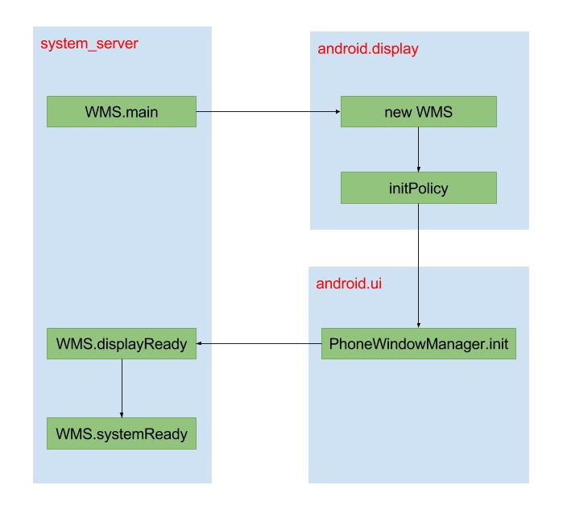

WindowManagerService简称WMS，WMS是属于Android系统的其他服务，但是它的重要性和AMS在同一级别，作为“窗口管理员”，它负责窗口的创建、调度、显示以及触摸事件分发。也是一个Android程序猿必须了解的系统服务。

以一个《深入理解Android内核设计思想》中的比方开始：

> 整个界面就像由N个演员参与的话剧：SurfaceFlinger是摄像机，WMS是导演，ViewRoot就是演员个体。摄像机(SurfaceFlinger)的作用是单一而规范的——它负责客观地捕抓当前的画面，然后真实地呈现给观众；导演(WMS)则会考虑到话剧的舞台效果和视觉美感，如他需要根据实际情况来安排各个演员的排序站位，谁在前在后，都会影响演出的“画面效果”与“剧情编排；而各个演员的长相和表情(ViewRoot)，则更多地取决于他们自身的条件与努力。正式通过这三者的“各司其职”，才能最终为观众呈现出一场美妙绝伦的“视觉盛宴”。

## SyetemServer

```java
private void startOtherServices() {
			WindowManagerService wm = null;
       
      //InputManagerService
			traceBeginAndSlog("StartInputManagerService");
      inputManager = new InputManagerService(context);
      Trace.traceEnd(Trace.TRACE_TAG_SYSTEM_SERVER);

      traceBeginAndSlog("StartWindowManagerService");
      
      wm = WindowManagerService.main(context, inputManager,
      mFactoryTestMode != FactoryTest.FACTORY_TEST_LOW_LEVEL,
      !mFirstBoot, mOnlyCore);
      ServiceManager.addService(Context.WINDOW_SERVICE, wm);
      ServiceManager.addService(Context.INPUT_SERVICE, inputManager);
      Trace.traceEnd(Trace.TRACE_TAG_SYSTEM_SERVER);
      
      mActivityManagerService.setWindowManager(wm);

      inputManager.setWindowManagerCallbacks(wm.getInputMonitor());
      inputManager.start();
      
      wm.displayReady();
      wm.systemReady();
}

```

这些是涉及到WMS的相关代码，可以看到，InputManagerService作为参数传递给了WMS，而WMS又作为参数传给了AMS。

## WMS.main

```java
public static WindowManagerService main(final Context context,
            final InputManagerService im,
            final boolean haveInputMethods, final boolean showBootMsgs,
            final boolean onlyCore) {
        final WindowManagerService[] holder = new WindowManagerService[1];
        //运行在"android.display"线程
        DisplayThread.getHandler().runWithScissors(new Runnable() {
            @Override
            public void run() {
                holder[0] = new WindowManagerService(context, im,
                        haveInputMethods, showBootMsgs, onlyCore);
            }
        }, 0);
        return holder[0];
    }
```

## WindowManagerService

```java
 private WindowManagerService(Context context, InputManagerService inputManager,
            boolean haveInputMethods, boolean showBootMsgs, boolean onlyCore) {
        mContext = context;
        mHaveInputMethods = haveInputMethods;
        mAllowBootMessages = showBootMsgs;
        mOnlyCore = onlyCore;
     
        ......
        //保存传进来的IMS
        mInputManager = inputManager; 
        mDisplayManagerInternal = LocalServices.getService(DisplayManagerInternal.class);
        mDisplaySettings = new DisplaySettings();
        mDisplaySettings.readSettingsLocked();

        mDisplayManager = (DisplayManager)context.getSystemService(Context.DISPLAY_SERVICE);
        // 获取Display数组，每个显示设备对应一个Display
        mDisplays = mDisplayManager.getDisplays();
        for (Display display : mDisplays) {
            // 创建DisplayContent,用于支持多屏幕的功能
            createDisplayContentLocked(display);
        }

      
        mActivityManager = ActivityManagerNative.getDefault();
      

        //创建WindowAnimator，用于管理所有的窗口动画
        mAnimator = new WindowAnimator(this);
        mAllowTheaterModeWakeFromLayout = context.getResources().getBoolean(
                com.android.internal.R.bool.config_allowTheaterModeWakeFromWindowLayout);

        LocalServices.addService(WindowManagerInternal.class, new LocalService());
   
        //初始化窗口管理策略接口类WindowManagerPolicy
        initPolicy();

        // Add ourself to the Watchdog monitors.
        Watchdog.getInstance().addMonitor(this);
        ......

    }

```

### initPolicy

```java
    private void initPolicy() {
        //运行在"android.ui"线程
        UiThread.getHandler().runWithScissors(new Runnable() {
            @Override
            public void run() {
                WindowManagerPolicyThread.set(Thread.currentThread(), Looper.myLooper());

                mPolicy.init(mContext, WindowManagerService.this, WindowManagerService.this);
            }
        }, 0);
    }

```

在initPolicy中，mPolicy实际为PhoneWindowManager。

`final WindowManagerPolicy mPolicy = new PhoneWindowManager();`


“system_server”线程中会调用WMS的main方法，main方法中会创建WMS，创建WMS的过程运行在”android.display”线程中，它的优先级更高一些，因此要等创建WMS完毕后才会唤醒处于等待状态的”system_server”线程。

WMS初始化时会执行initPolicy方法，initPolicy方法会调用PWM的init方法，这个init方法运行在”android.ui”线程，并且优先级更高，因此要先执行完PWM的init方法后，才会唤醒处于等待状态的”android.display”线程。

图片来自gityuan博客

