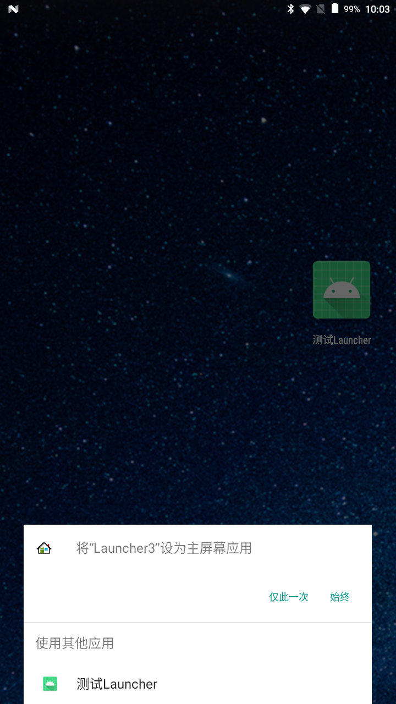
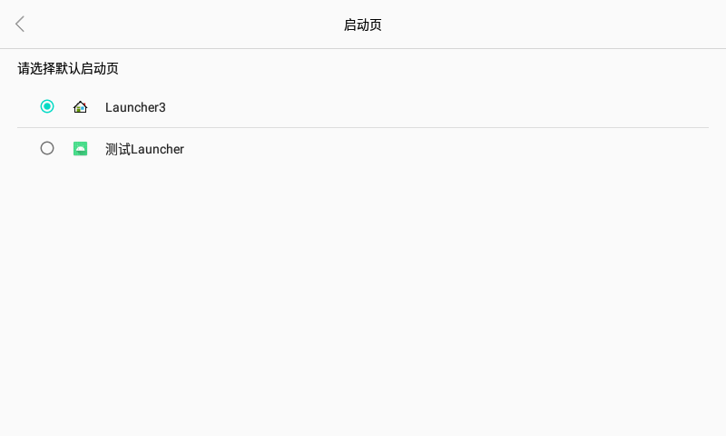

如果在Android设备上又安装了一个Launcher应用，当我们返回主页的时候，Android就会弹出一个弹窗，要用户 选择要启动的Launcher应用，如下图所示：



这个是普通Android设备的正常流程，现在我们的需求是不再显示这个提示窗，在设置中增加一个选择默认启动Launcher的页面，默认选择Launcher3。

## Settings



在设置中增加一个这样的页面，显示所有声明了`"android.intent.category.HOME"`的应用

```kotlin
 private fun getAllLauncherApps(): MutableList<AppInfo> {
        val list = ArrayList<AppInfo>()
        val launchIntent = Intent(Intent.ACTION_MAIN, null)
            .addCategory(Intent.CATEGORY_HOME)
        val intents = packageManager.queryIntentActivities(launchIntent, 0)

        //遍历
        for (ri in intents) {
            //得到包名
            val packageName = ri.activityInfo.applicationInfo.packageName
            if (packageName == "com.android.settings") { //不显示原生设置
                continue
            }
            //得到图标
            val icon = ri.loadIcon(packageManager)
            //得到应用名称
            val appName = ri.loadLabel(packageManager).toString()

            //封装应用信息对象
            val appInfo = AppInfo(icon, appName, packageName)
            //添加到list
            list.add(appInfo)
        }
        return list
    }
```

使用PackageManager提供的queryIntentActivities方法就可以获取所有Launcher应用，原生设置中也有Activity声明了HOME属性，在这里就把它屏蔽掉。

默认选择Launcher3应用为默认启动

```kotlin
private val DEFAULT_LAUNCHER = "my_default_launcher"
defaultLauncher = Settings.Global.getString(contentResolver, DEFAULT_LAUNCHER)
if (defaultLauncher.isNullOrEmpty()) {
    defaultLauncher = "com.android.launcher3"
    Settings.Global.putString(contentResolver, DEFAULT_LAUNCHER, defaultLauncher)
}
```

当选择另一个应用，就把选择应用的包名设置到 Settings.Global中。

这样应用选择页面完成，也设置了一个全局的参数提供给系统。

## 启动

最开始提到了Launcher选择弹窗，我们就考虑在这里做点事，把弹窗的逻辑给跳过，就可以实现默认启动。

弹窗源码位于`frameworks/base/core/java/com/android/internal/app/ResolverActivity.java`

在这里就不具体分析源码了，就看关键部分

```java
public boolean configureContentView(List<Intent> payloadIntents, Intent[] initialIntents,
            List<ResolveInfo> rList, boolean alwaysUseOption) {
        // The last argument of createAdapter is whether to do special handling
        // of the last used choice to highlight it in the list.  We need to always
        // turn this off when running under voice interaction, since it results in
        // a more complicated UI that the current voice interaction flow is not able
        // to handle.
        mAdapter = createAdapter(this, payloadIntents, initialIntents, rList,
                mLaunchedFromUid, alwaysUseOption && !isVoiceInteraction());

        final int layoutId;
        if (mAdapter.hasFilteredItem()) {
            layoutId = R.layout.resolver_list_with_default;
            alwaysUseOption = false;
        } else {
            layoutId = getLayoutResource();
        }
        mAlwaysUseOption = alwaysUseOption;

        int count = mAdapter.getUnfilteredCount();
        if (count == 1 && mAdapter.getOtherProfile() == null) {
            // Only one target, so we're a candidate to auto-launch!
            final TargetInfo target = mAdapter.targetInfoForPosition(0, false);
            if (shouldAutoLaunchSingleChoice(target)) {
                safelyStartActivity(target);
                mPackageMonitor.unregister();
                mRegistered = false;
                finish();
                return true;
            }
        }
        if (count > 0) {
            // add by liuwei,if set decard_default_launcher,start default
            String defaultlauncher = Settings.Global.getString(this.getContentResolver(), "my_default_launcher");
           
            final TargetInfo defaultTarget = mAdapter.targetInfoForDefault(defaultlauncher);
            if(defaultTarget != null){
                safelyStartActivity(defaultTarget);
                mPackageMonitor.unregister();
                mRegistered = false;
                finish();
                return true;
            }
            //end
            setContentView(layoutId);
            mAdapterView = (AbsListView) findViewById(R.id.resolver_list);
            onPrepareAdapterView(mAdapterView, mAdapter, alwaysUseOption);
        } else {
            setContentView(R.layout.resolver_list);

            final TextView empty = (TextView) findViewById(R.id.empty);
            empty.setVisibility(View.VISIBLE);

            mAdapterView = (AbsListView) findViewById(R.id.resolver_list);
            mAdapterView.setVisibility(View.GONE);
        }
        return false;
    }
```

在configureContentView中判断launcher应用个数，如果为1，则直接启动，finish当前页面。下面判断count>0，我们就在这里面增加自己的逻辑，获取配置的Settings.Global参数，再去Adapter中判断是否有应用包名和参数匹配，如果有就safelyStartActivity()，关闭弹窗。如果没有匹配包名，就走正常流程，弹窗提示用户。

mAdapter.targetInfoForDefault函数是在 `public class ResolveListAdapter extends BaseAdapter`中增加函数


```java
 public TargetInfo targetInfoForDefault(String myDefault){
            if(myDefault == null){
                return null;
            }

            TargetInfo info = null;
            for(int i=0;i<mDisplayList.size();i++){
                String disPackageName = mDisplayList.get(i).getResolveInfo().activityInfo.applicationInfo.packageName;
                if(myDefault.equals(disPackageName) ){
                    info = mDisplayList.get(i);
                    break;
                }
            }
            return info;
        }

```

OK，功能实现完成，自测也没有问题。