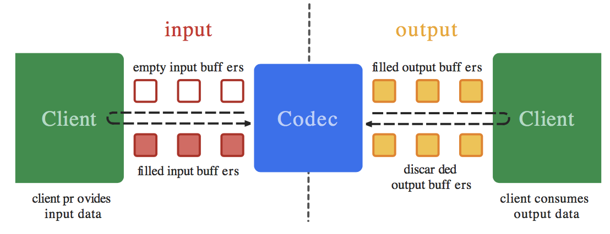
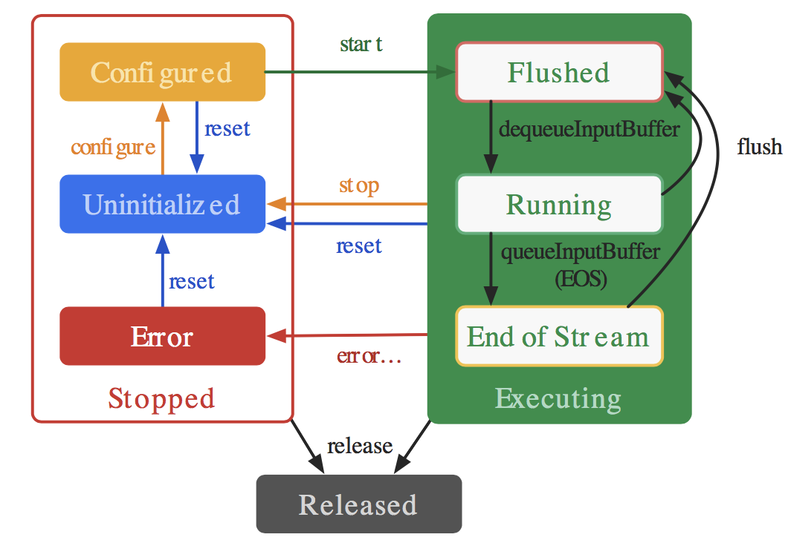

[Android音视频(一) Camera2 API采集数据](https://david1840.github.io/2019/01/04/Android%E9%9F%B3%E8%A7%86%E9%A2%91-%E4%B8%80-Camera2-API%E9%87%87%E9%9B%86%E6%95%B0%E6%8D%AE/)

[Android音视频(二)音频AudioRecord和AudioTrack](https://david1840.github.io/2019/01/06/Android%E9%9F%B3%E8%A7%86%E9%A2%91-%E4%BA%8C-%E9%9F%B3%E9%A2%91AudioRecord%E5%92%8CAudioTrack/)

[Android音视频(三)FFmpeg Camera2推流直播](https://david1840.github.io/2019/01/07/Android%E9%9F%B3%E8%A7%86%E9%A2%91-%E5%9B%9B-FFmpeg-Camera2%E6%8E%A8%E6%B5%81%E7%9B%B4%E6%92%AD/)

MediaCodec类可以访问底层媒体编解码框架（StageFright 或 OpenMAX），即编解码组件，它是Android基本的多媒体支持基础架构的一部分，通常和MediaExtractor、MediaSync、MediaMuxer、MediaCrypto、MediaDrm、Image、Surface和AudioTrack一起使用。它本身并不是Codec，它通过调用底层编解码组件获得了Codec的能力。

## MediaCodec的工作方式

MediaCodec处理输入数据产生输出数据。当异步处理数据时，使用一组输入和输出Buffer队列。通常，在逻辑上，客户端请求（或接收）数据后填入预先设定的空输入缓冲区，输入Buffer填满后将其传递到MediaCodec并进行编解码处理。之后MediaCodec编解码后的数据填充到一个输出Buffer中。最后，客户端请求（或接收）输出Buffer，消耗输出Buffer中的内容，用完后释放，给回MediaCodec重新填充输出数据。



必须保证输入和输出队列同时非空，即至少有一个输入Buffer和输出Buffer才能工作。

## MediaCodec状态周期图

在MediaCodec的生命周期中存在三种状态 ：Stopped、Executing、Released。

Stopped状态实际上还可以处在三种状态：Uninitialized、Configured、Error。

Executing状态也分为三种子状态：Flushed, Running、End-of-Stream。



从上图可以看出：

1. 当创建编解码器的时候处于未初始化状态。首先你需要调用configure(…)方法让它处于Configured状态，然后调用start()方法让其处于Executing状态。在Executing状态下，你就可以使用上面提到的缓冲区来处理数据。

2. Executing的状态下也分为三种子状态：Flushed, Running、End-of-Stream。在start() 调用后，编解码器处于Flushed状态，这个状态下它保存着所有的缓冲区。一旦第一个输入buffer出现了，编解码器就会自动运行到Running的状态。当带有end-of-stream标志的buffer进去后，编解码器会进入End-of-Stream状态，这种状态下编解码器不在接受输入buffer，但是仍然在产生输出的buffer。此时你可以调用flush()方法，将编解码器重置于Flushed状态。

3. 调用stop()将编解码器返回到未初始化状态，然后可以重新配置。 完成使用编解码器后，您必须通过调用release()来释放它。
4. 在极少数情况下，编解码器可能会遇到错误并转到错误状态。 这是使用来自排队操作的无效返回值或有时通过异常来传达的。 调用reset()使编解码器再次可用。 您可以从任何状态调用它来将编解码器移回未初始化状态。 否则，调用 release()动到终端释放状态。

## MediaCodec的优缺点

优点：**功耗低，速度快**

缺点：**扩展性不强，不同芯片厂商提供的支持方案不同，导致程序移植性差**

适用场景：适合有固定的硬件方案的项目，如智能家居类；需要长时间摄像。


## MediaCodec 编解码实现

做了一个Demo，使用AudioRecord录音，使用MediaCodec 编码为AAC并保存文件，然后可以从AAC解码为PCM数据，再用AudioTrack播放。


### 1、编码PCM数据，保存为AAC文件

#### 初始化AudioRecord和编码器

```java
private void initAudioRecord() {
    int audioSource = MediaRecorder.AudioSource.MIC;
    int sampleRate = 44100;
    int channelConfig = AudioFormat.CHANNEL_IN_MONO;
    int audioFormat = AudioFormat.ENCODING_PCM_16BIT;
    int minBufferSize = AudioRecord.getMinBufferSize(sampleRate, channelConfig, audioFormat);
    mAudioRecorder = new AudioRecord(audioSource, sampleRate, channelConfig, audioFormat, Math.max(minBufferSize, 2048));
}
```

```java
/**
 * 初始化编码器
 */
private void initAudioEncoder() {
    try {
        mAudioEncoder = MediaCodec.createEncoderByType(MediaFormat.MIMETYPE_AUDIO_AAC);
        MediaFormat format = MediaFormat.createAudioFormat(MediaFormat.MIMETYPE_AUDIO_AAC, 44100, 1);
        format.setInteger(MediaFormat.KEY_BIT_RATE, 96000);//比特率
        format.setInteger(MediaFormat.KEY_MAX_INPUT_SIZE, MAX_BUFFER_SIZE);
        mAudioEncoder.configure(format, null, null, MediaCodec.CONFIGURE_FLAG_ENCODE);
    } catch (IOException e) {
        e.printStackTrace();
    }

    if (mAudioEncoder == null) {
        Log.e(TAG, "create mediaEncode failed");
        return;
    }

    mAudioEncoder.start(); // 启动MediaCodec,等待传入数据
    encodeInputBuffers = mAudioEncoder.getInputBuffers(); //上面介绍的输入和输出Buffer队列
    encodeOutputBuffers = mAudioEncoder.getOutputBuffers();
    mAudioEncodeBufferInfo = new MediaCodec.BufferInfo();
}
```

#### 开始录音、编码

使用线程池，两条线程，一个线程去录音，另一个线程做编码操作。录音线程会将PCM数据存入一个队列中，编码线程从队列中取出数据编码。

```java
// 开启录音线程
mExecutorService.submit(new Runnable() {
    @Override
    public void run() {
        startRecorder();
    }
});
// 开启编码线程
mExecutorService.submit(new Runnable() {
    @Override
    public void run() {
        encodePCM();
    }
});

 /**
  * 将PCM数据存入队列
  */
    private void putPCMData(byte[] pcmChunk) {
        Log.e(TAG, "putPCMData");
        try {
            queue.put(pcmChunk);
        } catch (InterruptedException e) {
            e.printStackTrace();
        }
    }

    /**
     * 从队列取出PCM数据
     */
    private byte[] getPCMData() {
        try {
            if (queue.isEmpty()) {
                return null;
            }
            return queue.take();
        } catch (InterruptedException e) {
            e.printStackTrace();
        }
        return null;
    }
    /**
     * 添加ADTS头，如果要与视频流合并就不用添加，单独AAC文件就需要添加，否则无法正常播放
     */
    public static void addADTStoPacket(int sampleRateType, byte[] packet, int packetLen) {
        int profile = 2; // AAC LC
        int chanCfg = 2; // CPE

        packet[0] = (byte) 0xFF;
        packet[1] = (byte) 0xF9;
        packet[2] = (byte) (((profile - 1) << 6) + (sampleRateType << 2) + (chanCfg >> 2));
        packet[3] = (byte) (((chanCfg & 3) << 6) + (packetLen >> 11));
        packet[4] = (byte) ((packetLen & 0x7FF) >> 3);
        packet[5] = (byte) (((packetLen & 7) << 5) + 0x1F);
        packet[6] = (byte) 0xFC;
    }
```

##### 音频数据

```java
/**
 * 获取音频数据
 */
private void startRecorder() {
    try {
        mFilePath = Environment.getExternalStorageDirectory().getAbsolutePath() + "/RecorderTest/" + System.currentTimeMillis() + ".aac";
        mAudioFile = new File(mFilePath);
        if (!mAudioFile.getParentFile().exists()) {
            mAudioFile.getParentFile().mkdirs();
        }
        mAudioFile.createNewFile();
        mFileOutputStream = new FileOutputStream(mAudioFile);
        mAudioBos = new BufferedOutputStream(mFileOutputStream, 200 * 1024);
        mAudioRecorder.startRecording();

        start = System.currentTimeMillis();

        while (mIsRecording) {
            int read = mAudioRecorder.read(mBuffer, 0, 2048);
            if (read > 0) {
                byte[] audio = new byte[read];
                System.arraycopy(mBuffer, 0, audio, 0, read);
                putPCMData(audio); // PCM数据放入队列，等待编码
            }
        }
    } catch (IOException | RuntimeException e) {
        e.printStackTrace();
    } finally {
        if (mAudioRecorder != null) {
            mAudioRecorder.release();
            mAudioRecorder = null;
        }
    }
}
```

##### 编码

从队列中循环取出数据，MediaCodec 编码，将编码后的数据写入文件中。

```java
/**
 * 编码PCM
 */
private void encodePCM() {
    int inputIndex;
    ByteBuffer inputBuffer;
    int outputIndex;
    ByteBuffer outputBuffer;
    byte[] chunkAudio;
    int outBitSize;
    int outPacketSize;
    byte[] chunkPCM;

    while (mIsRecording || !queue.isEmpty()) {
        chunkPCM = getPCMData();//获取解码器所在线程输出的数据 代码后边会贴上
        if (chunkPCM == null) {
            continue;
        }
        inputIndex = mAudioEncoder.dequeueInputBuffer(-1);//同解码器
        if (inputIndex >= 0) {
            inputBuffer = encodeInputBuffers[inputIndex];//同解码器
            inputBuffer.clear();//同解码器
            inputBuffer.limit(chunkPCM.length);
            inputBuffer.put(chunkPCM);//PCM数据填充给inputBuffer
            mAudioEncoder.queueInputBuffer(inputIndex, 0, chunkPCM.length, 0, 0);//通知编码器 编码
        }

        outputIndex = mAudioEncoder.dequeueOutputBuffer(mAudioEncodeBufferInfo, 10000);
        while (outputIndex >= 0) {
            outBitSize = mAudioEncodeBufferInfo.size;
            outPacketSize = outBitSize + 7;//7为ADTS头部的大小
            outputBuffer = encodeOutputBuffers[outputIndex];//拿到输出Buffer
            outputBuffer.position(mAudioEncodeBufferInfo.offset);
            outputBuffer.limit(mAudioEncodeBufferInfo.offset + outBitSize);
            chunkAudio = new byte[outPacketSize];
            addADTStoPacket(44100, chunkAudio, outPacketSize);//添加ADTS
            outputBuffer.get(chunkAudio, 7, outBitSize);//将编码得到的AAC数据 取出到byte[]中 偏移量offset=7
            outputBuffer.position(mAudioEncodeBufferInfo.offset);
            try {
                mAudioBos.write(chunkAudio, 0, chunkAudio.length);//BufferOutputStream 将文件保存到内存卡中 *.aac
            } catch (IOException e) {
                e.printStackTrace();
            }
            mAudioEncoder.releaseOutputBuffer(outputIndex, false);
            outputIndex = mAudioEncoder.dequeueOutputBuffer(mAudioEncodeBufferInfo, 10000);
        }
    }

    stopRecorder();
}
```

### 2、解码AAC AudioTrack播放

#### 初始化AudioTrack和解码器

```java
/**
 * 初始化AudioTrack，等待播放数据
 */
private void initAudioTrack() {
    int streamType = AudioManager.STREAM_MUSIC;
    int sampleRate = 44100;
    int channelConfig = AudioFormat.CHANNEL_OUT_MONO;
    int audioFormat = AudioFormat.ENCODING_PCM_16BIT;
    int mode = AudioTrack.MODE_STREAM;

    int minBufferSize = AudioTrack.getMinBufferSize(sampleRate, channelConfig, audioFormat);

    audioTrack = new AudioTrack(streamType, sampleRate, channelConfig, audioFormat,
            Math.max(minBufferSize, 2048), mode);
    audioTrack.play();
}
```

```java
/**
 * 初始化解码器
 */
private void initAudioDecoder() {
    try {
        mMediaExtractor = new MediaExtractor();
        mMediaExtractor.setDataSource(mFilePath);

        MediaFormat format = mMediaExtractor.getTrackFormat(0);
        String mime = format.getString(MediaFormat.KEY_MIME);
        if (mime.startsWith("audio")) {//获取音频轨道
            mMediaExtractor.selectTrack(0);//选择此音频轨道
            format.setString(MediaFormat.KEY_MIME, "audio/mp4a-latm");
            format.setInteger(MediaFormat.KEY_CHANNEL_COUNT, 1);
            format.setInteger(MediaFormat.KEY_SAMPLE_RATE, 0);
            format.setInteger(MediaFormat.KEY_BIT_RATE, 96000);
            format.setInteger(MediaFormat.KEY_IS_ADTS, 1);
            format.setInteger(MediaFormat.KEY_AAC_PROFILE, 0);

            mAudioDecoder = MediaCodec.createDecoderByType(mime);//创建Decode解码器
            mAudioDecoder.configure(format, null, null, 0);
        } else {
            return;
        }
    } catch (IOException e) {
        e.printStackTrace();
    }

    if (mAudioDecoder == null) {
        Log.e(TAG, "mAudioDecoder is null");
        return;
    }
    mAudioDecoder.start();//启动MediaCodec ，等待传入数据
}
```

#### 解码并播放

```java
private void decodeAndPlay() {
    boolean isFinish = false;
    MediaCodec.BufferInfo decodeBufferInfo = new MediaCodec.BufferInfo();
    while (!isFinish && mIsPalying) {
        int inputIdex = mAudioDecoder.dequeueInputBuffer(10000);//获取可用的inputBuffer -1代表一直等待，0表示不等待 10000表示10秒超时
        if (inputIdex < 0) {
            isFinish = true;
        }
        ByteBuffer inputBuffer = mAudioDecoder.getInputBuffer(inputIdex);
        inputBuffer.clear();//清空之前传入inputBuffer内的数据
        int samplesize = mMediaExtractor.readSampleData(inputBuffer, 0);
        if (samplesize > 0) {
            mAudioDecoder.queueInputBuffer(inputIdex, 0, samplesize, 0, 0); //通知解码器 解码
            mMediaExtractor.advance(); //MediaExtractor移动到下一取样处
        } else {
            isFinish = true;
        }
        int outputIndex = mAudioDecoder.dequeueOutputBuffer(decodeBufferInfo, 10000);//获取解码得到的byte[]数据

        ByteBuffer outputBuffer;
        byte[] chunkPCM;
        //每次解码完成的数据不一定能一次吐出 所以用while循环，保证解码器吐出所有数据
        while (outputIndex >= 0) {
            outputBuffer = mAudioDecoder.getOutputBuffer(outputIndex);
            chunkPCM = new byte[decodeBufferInfo.size];
            outputBuffer.get(chunkPCM);
            outputBuffer.clear();//数据取出后一定记得清空此Buffer MediaCodec是循环使用这些Buffer的，不清空下次会得到同样的数
            // 播放解码后的PCM数据
            audioTrack.write(chunkPCM, 0, decodeBufferInfo.size);
            mAudioDecoder.releaseOutputBuffer(outputIndex, false);
            outputIndex = mAudioDecoder.dequeueOutputBuffer(decodeBufferInfo, 10000);//再次获取数据
        }
    }
    stopPlay();
}
```

Demo完成，手机测试效果不错。MediaCodec的使用要比我预想的复杂，网上查了好久才完成这个Demo，希望能帮到需要的人。

如有问题欢迎留言，[Github源码 - MediaCodecActivity](https://github.com/David1840/AudioDemo)  


