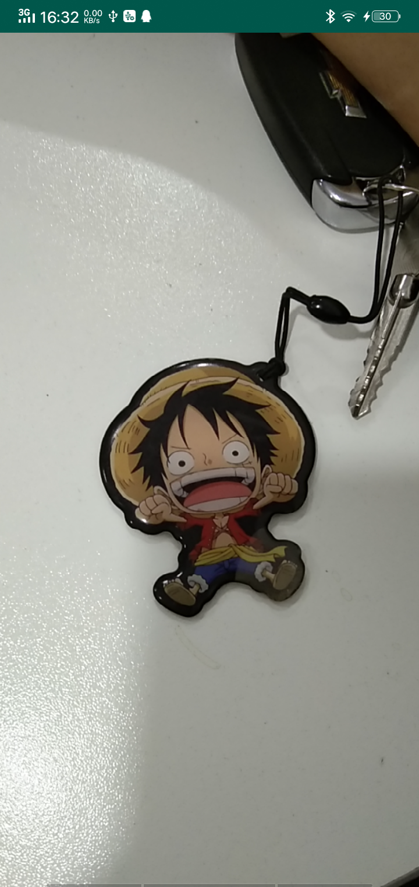

刚学习了OpenGL的纹理相关知识，终于可以接着写Android音视频系列了。

本篇博客会介绍使用OpenGL ES 3.0相关知识预览Camera，并且提供Camera和Camera2两个版本实现。

## 整体流程

1.  在 GLSurfaceView.Render 中创建一个纹理，再使用该纹理创建一个 SurfaceTexture。
2. 将该SurfaceTexture 作为相机预览输出
   - 使用Camera时直接将该SurfaceTexture传给相机。
   - 使用Camera2时使用该SurfaceTexture创建一个 Surface 传给相机。
3. 使用 GLSurfaceView.Render 将该纹理渲染到 GLSurfaceView 窗口上。
4. 使用 GLSurfaceTexture 的 setOnFrameAvailableListener 方法给 SurfaceTexture 添加一个数据帧数据可用的监听器，在监听器中调用 GLSurfaceView 的 requestRender 方法渲染该帧数据，这样相机每次输出一帧数据就可以渲染一次，就可以在GLSurfaceView窗口中看到相机的预览数据了。

## 着色器

顶点着色器

```c
#version 300 es
layout (location = 0) in vec4 vPosition;
layout (location = 1) in vec4 aTextureCoord;
//纹理矩阵
uniform mat4 uTextureMatrix;
out vec2 yuvTexCoords;
void main() {
    gl_Position  = vPosition;
    gl_PointSize = 10.0;
    //只保留x和y分量
    yuvTexCoords = (uTextureMatrix * aTextureCoord).xy;
}
```

片段着色器

```c
#version 300 es
//OpenGL ES3.0外部纹理扩展
#extension GL_OES_EGL_image_external_essl3 : require
precision mediump float;
uniform samplerExternalOES yuvTexSampler;
in vec2 yuvTexCoords;
out vec4 vFragColor;
void main() {
    vFragColor = texture(yuvTexSampler, yuvTexCoords);
}
```

纹理的类型需要使用 samplerExternalOES ，而不是之前渲染图片的 sampler2D。

我们知道Android相机输出的原始数据一般都为YUV数据，而在OpenGL中使用的绝大部分纹理ID都是RGBA的格式，所以原始数据都是无法直接用OpenGL ES来渲染的。所以我们添加了一个扩展`#extension GL_OES_EGL_image_external_essl3 : require`，其中定义了一个纹理的扩展类型`GL_TEXTURE_EXTERNAL_OES`。后面绑定纹理时需要绑定到`GL_TEXTURE_EXTERNAL_OES`上，而不是类型GL_TEXTURE_2D上。

```Java
/**
 * 加载外部纹理
 * @return
 */
public int loadTexture() {
    int[] tex = new int[1];
    //创建一个纹理
    GLES30.glGenTextures(1, tex, 0);
    //绑定到外部纹理上
    GLES30.glBindTexture(GLES11Ext.GL_TEXTURE_EXTERNAL_OES, tex[0]);
    //设置纹理过滤参数
    GLES30.glTexParameterf(GLES11Ext.GL_TEXTURE_EXTERNAL_OES, GLES30.GL_TEXTURE_MIN_FILTER, GLES30.GL_NEAREST);
    GLES30.glTexParameterf(GLES11Ext.GL_TEXTURE_EXTERNAL_OES, GLES30.GL_TEXTURE_MAG_FILTER, GLES30.GL_LINEAR);
    GLES30.glTexParameterf(GLES11Ext.GL_TEXTURE_EXTERNAL_OES, GLES30.GL_TEXTURE_WRAP_S, GLES30.GL_CLAMP_TO_EDGE);
    GLES30.glTexParameterf(GLES11Ext.GL_TEXTURE_EXTERNAL_OES, GLES30.GL_TEXTURE_WRAP_T, GLES30.GL_CLAMP_TO_EDGE);
    //解除纹理绑定
    GLES30.glBindTexture(GLES11Ext.GL_TEXTURE_EXTERNAL_OES, 0);
    return tex[0];
}
```

## Camera

#### 初始化

```Java
public CameraSurfaceRenderer(GLSurfaceView glSurfaceView) {
    //前置摄像头
    this.mCameraId = Camera.CameraInfo.CAMERA_FACING_FRONT; 
    //传入的SurfaceView
    this.mGLSurfaceView = glSurfaceView;
    // 打开Camera
    mCamera = Camera.open(mCameraId);
    // 设置预览角度
    setCameraDisplayOrientation(mCameraId, mCamera);
    
    ......
}
```

#### onSurfaceCreated

```Java
//设置背景颜色
GLES30.glClearColor(0.5f, 0.5f, 0.5f, 0.5f);
//编译
final int vertexShaderId = RenderUtil.compileShader(GLES30.GL_VERTEX_SHADER,ResReadUtils.readResource(R.raw.vertex_camera_shader));
final int fragmentShaderId = RenderUtil.compileShader(GLES30.GL_FRAGMENT_SHADER,ResReadUtils.readResource(R.raw.fragment_camera_shader));
//链接程序片段
mProgram = RenderUtil.linkProgram(vertexShaderId, fragmentShaderId);

uTextureMatrixLocation = GLES30.glGetUniformLocation(mProgram, "uTextureMatrix");
//获取Shader中定义的变量在program中的位置
uTextureSamplerLocation = GLES30.glGetUniformLocation(mProgram, "yuvTexSampler");

//加载纹理
textureId = loadTexture();
//加载SurfaceTexture
loadSurfaceTexture(textureId);
```

其实前面部分和加载图片没有什么区别，最后两行，对应上面流程中的1、2步。创建纹理，绑定外部纹理，然后根据纹理ID创建SurfaceTexture作为相机预览输出。

```Java
 public boolean loadSurfaceTexture(int textureId) {
        //根据纹理ID创建SurfaceTexture
        mSurfaceTexture = new SurfaceTexture(textureId);
        mSurfaceTexture.setOnFrameAvailableListener(new SurfaceTexture.OnFrameAvailableListener() {
            @Override
            public void onFrameAvailable(SurfaceTexture surfaceTexture) {
                // 渲染帧数据
                mGLSurfaceView.requestRender();
            }
        });
        //SurfaceTexture作为相机预览输出
        try {
            mCamera.setPreviewTexture(mSurfaceTexture);
        } catch (IOException e) {
            e.printStackTrace();
            return false;
        }
        //开启相机预览
        mCamera.startPreview();
        return true;
    }
```

#### 绘制

```Java
@Override
public void onDrawFrame(GL10 gl) {
    GLES30.glClear(GLES30.GL_COLOR_BUFFER_BIT);

    //使用程序片段
    GLES30.glUseProgram(mProgram);

    //更新纹理图像
    mSurfaceTexture.updateTexImage();
    mSurfaceTexture.getTransformMatrix(transformMatrix);

    //激活纹理单元0
    GLES30.glActiveTexture(GLES30.GL_TEXTURE0);
    //绑定外部纹理到纹理单元0
    GLES30.glBindTexture(GLES11Ext.GL_TEXTURE_EXTERNAL_OES, textureId);
    //将此纹理单元床位片段着色器的uTextureSampler外部纹理采样器
    GLES30.glUniform1i(uTextureSamplerLocation, 0);

    //将纹理矩阵传给片段着色器
    GLES30.glUniformMatrix4fv(uTextureMatrixLocation, 1, false, transformMatrix, 0);

    GLES30.glEnableVertexAttribArray(0);
    GLES30.glVertexAttribPointer(0, 3, GLES30.GL_FLOAT, false, 0, vertexBuffer);

    GLES30.glEnableVertexAttribArray(1);
    GLES30.glVertexAttribPointer(1, 2, GLES30.GL_FLOAT, false, 0, mTexVertexBuffer);

    // 绘制
    GLES20.glDrawElements(GLES20.GL_TRIANGLES, VERTEX_INDEX.length, GLES20.GL_UNSIGNED_SHORT, mVertexIndexBuffer);
}
```

#### Activity显示

```Java
private void setupViews() {
    //实例化一个GLSurfaceView
    mGLSurfaceView = new GLSurfaceView(this);
    mGLSurfaceView.setEGLContextClientVersion(3);
    mGLSurfaceView.setRenderer(new CameraSurfaceRenderer(mGLSurfaceView));
    setContentView(mGLSurfaceView);
}
```

## Camera2

使用Camera2在OpenGL方面其实是一样的，并没有什么改动。所以只需要看一下Camera2的调用就好。

```Java
 @Override
    public void onSurfaceCreated(GL10 gl, EGLConfig config) {
        Log.e("Renderer", "onSurfaceCreated");
        //加载纹理
        textureId = loadTexture();
        //创建SurfaceTexture，放到前面是为了防止Camera打开后获取SurfaceTexture为空
        mSurfaceTexture = new SurfaceTexture(textureId);
//设置背景颜色
        GLES30.glClearColor(0.5f, 0.5f, 0.5f, 0.5f);
        //编译
        final int vertexShaderId = RenderUtil.compileShader(GLES30.GL_VERTEX_SHADER, ResReadUtils.readResource(R.raw.vertex_camera_shader));
        final int fragmentShaderId = RenderUtil.compileShader(GLES30.GL_FRAGMENT_SHADER, ResReadUtils.readResource(R.raw.fragment_camera_shader));
        //链接程序片段
        mProgram = RenderUtil.linkProgram(vertexShaderId, fragmentShaderId);

        uTextureMatrixLocation = GLES30.glGetUniformLocation(mProgram, "uTextureMatrix");
        //获取Shader中定义的变量在program中的位置
        uTextureSamplerLocation = GLES30.glGetUniformLocation(mProgram, "yuvTexSampler");
    }
```

```Java
// 提供方法获取SurfaceTexture
public SurfaceTexture getSurfaceTexture() {
    return mSurfaceTexture;
}
```

#### 初始化

```Java
 private void initCamera() {
        cameraManager = (CameraManager) MyApplication.getApplication().getSystemService(Context.CAMERA_SERVICE);
        //获取指定相机的输出尺寸列表
        outputSizes = getCameraOutputSizes(cameraId, SurfaceTexture.class);
        photoSize = outputSizes.get(1);
    }
```

#### 打开摄像头

```Java
@SuppressLint("MissingPermission")
private void openCamera() {
    try {
        cameraManager.openCamera(String.valueOf(cameraId), cameraStateCallback, null);
    } catch (CameraAccessException e) {
        e.printStackTrace();
        Log.e(TAG, "openCamera fail");
    }
}
```

```Java
CameraDevice.StateCallback cameraStateCallback = new CameraDevice.StateCallback() {
    @Override
    public void onOpened(CameraDevice camera) {
        //从Renderer中获取SurfaceTexture
        surfaceTexture = camera2SurfaceRenderer.getSurfaceTexture();
        if (surfaceTexture == null) {
            return;
        }
        surfaceTexture.setDefaultBufferSize(photoSize.getWidth(), photoSize.getHeight());
        surfaceTexture.setOnFrameAvailableListener(new SurfaceTexture.OnFrameAvailableListener() {
            @Override
            public void onFrameAvailable(final SurfaceTexture surfaceTexture) {
                mGLSurfaceView.requestRender();
            }
        });
        // 根据SurfaceTexture创建Surface，作为预览数据的Target
        surface = new Surface(surfaceTexture);

        try {
            cameraDevice = camera;
            previewRequestBuilder = cameraDevice.createCaptureRequest(CameraDevice.TEMPLATE_PREVIEW);
            previewRequestBuilder.addTarget(surface);
            previewRequest = previewRequestBuilder.build();

            cameraDevice.createCaptureSession(Arrays.asList(surface), sessionsStateCallback, null);
        } catch (CameraAccessException e) {
            e.printStackTrace();
        }
    }

    @Override
    public void onDisconnected(CameraDevice camera) {
    }

    @Override
    public void onError(CameraDevice camera, int error) {
        Log.e(TAG, "Open  onError");
    }
};
```


## 最后看我路飞




[源码地址](https://github.com/David1840/OpenGLES-Learning)