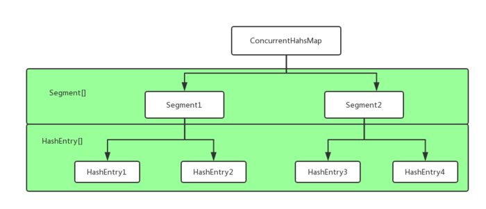
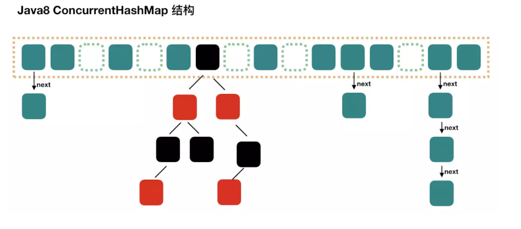

HashMap、HashTable是JDK中提供的两种的容器，在平时开发中经常会使用到。但在并发编程中，HashMap可能会导致程序死循环，而HashTable就是在所有涉及对该哈希表操作的方法上都加上了synchronized关键字，进行加锁操作。这么做实现了线程安全，但是效率非常低。因此就有了ConcurrentHashMap。

# JDK1.7

在JDK1.7中ConcurrentHashMap是由Segment数组结构和HashEntry数组结构组成。



Segment是一个可重入锁，HashEntry则用于存储键值对数据。一个ConcurrentHashMap里包含一个SegMent数组，Segment的结构和HashMap类似，是一种数组和链表结构。一个Segment里包含了一个HashEntry数组，每个HashEntry是一个链表结构的元素，每个Segment守护着一个HashEntry数组里的元素，当对HashEntry的数据进行修改时，必须先获得与它对应的Segment锁。

### get
先经过一次再散列，然后使用这个散列值通过散列运算定位到Segment，再通过散列算法定位到元素。get操作的高效之处在于get方法将要使用的共享变量都定义成volatile类型。

### put
当执行put方法插入数据时，根据key的hash值，在Segment数组中找到相应的位置，如果相应位置的Segment还未初始化，则通过CAS进行赋值，接着执行Segment对象的put方法通过加锁机制插入数据，实现如下：

线程A和线程B同时执行相同Segment对象的put方法

1. 线程A执行tryLock()方法成功获取锁，则把HashEntry对象插入到相应的位置；
2. 线程B获取锁失败，则执行scanAndLockForPut()方法，在scanAndLockForPut方法中，会通过重复执行tryLock()方法尝试获取锁，在多处理器环境下，重复次数为64，单处理器重复次数为1，当执行tryLock()方法的次数超过上限时，则执行lock()方法挂起线程B；
3. 当线程A执行完插入操作时，会通过unlock()方法释放锁，接着唤醒线程B继续执行；

### size

Segment中的全局变量count是一个volatile变量。先尝试两次通过不锁住Segment的方式统计各个Segment大小，如果两次统计结果相同，则说明计算出的元素个数是准确的。如果两次结果不同，则给每个Segment加锁，在进行一次计算。

# JDK1.8

在JDK1.8中已经抛弃了Segment分段锁机制，利用CAS+Synchronized来保证并发更新的安全，底层采用数组+链表+红黑树的存储结构。



## 1、重要属性

sizeCtl这个属性在ConcurrentHashMap中出镜率很高，因为它是一个控制标识符，在不同的地方有不同用途，而且它的取值不同，也代表不同的含义。

* 负数代表正在进行初始化或扩容操作
* -1代表正在初始化
* -N 表示有N-1个线程正在进行扩容操作
* 正数或0代表hash表还没有被初始化，这个数值表示初始化或下一次进行扩容的大小，这一点类似于扩容阈值的概念。还后面可以看到，它的值始终是当前ConcurrentHashMap容量的0.75倍，这与loadfactor是对应的。

```
    /**
     * 盛装Node元素的数组 它的大小是2的整数次幂
     * Size is always a power of two. Accessed directly by iterators.
     */
    transient volatile Node<K,V>[] table;
		
		/**
     * Table initialization and resizing control.  When negative, the
     * table is being initialized or resized: -1 for initialization,
     * else -(1 + the number of active resizing threads).  Otherwise,
     * when table is null, holds the initial table size to use upon
     * creation, or 0 for default. After initialization, holds the
     * next element count value upon which to resize the table.
     hash表初始化或扩容时的一个控制位标识量。
     负数代表正在进行初始化或扩容操作
     -1代表正在初始化
     -N 表示有N-1个线程正在进行扩容操作
     正数或0代表hash表还没有被初始化，这个数值表示初始化或下一次进行扩容的大小
     
     */
    private transient volatile int sizeCtl; 
    // 以下两个是用来控制扩容的时候 单线程进入的变量
     /**
     * The number of bits used for generation stamp in sizeCtl.
     * Must be at least 6 for 32bit arrays.
     */
    private static int RESIZE_STAMP_BITS = 16;
		/**
     * The bit shift for recording size stamp in sizeCtl.
     */
    private static final int RESIZE_STAMP_SHIFT = 32 - RESIZE_STAMP_BITS;
    
    
    /*
     * Encodings for Node hash fields. See above for explanation.
     */
    static final int MOVED     = -1; // hash值是-1，表示这是一个forwardNode节点
    static final int TREEBIN   = -2; // hash值是-2  表示这时一个TreeBin节点
```

## 2、重要的类
### Node
Node是最核心的内部类，它包装了key-value键值对，所有插入ConcurrentHashMap的数据都包装在这里面。它与HashMap中的定义很相似，但是但是有一些差别它对value和next属性设置了volatile同步锁(与JDK7的Segment相同)，它不允许调用setValue方法直接改变Node的value域，它增加了find方法辅助map.get()方法。

```
    static class Node<K,V> implements Map.Entry<K,V> {
        final int hash;
        final K key;
        volatile V val;
        volatile Node<K,V> next;
        ......
    }
```

其中value和next都用volatile修饰，保证并发的可见性。

### TreeNode

树节点类，另外一个核心的数据结构。当链表长度过长的时候，会转换为TreeNode。但是与HashMap不相同的是，它并不是直接转换为红黑树，而是把这些结点包装成TreeNode放在TreeBin对象中，由TreeBin完成对红黑树的包装。而且TreeNode在ConcurrentHashMap集成自Node类，而并非HashMap中的集成自LinkedHashMap.Entry<K,V>类，也就是说TreeNode带有next指针，这样做的目的是方便基于TreeBin的访问。

```
/**
     * Nodes for use in TreeBins
     */
    static final class TreeNode<K,V> extends Node<K,V> {
        TreeNode<K,V> parent;  // red-black tree links
        TreeNode<K,V> left;
        TreeNode<K,V> right;
        TreeNode<K,V> prev;    // needed to unlink next upon deletion
        boolean red;

        TreeNode(int hash, K key, V val, Node<K,V> next,
                 TreeNode<K,V> parent) {
            super(hash, key, val, next);
            this.parent = parent;
        }

        Node<K,V> find(int h, Object k) {
            return findTreeNode(h, k, null);
        }

        /**
         * Returns the TreeNode (or null if not found) for the given key
         * starting at given root.
         */
        final TreeNode<K,V> findTreeNode(int h, Object k, Class<?> kc) {
            if (k != null) {
                TreeNode<K,V> p = this;
                do  {
                    int ph, dir; K pk; TreeNode<K,V> q;
                    TreeNode<K,V> pl = p.left, pr = p.right;
                    if ((ph = p.hash) > h)
                        p = pl;
                    else if (ph < h)
                        p = pr;
                    else if ((pk = p.key) == k || (pk != null && k.equals(pk)))
                        return p;
                    else if (pl == null)
                        p = pr;
                    else if (pr == null)
                        p = pl;
                    else if ((kc != null ||
                              (kc = comparableClassFor(k)) != null) &&
                             (dir = compareComparables(kc, k, pk)) != 0)
                        p = (dir < 0) ? pl : pr;
                    else if ((q = pr.findTreeNode(h, k, kc)) != null)
                        return q;
                    else
                        p = pl;
                } while (p != null);
            }
            return null;
        }
    }
```

### TreeBin
这个类并不负责包装用户的key、value信息，而是包装的很多TreeNode节点。它代替了TreeNode的根节点，也就是说在实际的ConcurrentHashMap“数组”中，存放的是TreeBin对象，而不是TreeNode对象，这是与HashMap的区别。另外这个类还带有了读写锁。

```
/**
     * TreeNodes used at the heads of bins. TreeBins do not hold user
     * keys or values, but instead point to list of TreeNodes and
     * their root. They also maintain a parasitic read-write lock
     * forcing writers (who hold bin lock) to wait for readers (who do
     * not) to complete before tree restructuring operations.
     */
    static final class TreeBin<K,V> extends Node<K,V> {
        TreeNode<K,V> root;
        volatile TreeNode<K,V> first;
        volatile Thread waiter;
        volatile int lockState;
        // values for lockState
        static final int WRITER = 1; // set while holding write lock
        static final int WAITER = 2; // set when waiting for write lock
        static final int READER = 4; // increment value for setting read lock
        ......
}
```

### ForwardingNode
一个用于连接两个table的节点类。它包含一个nextTable指针，用于指向下一张表。而且这个节点的key value next指针全部为null，它的hash值为-1. 这里面定义的find的方法是从nextTable里进行查询节点，而不是以自身为头节点进行查找。

```

    /**
     * Encapsulates traversal for methods such as containsValue; also
     * serves as a base class for other iterators and spliterators.
     *
     * Method advance visits once each still-valid node that was
     * reachable upon iterator construction. It might miss some that
     * were added to a bin after the bin was visited, which is OK wrt
     * consistency guarantees. Maintaining this property in the face
     * of possible ongoing resizes requires a fair amount of
     * bookkeeping state that is difficult to optimize away amidst
     * volatile accesses.  Even so, traversal maintains reasonable
     * throughput.
     *
     * Normally, iteration proceeds bin-by-bin traversing lists.
     * However, if the table has been resized, then all future steps
     * must traverse both the bin at the current index as well as at
     * (index + baseSize); and so on for further resizings. To
     * paranoically cope with potential sharing by users of iterators
     * across threads, iteration terminates if a bounds checks fails
     * for a table read.
     */
    static class Traverser<K,V> {
        Node<K,V>[] tab;        // current table; updated if resized
        Node<K,V> next;         // the next entry to use
        TableStack<K,V> stack, spare; // to save/restore on ForwardingNodes
        int index;              // index of bin to use next
        int baseIndex;          // current index of initial table
        int baseLimit;          // index bound for initial table
        final int baseSize;     // initial table size
        ......
 }
```

## 3、核心方法

ConcurrentHashMap定义了三个原子操作，用于对指定位置的节点进行操作。正是这些原子操作保证了ConcurrentHashMap的线程安全。

```
    //获得在i位置上的Node节点
    static final <K,V> Node<K,V> tabAt(Node<K,V>[] tab, int i) {
        return (Node<K,V>)U.getObjectVolatile(tab, ((long)i << ASHIFT) + ABASE);
    }
	 //利用CAS算法设置i位置上的Node节点。之所以能实现并发是因为他指定了原来这个节点的值是多少
     static final <K,V> boolean casTabAt(Node<K,V>[] tab, int i,
                                        Node<K,V> c, Node<K,V> v) {
        return U.compareAndSwapObject(tab, ((long)i << ASHIFT) + ABASE, c, v);
    }
	 //利用volatile方法设置节点位置的值
    static final <K,V> void setTabAt(Node<K,V>[] tab, int i, Node<K,V> v) {
        U.putObjectVolatile(tab, ((long)i << ASHIFT) + ABASE, v);
    }
```

## 3.1 初始化

对于ConcurrentHashMap来说，调用它的构造方法仅仅是设置了一些参数而已。而整个table的初始化是在向ConcurrentHashMap中插入元素的时候发生的。如调用put、computeIfAbsent、compute、merge等方法的时候，调用时机是检查table==null。

```
 /**
     * Initializes table, using the size recorded in sizeCtl.
     */
    private final Node<K,V>[] initTable() {
        Node<K,V>[] tab; int sc;
        while ((tab = table) == null || tab.length == 0) {
            //sizeCtl表示有其他线程正在进行初始化操作，把线程挂起。对于table的初始化工作，只能有一个线程在进行。
            if ((sc = sizeCtl) < 0)
                Thread.yield(); // lost initialization race; just spin
            else if (U.compareAndSwapInt(this, SIZECTL, sc, -1)) {//利用CAS方法把sizectl的值置为-1 表示本线程正在进行初始化
                try {
                    if ((tab = table) == null || tab.length == 0) {
                        int n = (sc > 0) ? sc : DEFAULT_CAPACITY;
                        @SuppressWarnings("unchecked")
                        Node<K,V>[] nt = (Node<K,V>[])new Node<?,?>[n];
                        table = tab = nt;
                        sc = n - (n >>> 2); //相当于0.75*n 设置一个扩容的阈值
                    }
                } finally {
                    sizeCtl = sc;
                }
                break;
            }
        }
        return tab;
    }
```

## 3.2 扩容

1. 如果新增节点之后，所在链表的元素个数达到了阈值 8，则会调用treeifyBin方法把链表转换成红黑树,不过在结构转换之前，会对数组长度进行判断,如果数组长度n小于阈值MIN_TREEIFY_CAPACITY，默认是64，则会调用tryPresize方法把数组长度扩大到原来的两倍，并触发transfer方法，重新调整节点的位置。

2. 新增节点之后，会调用addCount方法记录元素个数，并检查是否需要进行扩容，当数组元素个数达到阈值时，会触发transfer方法，重新调整节点的位置。

### transfer实现

整个扩容操作分为两个部分：

1. 第一部分是构建一个nextTable,它的容量是原来的两倍，这个操作是单线程完成的。这个单线程的保证是通过RESIZE_STAMP_SHIFT这个常量经过一次运算来保证的；

2. 第二个部分就是将原来table中的元素复制到nextTable中，这里允许多线程进行操作。

先来看一下单线程是如何完成的，它的大体思想就是遍历、复制的过程。首先根据运算得到需要遍历的次数i，然后利用tabAt方法获得i位置的元素：

1. 如果这个位置为空，就在原table中的i位置放入forwardNode节点，这个也是触发并发扩容的关键点；

2. 如果这个位置是Node节点（fh>=0），如果它是一个链表的头节点，就构造一个反序链表，把他们分别放在nextTable的i和i+n的位置上

3. 如果这个位置是TreeBin节点（fh<0），也做一个反序处理，并且判断是否需要untreefi，把处理的结果分别放在nextTable的i和i+n的位置上

4. 遍历过所有的节点以后就完成了复制工作，这时让nextTable作为新的table，并且更新sizeCtl为新容量的0.75倍 ，完成扩容。

再看一下多线程是如何完成的：

如果遍历到的节点是forward节点，就向后继续遍历，再加上给节点上锁的机制，就完成了多线程的控制。多线程遍历节点，处理了一个节点，就把对应点的值set为forward，另一个线程看到forward，就向后遍历。这样交叉就完成了复制工作。而且还很好的解决了线程安全的问题。

``` 
    /**
     * Moves and/or copies the nodes in each bin to new table. See
     * above for explanation.
     */
    private final void transfer(Node<K,V>[] tab, Node<K,V>[] nextTab) {
        int n = tab.length, stride;
        // 将 length / 8 然后除以 CPU核心数。如果得到的结果小于 16，那么就使用 16。
        // 这里的目的是让每个 CPU 处理的桶一样多，避免出现转移任务不均匀的现象，如果桶较少的话，默认一个 CPU（一个线程）处理 16 个桶
        if ((stride = (NCPU > 1) ? (n >>> 3) / NCPU : n) < MIN_TRANSFER_STRIDE)
            stride = MIN_TRANSFER_STRIDE; // subdivide range
        if (nextTab == null) {            // initiating
            try {
                @SuppressWarnings("unchecked")
                Node<K,V>[] nt = (Node<K,V>[])new Node<?,?>[n << 1];//构造一个nextTable对象 它的容量是原来的两倍
                nextTab = nt;
            } catch (Throwable ex) {      // try to cope with OOME
                sizeCtl = Integer.MAX_VALUE;
                return;
            }
            nextTable = nextTab;
            transferIndex = n;
        }
        int nextn = nextTab.length;
        ForwardingNode<K,V> fwd = new ForwardingNode<K,V>(nextTab);//构造一个连节点指针 用于标志位
        boolean advance = true;//并发扩容的关键属性 如果等于true 说明这个节点已经处理过
        boolean finishing = false; // to ensure sweep before committing nextTab
        for (int i = 0, bound = 0;;) {
            Node<K,V> f; int fh;
            //这个while循环体的作用就是在控制i--  通过i--可以依次遍历原hash表中的节点
            while (advance) {
                int nextIndex, nextBound;
                if (--i >= bound || finishing)
                    advance = false;
                else if ((nextIndex = transferIndex) <= 0) {
                    i = -1;
                    advance = false;
                }
                else if (U.compareAndSwapInt
                         (this, TRANSFERINDEX, nextIndex,
                          nextBound = (nextIndex > stride ?
                                       nextIndex - stride : 0))) {
                    bound = nextBound;
                    i = nextIndex - 1;
                    advance = false;
                }
            }
            if (i < 0 || i >= n || i + n >= nextn) {
                int sc;
                if (finishing) {
                    //如果所有的节点都已经完成复制工作  就把nextTable赋值给table 清空临时对象nextTable
                    nextTable = null;
                    table = nextTab;
                    sizeCtl = (n << 1) - (n >>> 1);//扩容阈值设置为原来容量的1.5倍  依然相当于现在容量的0.75倍
                    return;
                }
                //利用CAS方法更新这个扩容阈值，在这里面sizectl值减一，说明新加入一个线程参与到扩容操作
                if (U.compareAndSwapInt(this, SIZECTL, sc = sizeCtl, sc - 1)) {
                    if ((sc - 2) != resizeStamp(n) << RESIZE_STAMP_SHIFT)
                        return;
                    finishing = advance = true;
                    i = n; // recheck before commit
                }
            }
            //如果遍历到的节点为空 则放入ForwardingNode指针
            else if ((f = tabAt(tab, i)) == null)
                advance = casTabAt(tab, i, null, fwd);
            //如果遍历到ForwardingNode节点  说明这个点已经被处理过了 直接跳过  这里是控制并发扩容的核心
            else if ((fh = f.hash) == MOVED)
                advance = true; // already processed
            else {
                //节点上锁
                synchronized (f) {
                    if (tabAt(tab, i) == f) {
                        Node<K,V> ln, hn;
                        //如果fh>=0 证明这是一个Node节点
                        if (fh >= 0) {
                            int runBit = fh & n;
                            //以下的部分在完成的工作是构造两个链表  一个是原链表  另一个是原链表的反序排列
                            Node<K,V> lastRun = f;
                            for (Node<K,V> p = f.next; p != null; p = p.next) {
                                int b = p.hash & n;
                                if (b != runBit) {
                                    runBit = b;
                                    lastRun = p;
                                }
                            }
                            if (runBit == 0) {
                                ln = lastRun;
                                hn = null;
                            }
                            else {
                                hn = lastRun;
                                ln = null;
                            }
                            for (Node<K,V> p = f; p != lastRun; p = p.next) {
                                int ph = p.hash; K pk = p.key; V pv = p.val;
                                if ((ph & n) == 0)
                                    ln = new Node<K,V>(ph, pk, pv, ln);
                                else
                                    hn = new Node<K,V>(ph, pk, pv, hn);
                            }
                            //在nextTable的i位置上插入一个链表
                            setTabAt(nextTab, i, ln);
                            //在nextTable的i+n的位置上插入另一个链表
                            setTabAt(nextTab, i + n, hn);
                            //在table的i位置上插入forwardNode节点  表示已经处理过该节点
                            setTabAt(tab, i, fwd);
                            //设置advance为true 返回到上面的while循环中 就可以执行i--操作
                            advance = true;
                        }
                        //对TreeBin对象进行处理  与上面的过程类似
                        else if (f instanceof TreeBin) {
                            TreeBin<K,V> t = (TreeBin<K,V>)f;
                            TreeNode<K,V> lo = null, loTail = null;
                            TreeNode<K,V> hi = null, hiTail = null;
                            int lc = 0, hc = 0;
                            //构造正序和反序两个链表
                            for (Node<K,V> e = t.first; e != null; e = e.next) {
                                int h = e.hash;
                                TreeNode<K,V> p = new TreeNode<K,V>
                                    (h, e.key, e.val, null, null);
                                if ((h & n) == 0) {
                                    if ((p.prev = loTail) == null)
                                        lo = p;
                                    else
                                        loTail.next = p;
                                    loTail = p;
                                    ++lc;
                                }
                                else {
                                    if ((p.prev = hiTail) == null)
                                        hi = p;
                                    else
                                        hiTail.next = p;
                                    hiTail = p;
                                    ++hc;
                                }
                            }
                            //如果扩容后已经不再需要tree的结构 反向转换为链表结构
                            ln = (lc <= UNTREEIFY_THRESHOLD) ? untreeify(lo) :
                                (hc != 0) ? new TreeBin<K,V>(lo) : t;
                            hn = (hc <= UNTREEIFY_THRESHOLD) ? untreeify(hi) :
                                (lc != 0) ? new TreeBin<K,V>(hi) : t;
                            //在nextTable的i位置上插入一个链表  
                            setTabAt(nextTab, i, ln);
                            //在nextTable的i+n的位置上插入另一个链表
                            setTabAt(nextTab, i + n, hn);
                            //在table的i位置上插入forwardNode节点  表示已经处理过该节点
                            setTabAt(tab, i, fwd);
                            //设置advance为true 返回到上面的while循环中 就可以执行i--操作
                            advance = true;
                        }
                    }
                }
            }
        }
    }
```
## 3.3 put

这个put方法依然沿用HashMap的put方法的思想，根据hash值计算这个新插入的点在table中的位置i，如果i位置是空的，直接放进去，否则进行判断，如果i位置是树节点，按照树的方式插入新的节点，否则把i插入到链表的末尾。ConcurrentHashMap中依然沿用这个思想，有一个最重要的不同点就是ConcurrentHashMap不允许key或value为null值。另外由于涉及到多线程，put方法就要复杂一点。在多线程中可能有以下两个情况:

1. 如果一个或多个线程正在对ConcurrentHashMap进行扩容操作，当前线程也要进入扩容的操作中。这个扩容的操作之所以能被检测到，是因为transfer方法中在空结点上插入forward节点，如果检测到需要插入的位置被forward节点占有，就帮助进行扩容；

2. 如果检测到要插入的节点是非空且不是forward节点，就对这个节点加锁，这样就保证了线程安全。尽管这个有一些影响效率，但是还是会比hashTable的synchronized要好得多。‘

整体流程就是首先定义不允许key或value为null的情况放入  对于每一个放入的值，首先利用spread方法对key的hashcode进行一次hash计算，由此来确定这个值在table中的位置。

如果这个位置是空的，那么直接放入，而且不需要加锁操作。

 如果这个位置存在结点，说明发生了hash碰撞，首先判断这个节点的类型。如果是链表节点（fh>0）,则得到的结点就是hash值相同的节点组成的链表的头节点。需要依次向后遍历确定这个新加入的值所在位置。如果遇到hash值与key值都与新加入节点是一致的情况，则只需要更新value值即可。否则依次向后遍历，直到链表尾插入这个结点。如果加入这个节点以后链表长度大于8，就把这个链表转换成红黑树。如果这个节点的类型已经是树节点的话，直接调用树节点的插入方法进行插入新的值。

```
  /**
     * Maps the specified key to the specified value in this table.
     * Neither the key nor the value can be null.
     *
     * <p>The value can be retrieved by calling the {@code get} method
     * with a key that is equal to the original key.
     *
     * @param key key with which the specified value is to be associated
     * @param value value to be associated with the specified key
     * @return the previous value associated with {@code key}, or
     *         {@code null} if there was no mapping for {@code key}
     * @throws NullPointerException if the specified key or value is null
     */
    public V put(K key, V value) {
        return putVal(key, value, false);
    }

    /** Implementation for put and putIfAbsent */
    final V putVal(K key, V value, boolean onlyIfAbsent) {
        if (key == null || value == null) throw new NullPointerException();
        int hash = spread(key.hashCode());
        int binCount = 0;
        //死循环 何时插入成功 何时跳出
        for (Node<K,V>[] tab = table;;) {
            Node<K,V> f; int n, i, fh;
            //如果table为空的话，初始化table
            if (tab == null || (n = tab.length) == 0)
                tab = initTable();
            //根据hash值计算出在table里面的位置 
            else if ((f = tabAt(tab, i = (n - 1) & hash)) == null) {
                //如果这个位置没有值 ，直接放进去，不需要加锁
                if (casTabAt(tab, i, null,
                             new Node<K,V>(hash, key, value, null)))
                    break;                   // no lock when adding to empty bin
            }
            //当遇到表连接点时，需要进行整合表的操作
            else if ((fh = f.hash) == MOVED)
                tab = helpTransfer(tab, f);
            else {
                V oldVal = null;
                //结点上锁  这里的结点可以理解为hash值相同组成的链表的头结点
                synchronized (f) {
                    if (tabAt(tab, i) == f) {
                        //fh>0 说明这个节点是一个链表的节点 不是树的节点
                        if (fh >= 0) {
                            binCount = 1;
                            //在这里遍历链表所有的结点
                            for (Node<K,V> e = f;; ++binCount) {
                                K ek;
                                //如果hash值和key值相同  则修改对应结点的value值
                                if (e.hash == hash &&
                                    ((ek = e.key) == key ||
                                     (ek != null && key.equals(ek)))) {
                                    oldVal = e.val;
                                    if (!onlyIfAbsent)
                                        e.val = value;
                                    break;
                                }
                                Node<K,V> pred = e;
                                //如果遍历到了最后一个结点，那么就证明新的节点需要插入 就把它插入在链表尾部
                                if ((e = e.next) == null) {
                                    pred.next = new Node<K,V>(hash, key,
                                                              value, null);
                                    break;
                                }
                            }
                        }
                        //如果这个节点是树节点，就按照树的方式插入值
                        else if (f instanceof TreeBin) {
                            Node<K,V> p;
                            binCount = 2;
                            if ((p = ((TreeBin<K,V>)f).putTreeVal(hash, key,
                                                           value)) != null) {
                                oldVal = p.val;
                                if (!onlyIfAbsent)
                                    p.val = value;
                            }
                        }
                    }
                }
                if (binCount != 0) {
                    //如果链表长度已经达到临界值8 就需要把链表转换为树结构
                    if (binCount >= TREEIFY_THRESHOLD)
                        treeifyBin(tab, i);
                    if (oldVal != null)
                        return oldVal;
                    break;
                }
            }
        }
        //将当前ConcurrentHashMap的元素数量+1
        addCount(1L, binCount);
        return null;
    }
```

我们可以发现JDK8中的实现也是锁分离的思想，只是锁住的是一个Node，而不是JDK7中的Segment，而锁住Node之前的操作是无锁的并且也是线程安全的，建立在之前提到的3个原子操作上。

## 3.4 get

get方法比较简单，给定一个key来确定value的时候，必须满足两个条件  key相同  hash值相同，对于节点可能在链表或树上的情况，需要分别去查找。

```
public V get(Object key) {
        Node<K,V>[] tab; Node<K,V> e, p; int n, eh; K ek;
        //计算hash值
        int h = spread(key.hashCode());
        //根据hash值确定节点位置
        if ((tab = table) != null && (n = tab.length) > 0 &&
            (e = tabAt(tab, (n - 1) & h)) != null) {
            //如果搜索到的节点key与传入的key相同且不为null,直接返回这个节点	
            if ((eh = e.hash) == h) {
                if ((ek = e.key) == key || (ek != null && key.equals(ek)))
                    return e.val;
            }
            //如果eh<0 说明这个节点在树上 直接寻找
            else if (eh < 0)
                return (p = e.find(h, key)) != null ? p.val : null;
             //否则遍历链表 找到对应的值并返回
            while ((e = e.next) != null) {
                if (e.hash == h &&
                    ((ek = e.key) == key || (ek != null && key.equals(ek))))
                    return e.val;
            }
        }
        return null;
    }
```