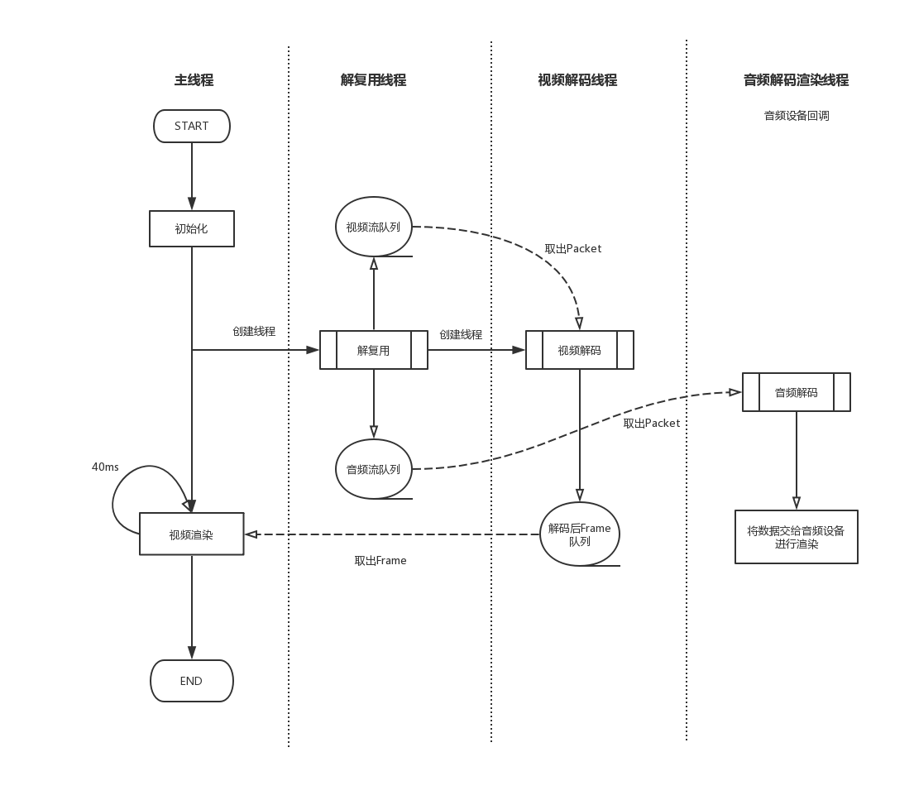

SDL2文章列表

[SDL2入门](https://david1840.github.io/2019/04/11/SDL2%E9%9F%B3%E8%A7%86%E9%A2%91%E6%B8%B2%E6%9F%93%E5%85%A5%E9%97%A8/)

[SDL2事件处理](https://david1840.github.io/2019/04/15/SDL2%E4%BA%8B%E4%BB%B6%E5%A4%84%E7%90%86/)

[SDL2纹理渲染](https://david1840.github.io/2019/04/16/SDL2%E7%BA%B9%E7%90%86%E6%B8%B2%E6%9F%93/)

[SDL2音频播放](https://david1840.github.io/2019/04/19/SDL2%E9%9F%B3%E9%A2%91%E6%92%AD%E6%94%BE/)

[FFmpeg+SDL2实现视频流播放](https://david1840.github.io/2019/04/22/FFmpeg-SDL2%E5%AE%9E%E7%8E%B0%E8%A7%86%E9%A2%91%E6%B5%81%E6%92%AD%E6%94%BE/)

[FFmpeg+SDL2实现音频流播放](https://david1840.github.io/2019/04/26/FFmpeg-SDL2%E5%AE%9E%E7%8E%B0%E9%9F%B3%E9%A2%91%E6%B5%81%E6%92%AD%E6%94%BE/)

[FFmpeg音视频同步](https://david1840.github.io/2019/05/01/FFmpeg%E9%9F%B3%E8%A7%86%E9%A2%91%E5%90%8C%E6%AD%A5/)

[SDL2线程操作]()

经过前面一系列的SDL2学习，终于到最后实现一个完整的简易播放器了。

## 线程模型



这是实现的简易播放器的线程模型，通过这张图再结合我们之前博客中学习的内容，基本可以了解播放器的一个整体运行流程。具体代码也是根据这张图来实现。

## 重要结构体

### VideoState

整个播放器中最重要的结构体，解复用、解码、音视频同步、渲染相关参数都在该结构体中，它贯穿了整个播放流程。

```c
typedef struct VideoState {
    
    char filename[1024]; // 文件名称
    AVFormatContext *pFormatCtx; // 上下文
    int videoStream, audioStream; //音视频流index


    //// 同步相关
    double audio_clock;
    double frame_timer;
    double frame_last_pts;
    double frame_last_delay;

    double video_clock; 
    double video_current_pts; 
    int64_t video_current_pts_time;  

    //音频相关
    AVStream *audio_st; // 音频流
    AVCodecContext *audio_ctx; // 音频解码上下文
    PacketQueue audioq; // 音频队列
    uint8_t audio_buf[(MAX_AUDIO_FRAME_SIZE * 3) / 2]; // 音频缓存
    unsigned int audio_buf_size;
    unsigned int audio_buf_index;
    AVFrame audio_frame; // 音频帧
    AVPacket audio_pkt; // 音频包
    uint8_t *audio_pkt_data;
    int audio_pkt_size;
    struct SwrContext *audio_swr_ctx; // 音频重采样


    //video
    AVStream *video_st; // 视频流
    AVCodecContext *video_ctx; // 视频流解码上下文
    PacketQueue videoq; // 视频流队列


    VideoPicture pictq[VIDEO_PICTURE_QUEUE_SIZE]; // 解码后视频帧数组
    int pictq_size, pictq_rindex, pictq_windex;
    SDL_mutex *pictq_mutex;
    SDL_cond *pictq_cond;

    SDL_Thread *parse_tid; // 解复用线程
    SDL_Thread *video_tid;// 视频解码线程

    int quit; // 退出标记位
} VideoState;
```

### PacketQueue

```c
//// 解复用后音视频packet保存队列
typedef struct PacketQueue {
    AVPacketList *first_pkt, *last_pkt;
    int nb_packets;
    int size;
    SDL_mutex *mutex;
    SDL_cond *cond;
} PacketQueue;

```

### VideoPicture 

```c
//// 解码后视频帧
typedef struct VideoPicture {
    AVFrame *frame;
    int width, height;
    double pts; // 音视频同步后视频帧应该播放的时间
} VideoPicture;
```


## 具体代码

### Main

1. 初始化
2. 创建定时器，定时视频帧的刷新
3. 创建解复用线程
4. 等待事件

```c
int WinMain(int argc, char *argv[]) {
    char *file = "C:\\Users\\lenovo\\Desktop\\IMG_5950.mp4";
    SDL_Event event;
    VideoState *is;
    is = av_mallocz(sizeof(VideoState));

    if (SDL_Init(SDL_INIT_VIDEO | SDL_INIT_AUDIO | SDL_INIT_TIMER)) {
        fprintf(stderr, "Could not initialize SDL - %s\n", SDL_GetError());
        exit(1);
    }
    //创建SDL Window
    win = SDL_CreateWindow("Media Player",
                           100,
                           100,
                           640, 480,
                           SDL_WINDOW_RESIZABLE);
    if (!win) {
        fprintf(stderr, "SDL_CreateWindow error，exit！", SDL_GetError());
        exit(1);
    }

    renderer = SDL_CreateRenderer(win, -1, 0);
    text_mutex = SDL_CreateMutex();
    
    strlcpy(is->filename, file, sizeof(is->filename));
    is->pictq_mutex = SDL_CreateMutex();
    is->pictq_cond = SDL_CreateCond();

    // 定时刷新器，主要用来控制视频的刷新
    schedule_refresh(is, 40);

    // 创建解复用线程
    is->parse_tid = SDL_CreateThread(demux_thread, "demux_thread", is);
    if (!is->parse_tid) {
        av_free(is);
        return -1;
    }


    for (;;) {
        // 等待SDL事件，否则阻塞
        SDL_WaitEvent(&event);
        switch (event.type) {
            case FF_QUIT_EVENT:
            case SDL_QUIT: // 退出
                is->quit = 1;
                goto Destroy;
            case SDL_KEYDOWN:// ESC退出
                if (event.key.keysym.sym == SDLK_ESCAPE) {
                    is->quit = 1;
                    goto Destroy;
                }
                break;
            case FF_REFRESH_EVENT: // 定时器刷新事件
                video_refresh_timer(event.user.data1);
                break;
            default:
                break;
        }
    }

    // 退出
    Destroy:
    SDL_Quit();
    return 0;

}
```

### 解复用

1. 打开文件
2. 找到音视频流
3. 打开音频、视频流，创建视频解码线程，准备解码
4. 读取packet，将音视频packet分别放入队列中，等待解码线程取出

```c
int demux_thread(void *arg) {
    
    if ((err_code = avformat_open_input(&pFormatCtx, is->filename, NULL, NULL)) < 0) {
        av_strerror(err_code, errors, 1024);
        return -1;
    }

    // Find the first video stream
    for (i = 0; i < pFormatCtx->nb_streams; i++) {
        if (pFormatCtx->streams[i]->codecpar->codec_type == AVMEDIA_TYPE_VIDEO &&
            video_index < 0) {
            video_index = i;
        }
        if (pFormatCtx->streams[i]->codecpar->codec_type == AVMEDIA_TYPE_AUDIO &&
            audio_index < 0) {
            audio_index = i;
        }
    }
    // 打开音频流，创建解码器，配置参数
    if (audio_index >= 0) {
        stream_component_open(is, audio_index);
    }
    // 打开视频流，创建解码器，创建解码线程
    if (video_index >= 0) {
        stream_component_open(is, video_index);
        // video_tid = SDL_CreateThread(decode_video_thread, "decode_video_thread", is);
    }

    for (;;) {
        if (av_read_frame(is->pFormatCtx, packet) < 0) {
            if (is->pFormatCtx->pb->error == 0) {
                SDL_Delay(100); /* no error; wait for user input */
                continue;
            } else {
                break;
            }
        }
        // 将packet存入队列中
        if (packet->stream_index == is->videoStream) {
            packet_queue_put(&is->videoq, packet);
        } else if (packet->stream_index == is->audioStream) {
            packet_queue_put(&is->audioq, packet);
        } else {
            av_packet_unref(packet);
        }
    }
    return 0;
}
```


### 视频解码

1. 从队列中取出视频packet
2. 解码，同步
3. 加码后Frame存入数组，等待视频渲染

```c
//// 视频解码
int decode_video_thread(void *arg) {
    VideoState *is = (VideoState *) arg;
    AVPacket pkt1, *packet = &pkt1;
    AVFrame *pFrame;
    double pts;

    pFrame = av_frame_alloc();

    for (;;) {
        // 从视频队列中取出packet
        if (packet_queue_get(&is->videoq, packet, 1) < 0) {
            break;
        }
        
        // 解码
        avcodec_send_packet(is->video_ctx, packet);
        while (avcodec_receive_frame(is->video_ctx, pFrame) == 0) {
            if ((pts = pFrame->best_effort_timestamp) != AV_NOPTS_VALUE) {
            } else {
                pts = 0;
            }
            pts *= av_q2d(is->video_st->time_base);

            // 同步
            pts = synchronize_video(is, pFrame, pts);
            if (queue_picture(is, pFrame, pts) < 0) {
                break;
            }
            av_packet_unref(packet);
        }
    }
    av_frame_free(&pFrame);
    return 0;
}
```


### 音频解码

```c
//// 音频设备回调
void audio_callback(void *userdata, Uint8 *stream, int len) {

    VideoState *is = (VideoState *) userdata;
    int len1, audio_size;
    double pts;

    SDL_memset(stream, 0, len);

    while (len > 0) {
        if (is->audio_buf_index >= is->audio_buf_size) {
            // 音频解码
            audio_size = audio_decode_frame(is, is->audio_buf, sizeof(is->audio_buf), &pts);
            if (audio_size < 0) {
                // 音频解码错误，播放静音
                is->audio_buf_size = 1024 * 2 * 2;
                memset(is->audio_buf, 0, is->audio_buf_size);
            } else {
                is->audio_buf_size = audio_size;
            }
            is->audio_buf_index = 0;
        }
        len1 = is->audio_buf_size - is->audio_buf_index;
        if (len1 > len)
            len1 = len;
        // 混音播放
        SDL_MixAudio(stream, (uint8_t *) is->audio_buf + is->audio_buf_index, len1, SDL_MIX_MAXVOLUME);
        len -= len1;
        stream += len1;
        is->audio_buf_index += len1;
    }
}
```

### 视频刷新播放

```c
//// 视频刷新播放，并预测下一帧的播放时间，设置新的定时器
void video_refresh_timer(void *userdata) {

    VideoState *is = (VideoState *) userdata;
    VideoPicture *vp;
    double actual_delay, delay, sync_threshold, ref_clock, diff;

    if (is->video_st) {
        if (is->pictq_size == 0) {
            schedule_refresh(is, 1);
        } else {
            // 从数组中取出一帧视频帧
            vp = &is->pictq[is->pictq_rindex];

            is->video_current_pts = vp->pts;
            is->video_current_pts_time = av_gettime();
            // 当前Frame时间减去上一帧的时间，获取两帧间的时差
            delay = vp->pts - is->frame_last_pts;
            if (delay <= 0 || delay >= 1.0) {
                // 延时小于0或大于1秒（太长）都是错误的，将延时时间设置为上一次的延时时间
                delay = is->frame_last_delay;
            }
            // 保存延时和PTS，等待下次使用
            is->frame_last_delay = delay;
            is->frame_last_pts = vp->pts;

            // 获取音频Audio_Clock
            ref_clock = get_audio_clock(is);
            // 得到当前PTS和Audio_Clock的差值
            diff = vp->pts - ref_clock;

            // AV_SYNC_THRESHOLD 最小刷新时间
            sync_threshold = (delay > AV_SYNC_THRESHOLD) ? delay : AV_SYNC_THRESHOLD;
            // diff小于非同步阈值，可以进行同步
            if (fabs(diff) < AV_NOSYNC_THRESHOLD) {
                if (diff <= -sync_threshold) {
                    // 视频时间在音频时间之前，应该让视频尽快播放
                    delay = 0;
                } else if (diff >= sync_threshold) {
                     // 视频时间在音频时间之后，应该让视频延迟播放
                    delay = 2 * delay;
                }
            }
            is->frame_timer += delay;
            // 最终真正要延时的时间
            actual_delay = is->frame_timer - (av_gettime() / 1000000.0);
            if (actual_delay < 0.010) {
                // 延时时间过小就设置最小值
                actual_delay = 0.010;
            }
            // 根据延时时间重新设置定时器，刷新视频
            schedule_refresh(is, (int) (actual_delay * 1000 + 0.5));

            // 视频帧显示
            video_display(is);

            // 更新视频帧数组下标
            if (++is->pictq_rindex == VIDEO_PICTURE_QUEUE_SIZE) {
                is->pictq_rindex = 0;
            }
            SDL_LockMutex(is->pictq_mutex);
            // 视频帧数组减一
            is->pictq_size--;
            SDL_CondSignal(is->pictq_cond);
            SDL_UnlockMutex(is->pictq_mutex);
        }
    } else {
        schedule_refresh(is, 100);
    }
}
```


大体的流程就是这样了，相比之前的Demo复杂度会高不少，但是所有的知识在前面的博客中都有涉及，在博客中也讲不了什么东西，还是直接自己运行，再去看代码会更好，理清流程，整个播放器的代码也不会很难看懂，这里附上[源码 Github-SimplePlay](https://github.com/David1840/SimplePlayer/blob/master/SimplePlayer.c)

学习音视频推荐：

第一个当然推荐雷神雷霄骅，中国FFmpeg第一人，系统地整理了FFmpeg相关的知识点，入门必看，可惜早逝，缅怀雷神。[雷霄骅的博客](https://me.csdn.net/leixiaohua1020)

第二个推荐大神李超的[慕课网视频](https://coding.imooc.com/class/279.html)，讲得非常实用，音视频小白入门值得一看。