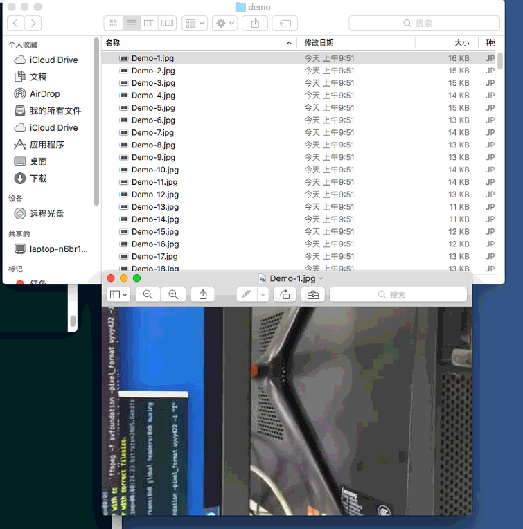

代码实现视频转图片主要是使用了FFmpeg视频编解码相关的知识，所以首先了解下FFmpeg中的编解码相关函数以及流程，后面再看代码就会比较轻松了。

## 视频解码

1. 打开输入文件 `avformat_open_input`
2. 找到视频流   `av_find_best_stream`
3. 找到对应的解码器 `avcodec_find_decoder`
4. 初始化一个编解码上下文 `avcodec_alloc_context3`
5. 拷贝流参数到编解码上下文中 `avcodec_parameters_to_context`
6. 打开解码器 `avcodec_open2`
7. 读取视频帧 `av_read_frame `
8. 发送等待解码帧 `avcodec_send_packet`
9. 接收解码后frame数据 `avcodec_receive_frame`


```c
int main(int argc, char *argv[]) {
    int ret;
    const char *in_filename, *out_filename;
    AVFormatContext *fmt_ctx = NULL;
    
    const AVCodec *codec;
    AVCodecContext *codeCtx = NULL;

    AVStream *stream = NULL;
    int stream_index;

    AVPacket avpkt;

    int frame_count;
    AVFrame *frame;
    

    if (argc <= 2) {
        printf("Usage: %s <input file> <output file>\n", argv[0]);
        exit(0);
    }
    in_filename = argv[1];
    out_filename = argv[2];

    // 1
    if (avformat_open_input(&fmt_ctx, in_filename, NULL, NULL) < 0) {
        printf("Could not open source file %s\n", in_filename);
        exit(1);
    }
    
    if (avformat_find_stream_info(fmt_ctx, NULL) < 0) {
        printf("Could not find stream information\n");
        exit(1);
    }

    av_dump_format(fmt_ctx, 0, in_filename, 0);

    av_init_packet(&avpkt);
    avpkt.data = NULL;
    avpkt.size = 0;

     // 2
    stream_index = av_find_best_stream(fmt_ctx, AVMEDIA_TYPE_VIDEO, -1, -1, NULL, 0);
    if (ret < 0) {
        fprintf(stderr, "Could not find %s stream in input file '%s'\n",
                av_get_media_type_string(AVMEDIA_TYPE_VIDEO), in_filename);
        return ret;
    }

    stream = fmt_ctx->streams[stream_index];

    // 3
    codec = avcodec_find_decoder(stream->codecpar->codec_id);
    if (codec == NULL) {
        return -1;
    }

    // 4
    codeCtx = avcodec_alloc_context3(NULL);
    if (!codeCtx) {
        fprintf(stderr, "Could not allocate video codec context\n");
        exit(1);
    }


    // 5
    if ((ret = avcodec_parameters_to_context(codeCtx, stream->codecpar)) < 0) {
        fprintf(stderr, "Failed to copy %s codec parameters to decoder context\n",
                av_get_media_type_string(AVMEDIA_TYPE_VIDEO));
        return ret;
    }

    // 6
    avcodec_open2(codeCtx, codec, NULL);


    //初始化frame，解码后数据
    frame = av_frame_alloc();
    if (!frame) {
        fprintf(stderr, "Could not allocate video frame\n");
        exit(1);
    }

    frame_count = 0;
    char buf[1024];
    // 7
    while (av_read_frame(fmt_ctx, &avpkt) >= 0) {
        if (avpkt.stream_index == stream_index) {
            // 8
            int re = avcodec_send_packet(codeCtx, &avpkt);
            if (re < 0) {
                continue;
            }
            
            // 9 这里必须用while()，因为一次avcodec_receive_frame可能无法接收到所有数据
            while (avcodec_receive_frame(codeCtx, frame) == 0) {
                // 拼接图片路径、名称
                snprintf(buf, sizeof(buf), "%s/Demo-%d.jpg", out_filename, frame_count);
                saveJpg(frame, buf); //保存为jpg图片
            }

            frame_count++;
        }
        av_packet_unref(&avpkt);
    }

}
```


## 视频编码（保存为图片）

编码整体在流程上和解码一致

```c

int saveJpg(AVFrame *pFrame, char *out_name) {
    
    int width = pFrame->width;
    int height = pFrame->height;
    AVCodecContext *pCodeCtx = NULL;
    
    
    AVFormatContext *pFormatCtx = avformat_alloc_context();
    // 设置输出文件格式
    pFormatCtx->oformat = av_guess_format("mjpeg", NULL, NULL);

    // 创建并初始化输出AVIOContext
    if (avio_open(&pFormatCtx->pb, out_name, AVIO_FLAG_READ_WRITE) < 0) {
        printf("Couldn't open output file.");
        return -1;
    }

    // 构建一个新stream
    AVStream *pAVStream = avformat_new_stream(pFormatCtx, 0);
    if (pAVStream == NULL) {
        return -1;
    }

    AVCodecParameters *parameters = pAVStream->codecpar;
    parameters->codec_id = pFormatCtx->oformat->video_codec;
    parameters->codec_type = AVMEDIA_TYPE_VIDEO;
    parameters->format = AV_PIX_FMT_YUVJ420P;
    parameters->width = pFrame->width;
    parameters->height = pFrame->height;

    AVCodec *pCodec = avcodec_find_encoder(pAVStream->codecpar->codec_id);

    if (!pCodec) {
        printf("Could not find encoder\n");
        return -1;
    }

    pCodeCtx = avcodec_alloc_context3(pCodec);
    if (!pCodeCtx) {
        fprintf(stderr, "Could not allocate video codec context\n");
        exit(1);
    }

    if ((avcodec_parameters_to_context(pCodeCtx, pAVStream->codecpar)) < 0) {
        fprintf(stderr, "Failed to copy %s codec parameters to decoder context\n",
                av_get_media_type_string(AVMEDIA_TYPE_VIDEO));
        return -1;
    }

    pCodeCtx->time_base = (AVRational) {1, 25};

    if (avcodec_open2(pCodeCtx, pCodec, NULL) < 0) {
        printf("Could not open codec.");
        return -1;
    }

    int ret = avformat_write_header(pFormatCtx, NULL);
    if (ret < 0) {
        printf("write_header fail\n");
        return -1;
    }

    int y_size = width * height;

    //Encode
    // 给AVPacket分配足够大的空间
    AVPacket pkt;
    av_new_packet(&pkt, y_size * 3);

    // 编码数据
    ret = avcodec_send_frame(pCodeCtx, pFrame);
    if (ret < 0) {
        printf("Could not avcodec_send_frame.");
        return -1;
    }

    // 得到编码后数据
    ret = avcodec_receive_packet(pCodeCtx, &pkt);
    if (ret < 0) {
        printf("Could not avcodec_receive_packet");
        return -1;
    }

    ret = av_write_frame(pFormatCtx, &pkt);

    if (ret < 0) {
        printf("Could not av_write_frame");
        return -1;
    }

    av_packet_unref(&pkt);

    //Write Trailer
    av_write_trailer(pFormatCtx);


    avcodec_close(pCodeCtx);
    avio_close(pFormatCtx->pb);
    avformat_free_context(pFormatCtx);

    return 0;
}
```


## 运行结果：




