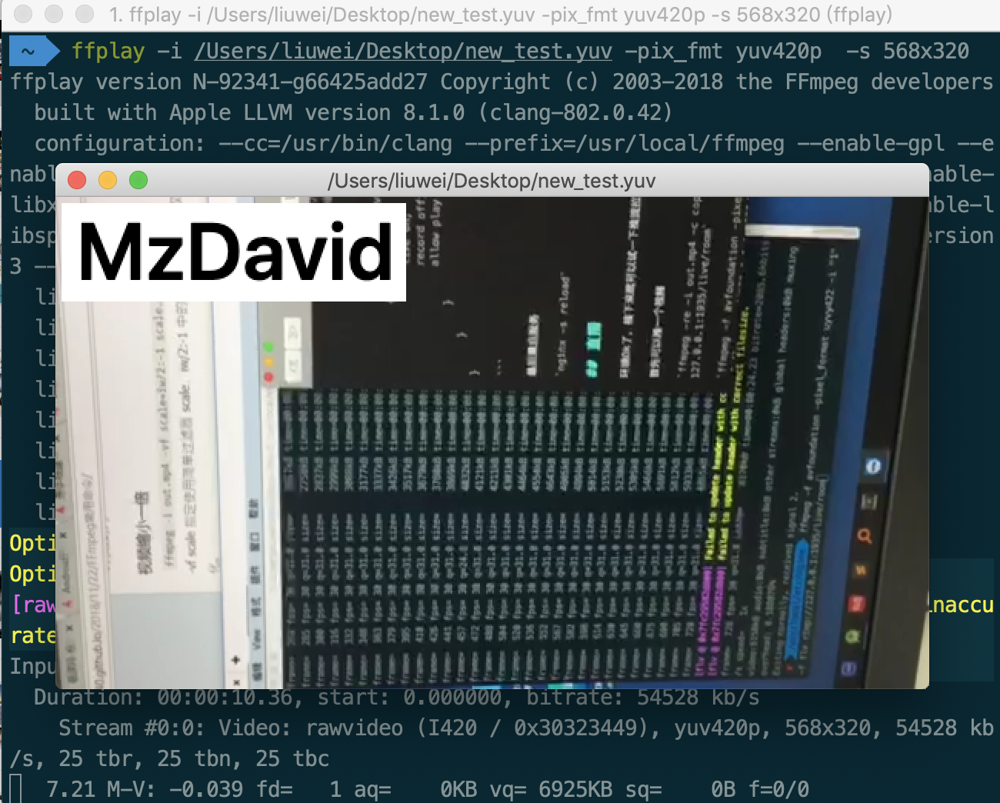
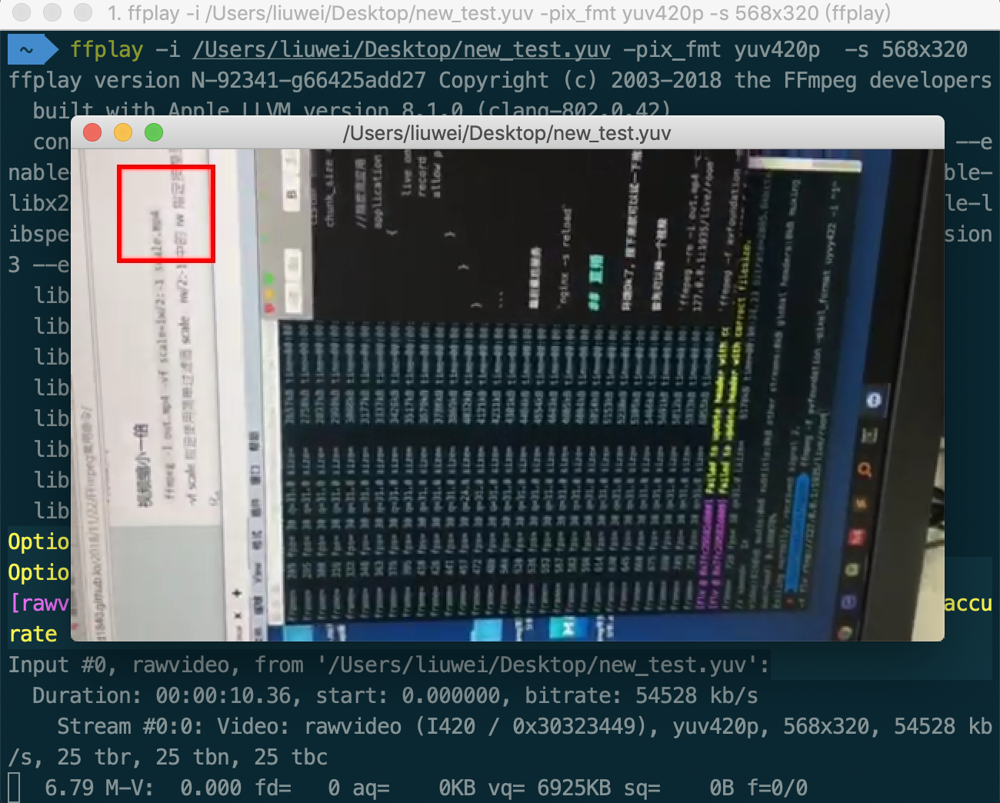

Filter，以认为是一些预定义的范式，可以实现类似积木的多种功能的自由组合。每个filter都有固定数目的输入和输出，而且实际使用中不允许有空 悬的输入输出端。使用文本描述时我们可以通过标识符指定输入和输出端口，将不同filter串联起来，构成更复杂的filter。这就形成了嵌套的 filter。当然每个filter可以通过ffmpeg/ffplay命令行实现，但通常filter更方便。

### Filter能做什么？

比较常见的有：

- 音视频的倍速播放
- 视频添加删除Logo
- 视频画中画
- 放大缩小
- 画面裁剪

### 源码

```c

#include <unistd.h>
#include <stdio.h>
#include <stdlib.h>

#include <libavcodec/avcodec.h>
#include <libavformat/avformat.h>
#include <libavfilter/buffersink.h>
#include <libavfilter/buffersrc.h>
#include <libavutil/opt.h>

static AVFormatContext *fmt_ctx;
static AVCodecContext *dec_ctx;
AVFilterContext *buffersink_ctx;
AVFilterContext *buffersrc_ctx;
AVFilterGraph *filter_graph;
static int video_stream_index = -1;

//打开输入文件
static int open_input_file(const char *filename)
{
    int ret;
    AVCodec *dec;

    if ((ret = avformat_open_input(&fmt_ctx, filename, NULL, NULL)) < 0) {
        av_log(NULL, AV_LOG_ERROR, "Cannot open input file\n");
        return ret;
    }

    if ((ret = avformat_find_stream_info(fmt_ctx, NULL)) < 0) {
        av_log(NULL, AV_LOG_ERROR, "Cannot find stream information\n");
        return ret;
    }

    //选择视频流
    ret = av_find_best_stream(fmt_ctx, AVMEDIA_TYPE_VIDEO, -1, -1, &dec, 0);
    if (ret < 0) {
        av_log(NULL, AV_LOG_ERROR, "Cannot find a video stream in the input file\n");
        return ret;
    }
    video_stream_index = ret;

    /* create decoding context */
    dec_ctx = avcodec_alloc_context3(dec);
    if (!dec_ctx)
        return AVERROR(ENOMEM);
    avcodec_parameters_to_context(dec_ctx, fmt_ctx->streams[video_stream_index]->codecpar);

    //初始化解码器
    if ((ret = avcodec_open2(dec_ctx, dec, NULL)) < 0) {
        av_log(NULL, AV_LOG_ERROR, "Cannot open video decoder\n");
        return ret;
    }

    return 0;
}

//初始化filter
static int init_filters(const char *filters_descr)
{
    char args[512];
    int ret = 0;
    //滤镜输入缓冲区，解码器解码后的数据都会放到buffer中，是一个特殊的filter
    const AVFilter *buffersrc  = avfilter_get_by_name("buffer"); 
    //滤镜输出缓冲区，滤镜处理完后输出的数据都会放在buffersink中，是一个特殊的filter
    const AVFilter *buffersink = avfilter_get_by_name("buffersink");
    AVFilterInOut *outputs = avfilter_inout_alloc();
    AVFilterInOut *inputs  = avfilter_inout_alloc();
    AVRational time_base = fmt_ctx->streams[video_stream_index]->time_base;
    enum AVPixelFormat pix_fmts[] = {AV_PIX_FMT_YUV420P, AV_PIX_FMT_GRAY8, AV_PIX_FMT_NONE};

    //创建filter图，会包含本次使用到的所有过滤器
    filter_graph = avfilter_graph_alloc();
    if (!outputs || !inputs || !filter_graph) {
        ret = AVERROR(ENOMEM);
        goto end;
    }

    /* buffer video source: the decoded frames from the decoder will be inserted here. */
    snprintf(args, sizeof(args),
            "video_size=%dx%d:pix_fmt=%d:time_base=%d/%d:pixel_aspect=%d/%d",
            dec_ctx->width, dec_ctx->height, dec_ctx->pix_fmt,
            time_base.num, time_base.den,
            dec_ctx->sample_aspect_ratio.num, dec_ctx->sample_aspect_ratio.den);

    //创建过滤器实例并将其添加到现有graph中
    ret = avfilter_graph_create_filter(&buffersrc_ctx, buffersrc, "in",
                                       args, NULL, filter_graph);
    if (ret < 0) {
        av_log(NULL, AV_LOG_ERROR, "Cannot create buffer source\n");
        goto end;
    }

    /* 缓冲视频接收器: 终止过滤器链 */
    ret = avfilter_graph_create_filter(&buffersink_ctx, buffersink, "out",
                                       NULL, NULL, filter_graph);
    if (ret < 0) {
        av_log(NULL, AV_LOG_ERROR, "Cannot create buffer sink\n");
        goto end;
    }

    ret = av_opt_set_int_list(buffersink_ctx, "pix_fmts", pix_fmts,
                              AV_PIX_FMT_NONE, AV_OPT_SEARCH_CHILDREN);
    if (ret < 0) {
        av_log(NULL, AV_LOG_ERROR, "Cannot set output pixel format\n");
        goto end;
    }

    /*
     * Set the endpoints for the filter graph. The filter_graph will
     * be linked to the graph described by filters_descr.
     */

    /*
     * The buffer source output must be connected to the input pad of
     * the first filter described by filters_descr; since the first
     * filter input label is not specified, it is set to "in" by
     * default.
     */
    outputs->name       = av_strdup("in");
    outputs->filter_ctx = buffersrc_ctx;
    outputs->pad_idx    = 0;
    outputs->next       = NULL;

    /*
     * The buffer sink input must be connected to the output pad of
     * the last filter described by filters_descr; since the last
     * filter output label is not specified, it is set to "out" by
     * default.
     */
    inputs->name       = av_strdup("out");
    inputs->filter_ctx = buffersink_ctx;
    inputs->pad_idx    = 0;
    inputs->next       = NULL;

    //将由字符串描述的图形添加到图形中
    if ((ret = avfilter_graph_parse_ptr(filter_graph, filters_descr,
                                    &inputs, &outputs, NULL)) < 0)
        goto end;

    if ((ret = avfilter_graph_config(filter_graph, NULL)) < 0)
        goto end;

end:
    avfilter_inout_free(&inputs);
    avfilter_inout_free(&outputs);

    return ret;
}

//保存YUV数据
static int save_frame(AVFrame *filt_frame, FILE *out){

    av_log(NULL, AV_LOG_DEBUG, "do_frame %d\n",filt_frame->format);
    if(filt_frame->format==AV_PIX_FMT_YUV420P){
        av_log(NULL, AV_LOG_ERROR, "save 1 frame\n");
        for(int i=0;i<filt_frame->height;i++){
            fwrite(filt_frame->data[0]+filt_frame->linesize[0]*i,1,filt_frame->width,out);
        }
        for(int i=0;i<filt_frame->height/2;i++){
            fwrite(filt_frame->data[1]+filt_frame->linesize[1]*i,1,filt_frame->width/2,out);
        }
        for(int i=0;i<filt_frame->height/2;i++){
            fwrite(filt_frame->data[2]+filt_frame->linesize[2]*i,1,filt_frame->width/2,out);
        }
    }
    fflush(out);

    return 0;
}


int main(int argc, char **argv)
{
    int ret;
    AVPacket packet;
    AVFrame *frame;
    AVFrame *filt_frame;
    FILE *out = NULL;

    const char *filter_desc="movie=my_logo.png[wm];[in][wm]overlay=5:5[out]"; //左上角绘制一个logo图片
    //"drawbox=30:10:64:64:red";//x= 30,y=10,width=64,height=64,color=red,绘制一个红色正方形
    const char* filename = "/Users/liuwei/Desktop/test.mp4";
    const char* outfile = "/Users/liuwei/Desktop/new_test.yuv";

    av_log_set_level(AV_LOG_DEBUG);


    frame = av_frame_alloc();
    filt_frame = av_frame_alloc();
    if (!frame || !filt_frame) {
        perror("Could not allocate frame");
        exit(1);
    }
    out = fopen(outfile, "wb");
    if(!out){
        av_log(NULL, AV_LOG_ERROR, "Failed to open yuv file!\n");
        exit(-1);
    }

    if ((ret = open_input_file(filename)) < 0)
        goto end;
    if ((ret = init_filters(filter_desc)) < 0)
        goto end;

    /* read all packets */
    while (1) {
        // 1 
        if ((ret = av_read_frame(fmt_ctx, &packet)) < 0)
            break;

        if (packet.stream_index == video_stream_index) {
            //2
            ret = avcodec_send_packet(dec_ctx, &packet);
            if (ret < 0) {
                av_log(NULL, AV_LOG_ERROR, "Error while sending a packet to the decoder\n");
                break;
            }

            while (ret >= 0) {
                //3
                ret = avcodec_receive_frame(dec_ctx, frame);
                if (ret == AVERROR(EAGAIN) || ret == AVERROR_EOF) {
                    break;
                } else if (ret < 0) {
                    av_log(NULL, AV_LOG_ERROR, "Error while receiving a frame from the decoder\n");
                    goto end;
                }

                frame->pts = frame->best_effort_timestamp;

                /*4 push the decoded frame into the filtergraph */
                if (av_buffersrc_add_frame_flags(buffersrc_ctx, frame, AV_BUFFERSRC_FLAG_KEEP_REF) < 0) {
                    av_log(NULL, AV_LOG_ERROR, "Error while feeding the filtergraph\n");
                    break;
                }

                /* pull filtered frames from the filtergraph */
                while (1) {
                    //5
                    ret = av_buffersink_get_frame(buffersink_ctx, filt_frame);
                    if (ret == AVERROR(EAGAIN) || ret == AVERROR_EOF)
                        break;
                    if (ret < 0)
                        goto end;
                    save_frame(filt_frame,out);
                    av_frame_unref(filt_frame);
                }
                av_frame_unref(frame);
            }
        }
        av_packet_unref(&packet);
    }
end:
    avfilter_graph_free(&filter_graph);
    avcodec_free_context(&dec_ctx);
    avformat_close_input(&fmt_ctx);
    av_frame_free(&frame);
    av_frame_free(&filt_frame);

    if (ret < 0 && ret != AVERROR_EOF) {
        fprintf(stderr, "Error occurred: %s\n", av_err2str(ret));
        exit(1);
    }

    exit(0);
}

```

代码中关键函数：

```
avfilter_graph_alloc()：为FilterGraph分配内存。

avfilter_graph_create_filter()：创建并向FilterGraph中添加一个Filter。

avfilter_graph_parse_ptr()：将一串通过字符串描述的Graph添加到FilterGraph中。

avfilter_graph_config()：检查FilterGraph的配置。

av_buffersrc_add_frame()：向FilterGraph中加入一个AVFrame。

av_buffersink_get_frame()：从FilterGraph中取出一个AVFrame。
```


`*filter_desc="movie=my_logo.png[wm];[in][wm]overlay=5:5[out]";`

代码会将一个MP4文件在左上角添加一个图片后输出为yuv文件，这个图片如果背景是透明的就是水印啦（主要是懒得做透明背景图片）。




`"drawbox=30:10:64:64:red";`x= 30,y=10,width=64,height=64,color=red, 绘制一个红色正方形


`"scale=iw*2:ih*2"`视频缩放，iw 表示输入视频的宽，ih表示输入视频的高。*2 表示放大两倍,如果是/2表示缩小两倍

`"crop=320:240:0:0"`视频裁剪，crop=width:height : x : y，其中 width 和 height 表示裁剪后的尺寸，x:y 表示裁剪区域的左上角坐标

还有很多filter可以使用，并且可以实现自定义filter，这些后面会慢慢了解。