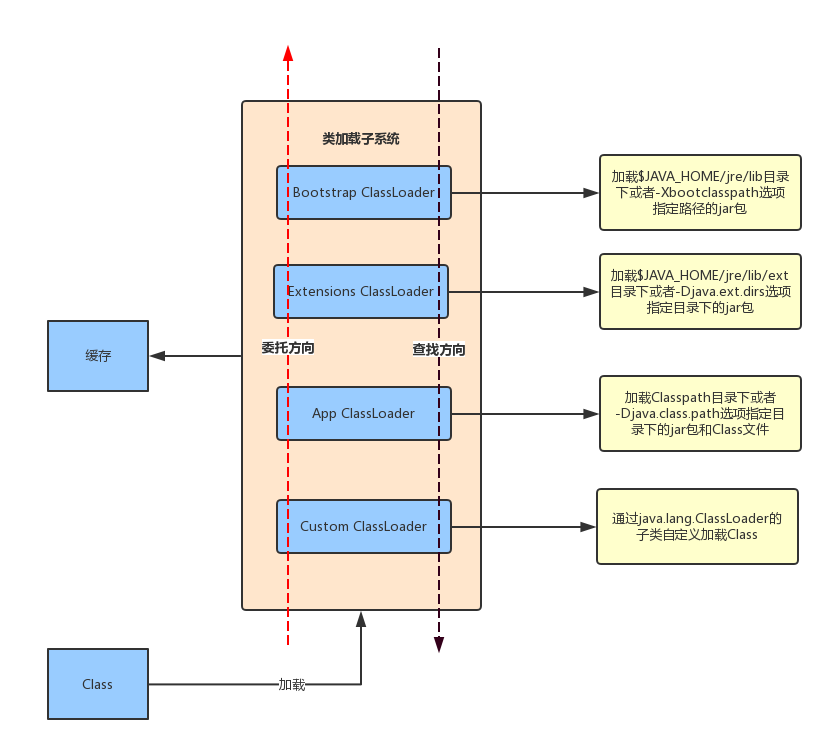

插件化和热修复都是目前比较火热的技术，而它们的实现是基于ClassLoader，因此今天先来分析一下Java中的ClassLoader。

## 类加载子系统
首先看一下Java虚拟机结构，如下图


从图中可以看到类加载子系统是在Class文件和JVM之间的桥梁，它的作用就是通过多种类加载器来查找和加载Class文件到Java虚拟机中。

Java中的类加载器主要有两种类型，系统类加载和自定义类加载器。其中系统类加载器包括3种，分别是Bootstrap ClassLoader、 Extensions ClassLoader和 Application ClassLoader。

### Bootstrap ClassLoader
用C/C++代码实现的加载器，用于加载Java虚拟机运行时所需要的系统类，如`java.lang.*`、`java.uti.*`等这些系统类，它们默认在$JAVA_HOME/jre/lib目录中，也可以通过启动Java虚拟机时指定-Xbootclasspath选项，来改变Bootstrap ClassLoader的加载目录。 

Java虚拟机的启动就是通过 Bootstrap ClassLoader创建一个初始类来完成的。由于Bootstrap ClassLoader是使用C/C++语言实现的， 所以该加载器不能被Java代码访问到。需要注意的是Bootstrap ClassLoader并不继承java.lang.ClassLoader。 

### Extensions ClassLoader

用于加载 Java 的拓展类 ，用来提供除了系统类之外的额外功能。也可以通过-Djava.ext.dirs选项添加和修改Extensions ClassLoader加载的路径。

### Application ClassLoader
负责加载当前应用程序Classpath目录下的所有jar和Class文件。也可以加载通过-Djava.class.path选项所指定的目录下的jar和Class文件。

### Custom ClassLoader
除了系统提供的类加载器，还可以自定义类加载器，自定义类加载器通过继承java.lang.ClassLoader类的方式来实现自己的类加载器，Extensions ClassLoader和Application ClassLoader也继承了java.lang.ClassLoader类。

## ClassLoader的继承关系

运行一个Java程序需要用到几种类型的类加载器呢？如下所示。


```
public class ClassLoaderTest {
    public static void main(String[] args) {
        ClassLoader loader = ClassLoaderTest.class.getClassLoader();
        while (loader != null) {
            System.out.println(loader);
            loader = loader.getParent();
        }
    }
}
```


打印结果如下所示。

```
sun.misc.Launcher$AppClassLoader@75b84c92
sun.misc.Launcher$ExtClassLoader@1b6d3586

```

第1行说明加载ClassLoaderTest的类加载器是AppClassLoader，第2行说明AppClassLoader的父加载器为ExtClassLoader。至于为何没有打印出ExtClassLoader的父加载器Bootstrap ClassLoader，这是因为Bootstrap ClassLoader是由C/C++编写的，并不是一个Java类，因此我们无法在Java代码中获取它的引用。

我们知道系统所提供的类加载器有3种类型，但是系统提供的ClassLoader相关类却不只3个。另外，AppClassLoader的父类加载器为ExtClassLoader，并不代表AppClassLoader继承自ExtClassLoader，ClassLoader的继承关系如下所示。


可以看到上图中共有5个ClassLoader相关类，下面简单对它们进行介绍：

* ClassLoader是一个抽象类，其中定义了ClassLoader的主要功能。
* SecureClassLoader继承了抽象类ClassLoader，但SecureClassLoader并不是ClassLoader的实现类，而是拓展了ClassLoader类加入了权限方面的功能，加强了ClassLoader的安全性。
* URLClassLoader继承自SecureClassLoader，用来通过URl路径从jar文件和文件夹中加载类和资源。
* ExtClassLoader和AppClassLoader都继承自URLClassLoader，它们都是Launcher 的内部类，Launcher 是Java虚拟机的入口应用，ExtClassLoader和AppClassLoader都是在Launcher中进行初始化的。


## 双亲委托模式

类加载器查找Class所采用的是双亲委托模式，所谓双亲委托模式就是首先判断该Class是否已经加载，如果没有则不是自身去查找而是委托给父加载器进行查找，这样依次的进行递归，直到委托到最顶层的Bootstrap ClassLoader，如果Bootstrap ClassLoader找到了该Class，就会直接返回，如果没找到，则继续依次向下查找，如果还没找到则最后会交由自身去查找。 
这样讲可能会有些抽象，来看下面的图。



我们知道类加载子系统用来查找和加载Class文件到 Java 虚拟机中，假设我们要加载一个位于D盘的Class文件，这时系统所提供的类加载器不能满足条件，这时就需要我们自定义类加载器继承自java.lang.ClassLoader，并复写它的findClass方法。加载D盘的Class文件步骤如下：

1. 自定义类加载器首先从缓存中要查找Class文件是否已经加载，如果已经加载就返回该Class，如果没加载则委托给父加载器也就是App ClassLoader。
2. 按照上图中红色虚线的方向递归步骤1。
3. 一直委托到Bootstrap ClassLoader，如果Bootstrap ClassLoader在缓存中还没有查找到Class文件，则在自己的规定路径JAVA_HOME/jre/libr中或者-Xbootclasspath选项指定路径的jar包中进行查找，如果找到则返回该Class，如果没有则交给子加载器Extensions ClassLoader。
4. Extensions ClassLoader查找JAVA_HOME/jre/lib/ext目录下或者-Djava.ext.dirs选项指定目录下的jar包，如果找到就返回，找不到则交给App ClassLoader。
5. App ClassLoade查找Classpath目录下或者-Djava.ext.dirs选项所指定的目录下的jar包和Class文件，如果找到就返回，找不到交给我们自定义的类加载器，如果还找不到则抛出异常。

总的来说就是Class文件加载到类加载子系统后，先沿着图中红色虚线的方向自下而上进行委托，再沿着黑色虚线的方向自上而下进行查找，整个过程就是先上后下。

类加载的步骤在JDK8的源码中也得到了体现，来查看抽象类的ClassLoader方法，如下所示。

```
 protected Class<?> More ...loadClass(String name, boolean resolve)
         throws ClassNotFoundException
     {
         synchronized (getClassLoadingLock(name)) {
             Class<?> c = findLoadedClass(name);//1
             if (c == null) {
                 long t0 = System.nanoTime();
                 try {
                     if (parent != null) {
                         c = parent.loadClass(name, false);//2
                     } else {
                         c = findBootstrapClassOrNull(name);//3
                     }
                 } catch (ClassNotFoundException e) {            
                 }
                 if (c == null) {
                     // If still not found, then invoke findClass in order
                     // to find the class.
                     long t1 = System.nanoTime();
                     c = findClass(name);//4
                     // this is the defining class loader; record the stats
                     sun.misc.PerfCounter.getParentDelegationTime().addTime(t1 - t0);
                     sun.misc.PerfCounter.getFindClassTime().addElapsedTimeFrom(t1);
                     sun.misc.PerfCounter.getFindClasses().increment();
                 }
             }
            if (resolve) {
                 resolveClass(c);
             }
            return c;
         }
     }
```

注释1处用来检查类是否已经加载，如果已经加载则后面的代码不会执行，最后会返回该类。没有加载则会接着向下执行。 

注释2处，如果父类加载器不为null，则调用父类加载器的loadClass方法。如果父类加载器为null则调用注释3处的findBootstrapClassOrNull方法，这个方法内部调用了Native方法findLoadedClass0，findLoadedClass0方法中最终会用Bootstrap Classloader来查找类。如果Bootstrap Classloader仍没有找到该类，也就说明向上委托没有找到该类，则调用注释4处的findClass方法继续向下进行查找。

#### 双亲委托模式的好处

采取双亲委托模式主要有两点好处： 

1. 避免重复加载，如果已经加载过一次Class，就不需要再次加载，而是先从缓存中直接读取。 
2. 更加安全，如果不使用双亲委托模式，就可以自定义一个String类来替代系统的String类，这显然会造成安全隐患，采用双亲委托模式会使得系统的String类在Java虚拟机启动时就被加载，也就无法自定义String类来替代系统的String类，除非我们修改类加载器搜索类的默认算法。还有一点，只有两个类名一致并且被同一个类加载器加载的类，Java虚拟机才会认为它们是同一个类，想要骗过Java虚拟机显然不会那么容易。

## 自定义ClassLoader

系统提供的类加载器只能够加载指定目录下的jar包和Class文件，如果想要加载网络上的或者是D盘某一文件中的jar包和Class文件则需要自定义ClassLoader。

实现自定义ClassLoader需要两个步骤： 

1. 定义一个自定义ClassLoade并继承抽象类ClassLoader。 
2. 复写findClass方法，并在findClass方法中调用defineClass方法。

下面我们就自定义一个ClassLoader用来加载位于D:\lib的Class文件。

#### 编写测试Class文件

首先编写测试类并生成Class文件，如下所示。

```
package com.example;
public class Jobs {
    public void say() {
        System.out.println("One more thing");
    }
}
```

将这个Jobs.java放入到D:\lib中，使用cmd命令进入D:\lib目录中，执行Javac Jobs.java对该java文件进行编译，这时会在D:\lib中生成Jobs.class。

#### 编写自定义ClassLoader

接下来编写自定义ClassLoader，如下所示。

```
import java.io.ByteArrayOutputStream;
import java.io.File;
import java.io.FileInputStream;
import java.io.IOException;
import java.io.InputStream;
public class DiskClassLoader extends ClassLoader {
    private String path;
    public DiskClassLoader(String path) {
        this.path = path;
    }
    @Override
    protected Class<?> findClass(String name) throws ClassNotFoundException {
        Class clazz = null;
        byte[] classData = loadClassData(name);//1
        if (classData == null) {
            throw new ClassNotFoundException();
        } else {
            clazz= defineClass(name, classData, 0, classData.length);//2
        }
        return clazz;
    }
    private byte[] loadClassData(String name) {
        String fileName = getFileName(name);
        File file = new File(path,fileName);
        InputStream in=null;
        ByteArrayOutputStream out=null;
        try {
             in = new FileInputStream(file);
             out = new ByteArrayOutputStream();
            byte[] buffer = new byte[1024];
            int length=0;
            while ((length = in.read(buffer)) != -1) {
                out.write(buffer, 0, length);
            }
            return out.toByteArray();
        } catch (IOException e) {
            e.printStackTrace();
        }finally {
            try {
                if(in!=null) {
                    in.close();
                }
            } catch (IOException e) {
                e.printStackTrace();
            }
            try{
                if(out!=null) {
                    out.close();
                }
            }catch (IOException e){
                e.printStackTrace();
            }
        }
        return null;
    }
    private String getFileName(String name) {
        int index = name.lastIndexOf('.');
        if(index == -1){//如果没有找到'.'则直接在末尾添加.class
            return name+".class";
        }else{
            return name.substring(index+1)+".class";
        }
    }
}
```

这段代码有几点需要注意的，注释1处的loadClassData方法会获得class文件的字节码数组，并在注释2处调用defineClass方法将class文件的字节码数组转为Class类的实例。loadClassData方法中需要对流进行操作，关闭流的操作要放在finally语句块中，并且要对in和out分别采用try语句，如果in和out共同在一个try语句中，那么如果in.close()发生异常，则无法执行 out.close()。

最后我们来验证DiskClassLoader是否可用，代码如下所示。

```
import java.lang.reflect.InvocationTargetException;
import java.lang.reflect.Method;

public class ClassLoaderTest {
    public static void main(String[] args) {
        DiskClassLoader diskClassLoader = new DiskClassLoader("D:\\lib");//1
        try {
            Class c = diskClassLoader.loadClass("com.example.Jobs");//2
            if (c != null) {
                try {
                    Object obj = c.newInstance();
                    System.out.println(obj.getClass().getClassLoader());
                    Method method = c.getDeclaredMethod("say", null);
                    method.invoke(obj, null);//3
                } catch (InstantiationException | IllegalAccessException
                        | NoSuchMethodException
                        | SecurityException |
                        IllegalArgumentException |
                        InvocationTargetException e) {
                    e.printStackTrace();
                }
            }
        } catch (ClassNotFoundException e) {
            e.printStackTrace();
        }
    }
}
```

注释1出创建DiskClassLoader并传入要加载类的路径，注释2处加载Class文件，需要注意的是，不要在项目工程中存在名为com.example.Jobs的Java文件，否则就不会使用DiskClassLoader来加载，而是AppClassLoader来负责加载，这样我们定义DiskClassLoader就变得毫无意义。接下来在注释3通过反射来调用Jobs的say方法，打印结果如下：

```
com.example.DiskClassLoader@4554617c
One more thing
```

使用了DiskClassLoader来加载Class文件，say方法也正确执行，显然我们的目的达到了。