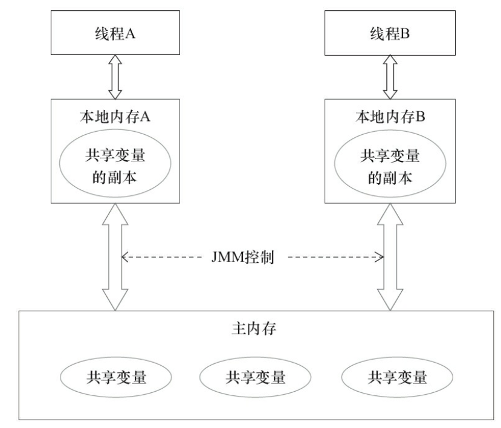

Java的并发采用的是共享内存模型，Java线程之间的通信总是隐式进行，整个通信过程对程序员完全透明。因此在开发过程中很可能遇到各种奇怪的内存可见性问题。

# JMM
Java线程之间的通信由Java内存模型(JMM)控制，JMM决定了一个线程对共享变量的写入何时对另一个线程可见。

如图，线程A和线程B之间要通信的话，必须经历：

1. 线程A把本地内存A中更新过的共享变量刷新到主内存中去。
2. 线程B到主内存中去读取线程A之前已经更新过的数据。

线程A向B发送消息，而这个通信过程必须要经过主内存，JMM就是通过控制主内存与每个线程的本地内存之间的交互，来为Java程序员提供内存可见性保证。

那JMM具体是如何控制这个过程呢？我们需要认识几个基础概念：内存屏障（memory Barriers），指令重排序，`happens-before`规则，`as-if-serial`语义

## 内存屏障

内存屏障，又称内存栅栏，是一个CPU指令，主要功能如下：

1. 保证特定操作的执行顺序
2. 影响某些数据(或是某条指令的执行结果)的内存可见性

编译器和CPU能够重排序指令，保证最终相同的结果，尝试优化性能。插入一条Memory Barrier会告诉编译器和CPU：不管什么指令都不能和这条Memory Barrier指令重排序。

Memory Barrier所做的另外一件事是强制刷出各种CPU cache，如一个 Write-Barrier（写入屏障）将刷出所有在 Barrier 之前写入 cache 的数据，因此，任何CPU上的线程都能读取到这些数据的最新版本。

在Java中，[volatile](https://david1840.github.io/2018/07/28/Volatile%E5%85%B3%E9%94%AE%E5%AD%97/)是基于Memory Barrier实现的。

## 指令重排序
指令重排序是指编译器和处理器为了优化程序性能而对指令序列进行重新排序的一种手段。但是，JMM确保在不同的编译器和不同的处理器平台之上，通过插入特定类型的Memory Barrier来禁止特定类型的编译器重排序和处理器重排序，为上层提供一致的内存可见性保证。

1. 编译器优化重排序：编译器在不改变单线程程序语义的前提下，可以重新安排语句的执行顺序。
2. 指令级并行的重排序：如果不存l在数据依赖性，处理器可以改变语句对应机器指令的执行顺序。
3. 内存系统的重排序：处理器使用缓存和读写缓冲区，这使得加载和存储操作看上去可能是在乱序执行。

#### 数据依赖性
如果两个操作访问同一个变量，其中一个为写操作，此时这两个操作之间存在数据依赖性。

上面三种情况，只要重排序两个操作的执行顺序，程序的执行结果就会被改变。因此，编译器和处理器不会改变存在数据依赖性关系的两个操作的执行顺序，即不会重排序。

## `happens-before`规则

在JMM中，如果一个操作的执行结果需要对另一个操作可见，那么这两个操作之间必须要存在happens-before关系，这个的两个操作既可以在同一个线程，也可以在不同的两个线程中。

与程序员密切相关的happens-before规则如下：

1. 程序顺序规则：一个线程中的每个操作，happens-before于该线程中任意的后续操作。
2. 监视器锁规则：对一个锁的解锁操作，happens-before于随后对这个锁的加锁操作。
3. volatile域规则：对一个volatile域的写操作，happens-before于任意线程后续对这个volatile域的读。
4. 传递性规则：如果 A happens-before B，且 B happens-before C，那么A happens-before C。

> 两个操作之间具有happens-before关系，并不意味前一个操作必须要在后一个操作之前执行！仅仅要求前一个操作的执行结果，对于后一个操作是可见的，且前一个操作按顺序排在后一个操作之前

## `as-if-serial`语义

不管怎么重排序，单线程下的执行结果不能被改变，编译器、runtime和处理器都必须遵守as-if-serial语义。