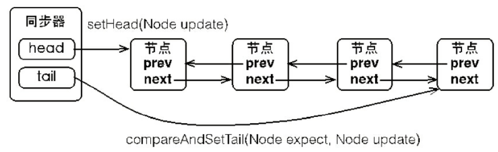

队列同步器，AbstractQueuedSynchronized,简称AQS，是用来构建锁或者其他同步组建的基础框架，常用的有ReentrantLock、ReadWriteLock（实现类ReentrantReadWriteLock），内部实现都依赖于它。Doug Lea大神期望它能够成为实现大部分同步需求的基础。

## 定义

```
public abstract class AbstractQueuedSynchronizer extends
    AbstractOwnableSynchronizer implements java.io.Serializable { 
    //等待队列的头节点
    private transient volatile Node head;
    //等待队列的尾节点
    private transient volatile Node tail;
    //同步状态
    private volatile int state;
    protected final int getState() { return state;}
    protected final void setState(int newState) { state = newState;}
    protected final boolean compareAndSetState(int expect, int update) {
        return unsafe.compareAndSwapInt(this, stateOffset, expect, update);
    }
    ...
}

```

AQS使用了一个int成员变量state表示同步状态，通过内置的FIFO队列来完成资源获取线程的排队工作。基本结构如图所示：



当前线程获取同步状态失败时，AQS会将当前线程以及等待状态等信息构造成一个节点(Node)并将其加入到队列中(添加到队尾，要保证线程安全，使用CAS)，同时阻塞当前线程。当同步状态释放时，会把首节点的线程唤醒，使其再尝试获取同步状态。

节点类：

```
  static final class Node {
        static final Node SHARED = new Node();
        static final Node EXCLUSIVE = null;
        static final int CANCELLED =  1;
        static final int SIGNAL    = -1;
        static final int CONDITION = -2;
        static final int PROPAGATE = -3;
        volatile int waitStatus;
        volatile Node prev;
        volatile Node next;
        volatile Thread thread;
        Node nextWaiter;
        ...
    }
```

每个节点中， 除了存储了当前线程，前后节点的引用以外，还有一个waitStatus变量，用于描述节点当前的状态。一共有4中状态：

* CANCELLED 取消状态
* SIGNAL 等待触发状态
* CONDITION 等待条件状态
* PROPAGATE 状态需要向后传播

等待队列是FIFO先进先出，只有前一个节点的状态为SIGNAL时，当前节点的线程才能被挂起。

## 实现原理

AQS的主要使用方式是继承，子类通过继承同步器并实现它的抽象方法来管理同步状态。子类重写tryAcquire和tryRelease方法通过CAS指令修改状态变量state。

```
    public final void acquire(int arg) {
        if (!tryAcquire(arg) &&
            acquireQueued(addWaiter(Node.EXCLUSIVE), arg))
            selfInterrupt();
    }

```

上述代码主要完成了同步状态获取、节点构造、加入同步队列以及在同步队列中自旋等待的相关工作。首先调用自定义同步器实现的`tryAcquire(arg)`，该方法保证线程安全地获取同步状态，如果获取同步状态失败，则构造同步节点并通过`addWaiter(Node node)`方法加入到同步队列的尾部，最后调用`acquireQueued(Node node, int arg)`方法使该节点以"死循环"的方式获取同步状态。如果获取不到则阻塞节点中的线程，而被阻塞的线程唤醒主要依靠前驱节点的出队或阻塞线程被中断来实现。

### 1、节点构造和加入同步队列
```
private Node addWaiter(Node mode) {
        Node node = new Node(Thread.currentThread(), mode);
        // Try the fast path of enq; backup to full enq on failure
        Node pred = tail;
        if (pred != null) {
            node.prev = pred;
            if (compareAndSetTail(pred, node)) {
                pred.next = node;
                return node;
            }
        }
        enq(node);
        return node;
    }
```

```
private Node enq(final Node node) {
        for (;;) {
            Node t = tail;
            if (t == null) { // Must initialize
                if (compareAndSetHead(new Node()))
                    tail = head;
            } else {
                node.prev = t;
                if (compareAndSetTail(t, node)) {
                    t.next = node;
                    return t;
                }
            }
        }
    }
```
### 2、节点进入自旋
```
final boolean acquireQueued(final Node node, int arg) {
        boolean failed = true;
        try {
            boolean interrupted = false;
            for (;;) {
                //p为node的前驱节点
                final Node p = node.predecessor();
                //前驱节点是头节点才尝试获取同步状态
                //如果成功，将自己设为头节点
                if (p == head && tryAcquire(arg)) {
                    setHead(node);
                    p.next = null; // help GC
                    failed = false;
                    return interrupted;
                }
                if (shouldParkAfterFailedAcquire(p, node) &&
                    parkAndCheckInterrupt())
                    interrupted = true;
            }
        } finally {
            if (failed)
                cancelAcquire(node);
        }
    }

```


尝试获取失败则进入下面方法

```
 private static boolean shouldParkAfterFailedAcquire(Node pred, Node node) {
        int ws = pred.waitStatus;
        if (ws == Node.SIGNAL)
            /*
             * This node has already set status asking a release
             * to signal it, so it can safely park.
             */
            return true;
        if (ws > 0) {
            /*
             * Predecessor was cancelled. Skip over predecessors and
             * indicate retry.
             */
            do {
                node.prev = pred = pred.prev;
            } while (pred.waitStatus > 0);
            pred.next = node;
        } else {
            /*
             * waitStatus must be 0 or PROPAGATE.  Indicate that we
             * need a signal, but don't park yet.  Caller will need to
             * retry to make sure it cannot acquire before parking.
             */
            compareAndSetWaitStatus(pred, ws, Node.SIGNAL);
        }
        return false;
    }
```

```
private final boolean parkAndCheckInterrupt() {
        LockSupport.park(this);
        return Thread.interrupted();
    }
```

1. 如果pred的waitStatus == 0，则通过CAS指令修改waitStatus为Node.SIGNAL。
2. 如果pred的waitStatus > 0，表明pred的线程状态CANCELLED，需从队列中删除。
3. 如果pred的waitStatus为Node.SIGNAL，则通过LockSupport.park()方法把线程A挂起，并等待被唤醒
4. 线程每次被唤醒时，都要进行中断检测，如果发现当前线程被中断，那么抛出InterruptedException并退出循环。从无限循环的代码可以看出，并不是被唤醒的线程一定能获得锁，必须调用tryAccquire重新竞争，因为锁是非公平的，有可能被新加入的线程获得，从而导致刚被唤醒的线程再次被阻塞，这个细节充分体现了“非公平”的精髓。


### 3、释放

```
public final boolean release(int arg) {
        if (tryRelease(arg)) {
            Node h = head;
            if (h != null && h.waitStatus != 0)
                unparkSuccessor(h);
            return true;
        }
        return false;
    }
```

```
private void unparkSuccessor(Node node) {
    /*
     * If status is negative (i.e., possibly needing signal) try
     * to clear in anticipation of signalling.  It is OK if this
     * fails or if status is changed by waiting thread.
     */
    int ws = node.waitStatus;
    if (ws < 0)
        compareAndSetWaitStatus(node, ws, 0);

    /*
     * Thread to unpark is held in successor, which is normally
     * just the next node.  But if cancelled or apparently null,
     * traverse backwards from tail to find the actual
     * non-cancelled successor.
     */
    Node s = node.next;
    if (s == null || s.waitStatus > 0) {
        s = null;
        for (Node t = tail; t != null && t != node; t = t.prev)
            if (t.waitStatus <= 0)
                s = t;
    }
    if (s != null)
        LockSupport.unpark(s.thread);
}
```

1. 如果头结点head的waitStatus值为-1，则用CAS指令重置为0；
2. 找到waitStatus值小于0的节点s，通过LockSupport.unpark(s.thread)唤醒线程。

## 总结

在获取同步状态时，同步器维护了一个同步队列，获取状态失败的线程都会被加入到队列中并在队列中进行自旋；移出或停止自旋的条件是前驱节点为头节点且成功获取到了同步状态。在释放同步状态时，同步器调用`tryRelease(int arg)`方法释放同步状态，然后唤醒头节点的后续节点。

