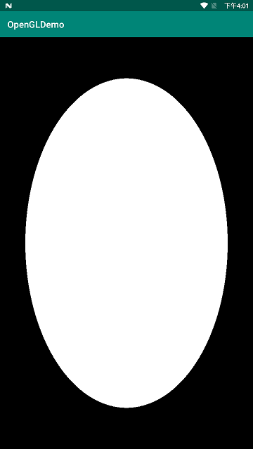

之前学习了绘制点、线、三角形，都很完美的展示出来了，所以有点小膨胀，想画一个圆形证明自己OpenGL已经入门了。

画一个圆形其实和画一个三角形没有太大区别，因为一个圆形也就是由无数个相同顶点的三角形组成的，三角形个数趋向于无限大的时候，整个图案也就越趋向于圆。顶点数据就不能手写了，可以靠代码生成。

```java
private float[] createPositions() {
    // 绘制的半径
    float radius = 0.8f;
    ArrayList<Float> data = new ArrayList<>();
    data.add(0.0f); //设置圆心坐标
    data.add(0.0f);
    data.add(0.0f);
    float angDegSpan = 360f / 360; // 分成360份
    for (float i = 0; i < 360 + angDegSpan; i += angDegSpan) {
        data.add((float) (radius * Math.sin(i * Math.PI / 180f)));
        data.add((float) (radius * Math.cos(i * Math.PI / 180f)));
        data.add(0.0f);
    }
    float[] f = new float[data.size()];
    for (int i = 0; i < f.length; i++) {
        f[i] = data.get(i);
    }
    return f;
}
```

把圆分成了 360 份。圆形的顶点数据也分为了三部分了，以原心作为我们的中心点，中间的 360 个点用来绘制三角形，最后一个点使得我们的图形闭合。

```java
GLES30.glDrawArrays(GLES30.GL_TRIANGLE_FAN, 0, 362);
```

当信心满满地运行后，现实却打了脸：



圆形变成了一个椭圆。。。 为什么呢？

OpenGL希望在每次顶点着色器运行后，我们可见的所有顶点都为标准化设备坐标(Normalized Device Coordinate, NDC)。也就是说，每个顶点的**x**，**y**，**z**坐标都应该在**-1.0**到**1.0**之间，超出这个坐标范围的顶点都将不可见。我们通常会自己设定一个坐标的范围，之后再在顶点着色器中将这些坐标变换为标准化设备坐标。然后将这些标准化设备坐标传入光栅器(Rasterizer)，将它们变换为屏幕上的二维坐标或像素。

而在上面的例子中，假设实际手机分辨率以像素为单位是`720x1280`，我们默认使用`OpenGL`占用整个显示屏。
设备在竖屏模式下，那么`[-1，1]`的范围对应的高有`1280像素`，而宽却只有`720像素`。图像会在`x轴`显得扁平，如果在横屏模式，图像会在`y轴`显得扁平。

所以我们缺少了将坐标变换为标准化设备坐标，再转化为屏幕坐标的过程，导致最终呈现出一个椭圆。现在就去了解下这个转换过程！

## 坐标系统

