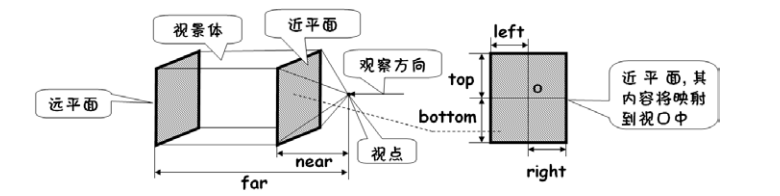
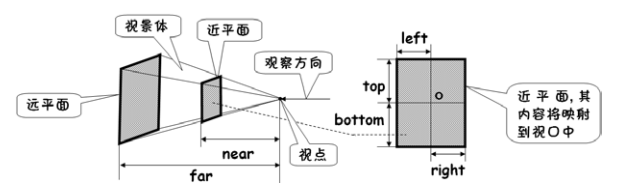
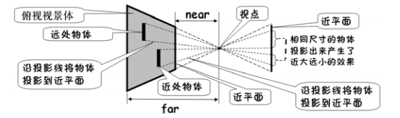
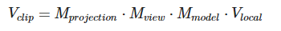
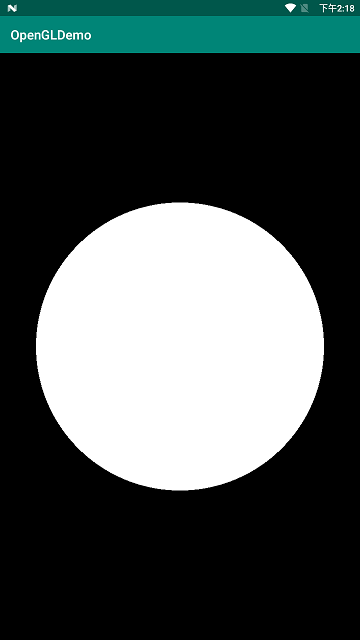

之前学习了绘制点、线、三角形，都很完美的展示出来了，所以有点小膨胀，想画一个圆形证明自己OpenGL已经入门了。

画一个圆形其实和画一个三角形没有太大区别，因为一个圆形也就是由无数个相同顶点的三角形组成的，三角形个数趋向于无限大的时候，整个图案也就越趋向于圆。顶点数据就不能手写了，可以靠代码生成。

```java
private float[] createPositions() {
    // 绘制的半径
    float radius = 0.8f;
    ArrayList<Float> data = new ArrayList<>();
    data.add(0.0f); //设置圆心坐标
    data.add(0.0f);
    data.add(0.0f);
    float angDegSpan = 360f / 360; // 分成360份
    for (float i = 0; i < 360 + angDegSpan; i += angDegSpan) {
        data.add((float) (radius * Math.sin(i * Math.PI / 180f)));
        data.add((float) (radius * Math.cos(i * Math.PI / 180f)));
        data.add(0.0f);
    }
    float[] f = new float[data.size()];
    for (int i = 0; i < f.length; i++) {
        f[i] = data.get(i);
    }
    return f;
}
```

把圆分成了 360 份。圆形的顶点数据也分为了三部分了，以原心作为我们的中心点，中间的 360 个点用来绘制三角形，最后一个点使得我们的图形闭合。

```java
GLES30.glDrawArrays(GLES30.GL_TRIANGLE_FAN, 0, 362);
```

当信心满满地运行后，现实却打了脸：


圆形变成了一个椭圆。。。 为什么呢？

OpenGL希望在每次顶点着色器运行后，我们可见的所有顶点都为标准化设备坐标(Normalized Device Coordinate, NDC)。也就是说，每个顶点的**x**，**y**，**z**坐标都应该在**-1.0**到**1.0**之间，超出这个坐标范围的顶点都将不可见。

而在上面的例子中，假设实际手机分辨率以像素为单位是`720x1280`，我们默认使用`OpenGL`占用整个显示屏。
设备在竖屏模式下，那么`[-1，1]`的范围对应的高有`1280像素`，而宽却只有`720像素`。正因为标准化设备坐标假定坐标空间是一个正方形，而实际的设备屏幕不是正方形，因为宽高之间的比例，使得绘制结果与预料结果不一致。

如何解决这个问题？在OpenGL中使用了正交投影的方式解决这个问题。

在学习正交投影前先学习下OpenGL的坐标系统。

## 坐标系统

OpenGL中我们通常会自己设定一个坐标的范围，之后再在顶点着色器中将这些坐标变换为标准化设备坐标。然后将这些标准化设备坐标传入光栅器(Rasterizer)，将它们变换为屏幕上的二维坐标或像素。

将坐标变换为标准化设备坐标，接着再转化为屏幕坐标的过程通常是分步进行的，也就是类似于流水线那样子。在流水线中，物体的顶点在最终转化为屏幕坐标之前还会被变换到多个坐标系统(Coordinate System)。将物体的坐标变换到几个**过渡**坐标系(Intermediate Coordinate System)的优点在于，在这些特定的坐标系统中，一些操作或运算更加方便和容易，这一点很快就会变得很明显。对我们来说比较重要的总共有5个不同的坐标系统：

- 局部空间(Local Space，或者称为物体空间(Object Space))
- 世界空间(World Space)
- 观察空间(View Space，或者称为视觉空间(Eye Space))
- 裁剪空间(Clip Space)
- 屏幕空间(Screen Space)

这就是一个顶点在最终被转化为片段之前需要经历的所有不同状态。

为了将坐标从一个坐标系变换到另一个坐标系，我们需要用到几个变换矩阵，最重要的几个分别是**模型(Model)**、**观察(View)**、**投影(Projection)**三个矩阵。我们的顶点坐标起始于**局部空间(Local Space)**，在这里它称为**局部坐标(Local Coordinate)**，它在之后会变为**世界坐标(World Coordinate)**，**观察坐标(View Coordinate)**，**裁剪坐标(Clip Coordinate)**，并最后以**屏幕坐标(Screen Coordinate)**的形式结束。下面的这张图展示了整个流程以及各个变换过程做了什么：


首先了解下OpenGL是一个右手坐标系，简单来说，就是正x轴在你的右手边，正y轴朝上，而正z轴是朝向后方的。想象你的屏幕处于三个轴的中心，则正z轴穿过你的屏幕朝向你。坐标系画起来如下：


### 局部空间

局部空间坐标是 OpenGL 绘制坐标的起点，接下来所有的转换操作都是在局部空间坐标基础上进行的。

局部空间坐标就是我们自己定义的起始坐标点，是相对于原点 `(0,0,0)(0,0,0)` 的。

此时所在的空间就是局部空间，也就是说我们在局部空间里面定义物体的起始坐标。

### 世界空间

如果我们将我们所有的物体导入到程序当中，它们有可能会全挤在世界的原点(0, 0, 0)上，这并不是我们想要的结果。我们想为每一个物体定义一个位置，从而能在更大的世界当中放置它们。世界空间中的坐标正如其名：是指顶点相对于（游戏）世界的坐标。如果你希望将物体分散在世界上摆放（特别是非常真实的那样），这就是你希望物体变换到的空间。物体的坐标将会从局部变换到世界空间；该变换是由模型矩阵(Model Matrix)实现的。

模型矩阵是一种变换矩阵，它能通过对物体进行位移、缩放、旋转来将它置于它本应该在的位置或朝向。你可以将它想像为变换一个房子，你需要先将它缩小（它在局部空间中太大了），并将其位移至郊区的一个小镇，然后在y轴上往左旋转一点以搭配附近的房子。

### 观察空间

观察空间经常被人们称之OpenGL的摄像机(Camera)（所以有时也称为摄像机空间(Camera Space)或视觉空间(Eye Space)）。观察空间是将世界空间坐标转化为用户视野前方的坐标而产生的结果。因此观察空间就是从摄像机的视角所观察到的空间。而这通常是由一系列的位移和旋转的组合来完成，平移/旋转场景从而使得特定的对象被变换到摄像机的前方。这些组合在一起的变换通常存储在一个观察矩阵(View Matrix)里，它被用来将世界坐标变换到观察空间。

从日常生活的经验中可以很容易地了解到，随着摄像机位置、姿态的不同，就算是对同一 个场景进行拍摄，得到的画面也是迥然不同的。 因此摄像机的位置、姿态在 OpenGL ES 3.0 应用程序的开发中就显得非常重要，所以先介绍一下摄像机的设置方法。 

摄像机的设置需要给出 3 方面的信息，包括摄像机的位置、观察的方向以及 up 方向，具体情况如图所示。 


- 摄像机的位置很容易理解，用其在 3D 空间中的坐标来表示。 
- 摄像机观察的方向可以理解为摄像机镜头的指向，用一个观察目标点来表示（通过摄像机位置与观察目标点可以确定一个向量，此向量即代表了摄像机观察的方向）。 
- 摄像机的 up 方向可以理解为摄像机顶端的指向，用一个向量来表示。 

通过摄像机拍摄场景与人眼观察现实世界很类似，因此，通过人眼对现实世界观察的切身感受可以帮助读者理解摄像机的各个参数。


### 裁剪空间

在一个顶点着色器运行的最后，OpenGL期望所有的坐标都能落在一个特定的范围内，且任何在这个范围之外的点都应该被裁剪掉(Clipped)。被裁剪掉的坐标就会被忽略，所以剩下的坐标就将变为屏幕上可见的片段。这也就是裁剪空间(Clip Space)名字的由来。

因为将所有可见的坐标都指定在-1.0到1.0的范围内不是很直观，所以我们会指定自己的坐标集(Coordinate Set)并将它变换回标准化设备坐标系，就像OpenGL期望的那样。

为了将顶点坐标从观察变换到裁剪空间，我们需要定义一个投影矩阵(Projection Matrix)，它指定了一个范围的坐标，比如在每个维度上的-1000到1000。投影矩阵接着会将在这个指定的范围内的坐标变换为标准化设备坐标的范围(-1.0, 1.0)。所有在范围外的坐标不会被映射到在-1.0到1.0的范围之间，所以会被裁剪掉。在上面这个投影矩阵所指定的范围内，坐标(1250, 500, 750)将是不可见的，这是由于它的x坐标超出了范围，它被转化为一个大于1.0的标准化设备坐标，所以被裁剪掉了。

由投影矩阵创建的**观察箱**(Viewing Box)被称为平截头体(Frustum)，每个出现在平截头体范围内的坐标都会最终出现在用户的屏幕上。将特定范围内的坐标转化到标准化设备坐标系的过程（而且它很容易被映射到2D观察空间坐标）被称之为投影(Projection)，因为使用投影矩阵能将3D坐标投影(Project)到很容易映射到2D的标准化设备坐标系中。

一旦所有顶点被变换到裁剪空间，最终的操作——透视除法(Perspective Division)将会执行，在这个过程中我们将位置向量的x，y，z分量分别除以向量的齐次w分量；透视除法是将4D裁剪空间坐标变换为3D标准化设备坐标的过程。这一步会在每一个顶点着色器运行的最后被自动执行。

在这一阶段之后，最终的坐标将会被映射到屏幕空间中（使用glViewport中的设定），并被变换成片段。

将观察坐标变换为裁剪坐标的投影矩阵可以为两种不同的形式，每种形式都定义了不同的平截头体。我们可以选择创建一个**正交投影矩阵(Orthographic Projection Matrix)**或一个**透视投影矩阵(Perspective Projection Matrix)**。


#### 正交投影

OpenGL ES 3.0 中，根据应用程序中提供的投影矩阵，管线会确定一个可视空间区域，称为视景体。视景体是由 6 个平面确定的，这 6 个平面分别为：上平面（up）、下平面（down）、左平面（left）、右平面（right）、远平面（far）、近平面（near）。 

场景中处于视景体内的物体会被投影到近平面上（视景体外面的物体将被裁剪掉），然后再将近平面上投影出的内容映射到屏幕上的视口中。



由于正交投影是平行投影的一种，其投影线（物体的顶点与近平面上投影点的连线）是平行的。故其视景体为长方体，投影到近平面上的图形不会产生真实世界中“近大远小”的效果，下图更清楚地说明了这个问题。


#### 透视投影

现实世界中人眼观察物体时会有“近大远小”的效果，我们看一条无限长的高速公路或铁路时尤其明显，正如下面图片显示的那样：


由于透视，这两条线在很远的地方看起来会相交。因此，要想开发出更加真实的场景，仅使用正交投影是远远不够的，这时可以采用透视投影。透视投影的投影线是不平行的，他们相交于视点。通过透视投影，可以产生现实世界中“近大远小”的效果，大部分 3D 游戏采用的都是透视投影。

透视投影中，视景体为锥台形区域，如图所示。



从上图中可以看出，透视投影的投影线互不平行，都相交于视点。因此，同样尺寸的物体，近处的投影出来大，远处的投影出来小，从而产生了现实世界中“近大远小”的效果。下图更清楚地说明了这个问题。



### 把它们都组合到一起

我们为上述的每一个步骤都创建了一个变换矩阵：模型矩阵、观察矩阵和投影矩阵。一个顶点坐标将会根据以下过程被变换到裁剪坐标：



注意矩阵运算的顺序是相反的（记住我们需要从右往左阅读矩阵的乘法）。最后的顶点应该被赋值到顶点着色器中的gl_Position，OpenGL将会自动进行透视除法和裁剪。


## 实现画圆

上面大概了解了下OpenGL的坐标系统，里面涉及的知识实在太多，后面慢慢了解。我们先使用正交投影完成一个完美的圆的绘制。为了解决图像拉伸问题，就是要保证近平面的宽高比和视口的宽高比一致，而且是以较短的那一边作为 1 的标准，让图像保持居中。

OpenGL中通过调用 Matrix 类的 orthoM 方法完成对正交投影的设置，其基本代码如下。 

```java
orthoM(float[] m,                            //存储生成矩阵元素的float[]类型数组
       int mOffset,                          //填充起始偏移量
       float left,float right,               //near面的left、right
       float bottom,float top,               //near面的bottom、top
       float near,float far)                 //near面、far面与视点的距离
```

- orthoM 方法的功能为根据接收的 6 个正交投影相关参数产生正交投影矩阵，并将矩阵的元素填充到指定的数组中。
- 参数 left、right 为近平面左右侧边对应的 x 坐标，top、bottom 为近平面上下侧边对应的 y坐标，分别用来确定左平面、右平面、上平面、下平面的位置。参数 near、far 分别为视景体近平面与远平面距视点的距离。

近平面的坐标原点位于中心，向右为 X 轴正方向，向上为 Y 轴正方向，所以我们的 left、bottom 要为负数，而 right、top 要为正数。同时，近平面和远平面的距离都是指相对于视点的距离，所以 near、far 要为正数，而且 far>near。

可以在 GLSurfaceView 的 surfaceChanged 里面来设定正交投影矩阵。

```java
float aspectRatio = width > height ? (float) width / (float) height : (float) height / (float) width;
if (width > height) {
    Matrix.orthoM(mMatrix, 0, -aspectRatio, aspectRatio, -1f, 1f, 0f, 10f);
} else {
    Matrix.orthoM(mMatrix, 0, -1f, 1f, -aspectRatio, aspectRatio, 0f, 10f);
}
```

这样就把近平面和视口的宽高比设置为一致的了，解决了之前图像被拉伸的问题。




完整代码请看Github：[**OpenGLES-Learning : CircleRenderer**](https://github.com/David1840/OpenGLES-Learning/blob/master/app/src/main/java/com/david/opengl/render/CircleRenderer.java)