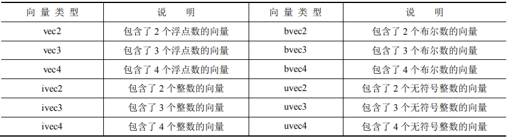
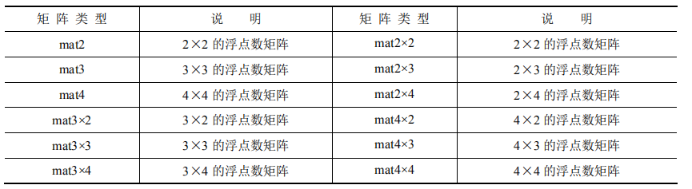
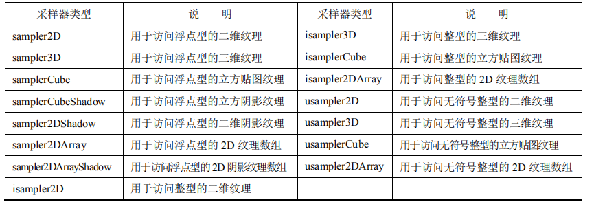
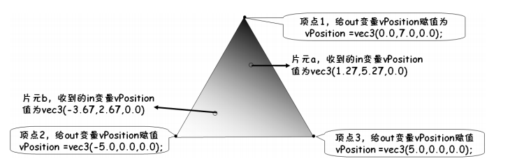
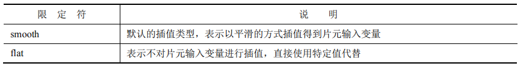
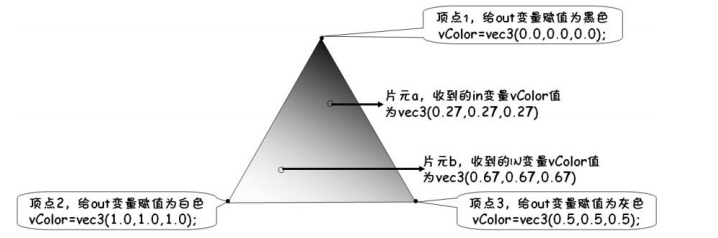
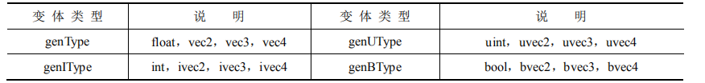

OpenGL ES 着色语言是一种高级的图形编程语言，其源自应用广泛的 C 语言，同时具有 RenderMan 以及其他着色语言的一些优良特性，易于被开发人员掌握。 

与传统通用编程语言有很大不同的是，其提供了更加丰富的原生类型，如向量、矩阵等。这 些特性的加入使得 OpenGL ES 着色语言在处理 3D 图形方面更加高效、易用。简单来说，OpenGL  ES 着色语言主要包括以下特性。

‰ OpenGL ES 着色语言是一种高级的过程语言（注意，不是面向对象）。 

‰ 对顶点着色器、片元着色器使用的是同样的语言，不做区分。 

‰ 基于 C/C++的基本语法及流程控制。 

‰ 完美支持向量与矩阵的各种操作。 

‰ 通过类型限定符来管理输入与输出。 

‰ 拥有大量的内置函数来提供丰富的功能

总之，OpenGL ES 着色语言是一种易于实现、功能强大、便于使用，并且可以高度并行处理、性能优良的高级图形编程语言。其可以帮助开发人员在不浪费大量时间的情况下，轻松地为用户带来更完美的视觉体验，开发出更加酷炫的 3D 场景与特效。

## 着色语言基础

### 数据类型

#### 1. 标量

标量也被称为“无向量”，其值只具有大小，并不具有方向。

- 布尔型 bool
- 有符号整型int 和 无符号整型 uint
- 浮点型 float

#### 2. 向量

向量可以看做是用同样类型的标量组成的，其基本类型也分为 bool、int、uint 及 float 四种。



向量在着色器代码的开发中有着十分重要的作用，可以很方便地存储以及操作颜色、位置、纹理坐标等不仅包含一个组成部分的量。开发中，有时也可能需要单独访问向量中的某个分量， 基本的语法为“<向量名>.<分量名>”，根据目的的不同，主要有如下几种用法。

- 将一个向量看作颜色时，可以使用 r、g、b、a 四个分量名，其分别代表红、绿、蓝、透明度 4 个色彩通道，具体用法如下。

  ```
  aColor.r=0.6; //给向量 aColor 的红色通道分量赋值 
  
  aColor.g=0.8; //给向量 aColor 的绿色通道分量赋值
  ```

- 将一个向量看作位置时，可以使用 x、y、z、w 四个分量名，其分别代表 x 轴、y 轴、z轴分量及 W 值，具体用法如下。

  ```
  aPosition.x=67.2; //给向量 aPosition 的 X 分量赋值 
  
  aPosition.z=48.3; //给向量 aPosition 的 Z 分量赋值
  ```

- 将一个向量看作纹理坐标时，可以使用 s、t、p、q 四个分量名，其分别代表纹理坐标的不同分量，具体用法如下。

  ```
  aTexCoor.s=0.65; //给向量 aTexCoor 的 s 分量赋值 
  
  aTexCoor.t=0.34; //给向量 aTexCoor 的 t 分量赋值
  ```

#### 3. 矩阵



OpenGL ES 着色语言中，矩阵是按列顺序组织的，也就是一个矩阵可以看作由几个列向量组成。对于矩阵的访问，可以将矩阵作为列向量的数组来访问。如 matrix 为一个 mat4，可以使用`matrix[2]`取到该矩阵的第 3 列，其为一个 vec4；也可以使用 `matrix[2][2]`取得第 3 列的向量的第 3个分量，其为一个 float；其他的依此类推。

#### 4. 采样器

采样器是着色语言中不同于 C 语言的一种特殊的基本数据类型，其专门用来进行纹理采样的相关操作。一般情况下，一个采样器变量代表一幅或一套纹理贴图。



#### 5. 结构体

使用 **struct** 关键字进行声明

```c
struct info{
   vec3 color;
   vec3 position;
   vec2 textureCoor;
}
info CubeInfo;
```

#### 6. 数组

在着色语言中，开发人员可以声明任何类型的数组。声明数组的方式主要有两种，具体如下所列。

1. 在声明数组的同时，指定数组的大小：

   ```
   vec3 position[20]; //声明了一个包含 20 个 vec3 的数组，索引从 0 开始
   ```

2. 在声明数组并初始化的同时，可以不指定数组的大小：

   ```
   float x[]=float[2](1.0,2.0); //数组的长度为 2 
   float y[]=float[](1.0,2.0,3.0); //数组的长度为 3
   ```

> OpenGL ES 3.0 的着色语言只支持一维数组的使用，不支持二维以及更多维数组 
>
> 的使用。对于这一点，请读者稍加注意。

####  7. 空类型

空类型使用 `void` 表示，仅用来声明不返回任何值的函数，比如着色器中的 main 函数就是一个返回值为 `void` 类型的函数。

### 存储限定符


限定符在使用时应该放在变量类型之前，且使用 in、uniform 以及 out 限定符修饰的变量必须为全局变量。

着色器语言中没有默认限定符的概念，因此如果有需要，必须为全局变量明确指定需要的限定符。

#### 1. in/centroid in限定符

in/centroid in 限定符修饰的全局变量又称为输入变量，其形成当前着色器与渲染管线前驱阶段的动态输入接口。输入变量的值是在着色器开始执行时，由渲染管线的前一阶段送入。在着色器程序执行过程中，变量不可以被重新赋值。in/centroid in 限定符的使用分为如下两种情况。

1. 顶点着色器的输入变量

   顶点着色器中只能使用 in 限定符来修饰全局变量，不能使用 centroid in 限定符和interpolation 限定符。

   顶点着色器中用 in 限定符修饰的变量其值实质是由宿主程序（本书中为 Java、C++）批量传入渲染管线的，管线进行基本处理后再传递给顶点着色器。数据中有多少个顶点，管线就调用多少次顶点着色器，每次将一个顶点的各种属性数据传递给顶点着色器中对应的 in 变 量。因此，顶点着色器每次执行将完成对一个顶点各项属性数据的处理。

   在顶点着色器中，in 限定符只能用来修饰浮点数标量、浮点数向量、矩阵变量以及有符号或无符号的整型标量或整型向量，不能用来修饰其他类型的变量。

   ```c
   in vec3 aPosition; //顶点位置
   in vec3 aNormal; //顶点法向量
   ```

2. 片元着色器的输入变量

   片元着色器中可以使用 in 或 centroid in 限定符来修饰全局变量，其变量用于接收来自顶点着 色器的相关数据，最典型的是接收根据顶点着色器的顶点数据插值产生的片元数据。

   ```c
   in vec3 vPosition; //接收从顶点着色器传递过来的顶点位置数据
   centroid in vec2 vTexCoord; //接收从顶点着色器传递过来的纹理坐标数据
   flat in vec3 vColor; //接收从顶点着色器传递过来的颜色数据
   ```

#### 2. uniform 限定符

uniform 为一致变量限定符，一致变量指的是对于同一组顶点组成的单个 3D 物体中所有顶点都相同的量。uniform 变量可以用在顶点着色器或片元着色器中，其支持用来修饰所有的基本数据类型。与 in 变量类似，一致变量的值也是从宿主程序传入的。

```c
uniform mat4 uMVPMatrix; //总变换矩阵
uniform mat4 uMMatrix; //基本变换矩阵
uniform vec3 uLightLocation; //光源位置
uniform vec3 uCamera; //摄像机位置
```

#### 3. out/centroid out 限定符

out/centroid out 限定符修饰的全局变量又称为输出变量，其形成当前着色器与渲染管线后继阶段的动态输出接口。通常在当前着色器程序执行完毕时，输出变量的值才被送入后继阶段进行处理。因此，不能在着色器中声明同时起到输入和输出作用的 inout 全局变量，out/centroid out 限定符的使用分为如下两种情况。

1. 顶点着色器的输出变量

   顶点着色器中可以使用 out 或 centroid out 限定符修饰全局变量，其变量用于向渲染管线后继 阶段传递当前顶点的数据。

   

   从图中可以看出，在默认情况下，首先顶点着色器在每个顶点中都对 out 变量 vPosition进行了赋值。接着在片元着色器中接收 in 变量 vPosition 的值时得到的并不是某个顶点赋的特定值，而是根据片元所在的位置及图元中各个顶点的位置进行插值计算产生的值。

   ```c
   out vec4 ambient; //环境光 out 变量
   out vec4 diffuse; //散射光 out 变量
   centroid out vec2 texCoor; //纹理坐标 out 变量
   invariant centroid out vec4 color; //颜色值 out 变量
   ```

2. 片元着色器的输出变量

   在片元着色器中只能使用 out 限定符来修饰全局变量，而不能使用 centroid out 限定符。片元着色器中的 out 变量一般指的是由片元着色器写入计算完成片元颜色值的变量，一般在片元着色器的最后都需要对其进行赋值，最后将其送入渲染管线的后继阶段进行处理。

   ```c
   out vec4 fragColor; //输出的片元颜色
   out uint luminosity;
   ```

   > 对于顶点着色器而言，一般是既声明 out 变量，又对 out 变量进行赋值用以传递给片元着色器。而片元着色器中声明 in 变量用于接收顶点着色器传过来的值即可，是不可以对 in 变量赋值的。OpenGL ES 3.0 中片元着色器内的内建输出变量gl_FragColor（此内建变量在 OpenGL ES 2.0 中几乎总要用到）不存在了，需要自己声明 out（vec4）变量，用声明的 out 变量替代 gl_FragColor 内建变量。

#### 4. const限定符

用 const 限定符修饰的变量是只读的，其值是不可以变的，也就是常量，又称为编译时常量。

### 插值限定符

插值（interpolation）限定符，其主要用于控制顶点着色器传递到片元着色器数据的插值方式。插值限定符包含 smooth、flat 两种。



1. smooth限定符

   如果顶点着色器中 out 变量之前含有 smooth 限定符或者不含有任何限定符，则传递到后继片元着色器对应的 in 变量的值，是在光栅化阶段由管线根据片元所属图元各个顶点对应的顶点着色器对此 out 变量的赋值情况，及片元与各顶点的位置关系插值产生。

   

   从图中可以看出，当顶点着色器中的 out 变量被 smooth 限定符修饰时，首先顶点着色器在每个顶点中都对 out 变量 vColor 进行了赋值，接着在片元着色器中接收 in 变量 vColor 的值时得到的并不是某个顶点赋的特定值，而是根据片元的位置及图元中各个顶点的位置与各个顶点赋值的情况进行插值计算产生的值。

   下面的代码片段给出了在顶点着色器中正确使用 smooth 限定符的情况。

   ```
   smooth out vec3 normal; // 顶点着色器 out 变量
   ```

   下面的代码片段给出了在片元着色器中正确使用 smooth 限定符的情况。

   ```
   smooth in vec3 normal; //片元着色器 in 变量
   ```

2. flat 限定符

   如果顶点着色器中 out 变量之前含有 flat 限定符，则传递到后继片元着色器中对应的 in 变量的值不是在光栅化阶段插值产生的，一般是由图元的最后一个顶点对应的顶点着色器对此 out 变量所赋的值决定的。此时，图元中每个片元的此项值均相同。

   下面的代码片段给出了在顶点着色器中正确使用 flat 限定符的情况。

   ```
   flat out vec4 vColor; //用于传递给片元着色器的变量
   ```

   下面的代码片段给出了在片元着色器中正确使用 flat 限定符的情况。

   ```
   flat in vec4 vColor; //用于接收来自顶点着色器的变量
   ```

### 一致块

多个一致变量的声明可以通过类似结构体形式的接口块实现，该形式的接口块又称为一致块（uniform block）。一致块的数据是通过缓冲对象送入渲染管线的，以一致块的形式批量传送数据比单个传送效率高，其基本语法为：

```
[<layout 限定符>] uniform 一致块名称 {<成员变量列表>} [<实例名>]
```

下面的代码片段给出了一致块在顶点着色器中的正确使用。

```
uniform Transform{            //声明一个 uniform 接口块
  float radius;               //半径成员
  mat4 modelViewMatrix;       //矩阵成员
  uniform mat3 normalMatrix;  //矩阵成员
} block_Transform;
```

### layout限定符

layout 限定符是从 OpenGL ES 3.0 开始出现的，其主要用于设置变量的存储索引（即引用）值，声明有几种不同的形式。 

- 其可以作为接口块定义的一部分或者接口块的成员。

- 其也可以仅仅修饰 uniform，用于建立其他一致变量声明的参照，语法如下。

  ```
  <layout 限定符> uniform
  ```

  

- 其还可以用于修饰被接口限定符修饰的单独变量，语法如下。

  ```
  <layout 限定符> <接口限定符> <变量声明>
  ```

接口限定符有 in、out、uniform 三种选择，layout 限定符修饰接口限定符的内容将在下面进行介绍，具体内容如下。

1. layout 输入限定符

   顶点着色器允许 layout 输入限定符修饰输入变量的声明。下面的代码片段说明了这种形式的声明。

   ```
   layout (location=0) in vec3 aPosition; // aPosition 输入变量的引用值为 0 
   layout (location=1) in vec4 aColor; // aColor 输入变量的引用值为 1
   ```

2. layout 输出限定符

   片元着色器中，layout 限定符通过 location 值将输出变量和指定编号的绘制缓冲绑定起来。每一个输出变量的索引（引用）值都会对应到一个相应编号的绘制缓冲，而这个输出变量的值将写入相应缓冲。

   ```
   layout (location=0) out vec4 fragColor; //此输出变量写入到 0 号绘制缓冲
   layout (location=1) out vec4 colors[2]; //此输出变量写入到 1 号绘制缓冲
   ```

   顶点着色器不允许有 layout 输出限定符。

## 特殊的内建函数

### 顶点着色器中的内建函数

1. 内建输入变量

   顶点着色器中的内建输入变量主要有 **gl_VertexID** 以及**gl_InstanceID**。这两个变量分别为顶点整数索引和实例 ID，都只在顶点着色器中使用，其具体含义如下。

   - gl_VertexID

     gl_VertexID 是顶点着色器的一个内建输入变量，类型为“highp int”，主要用来记录顶点的整数索引。

   - gl_InstanceID

     gl_InstanceID 是顶点着色器的另一个内建输入变量，类型为“highp int”，其用来记录采用实例绘制时当前图元对应的实例号。如果当前图元不是来自于实例绘制，则 gl_InstanceID 的值为 0。

2. 内建输出变量

   顶点着色器中的内建输出变量主要有 **gl_Position** 和 **gl_PointSize**。这两个变量分别用来存放处理后顶点的位置和顶点的大小，都只能在顶点着色器中使用

### 片元着色器中的内建变量

片元着色器的内建变量分为输入和输出变量，其中输入变量包括 gl_FragCoord、gl_FrontFacing和 gl_PointCoord。输出变量包括 gl_FragDepth，其值为片元深度值.


## 内置函数

与其他高级语言类似，为了方便开发，OpenGL ES 着色语言中也ᨀ供了很多的内置函数。这些函数大都已经被重载，一般具有 4 种变体，分别用来接收和返回 genType、genIType、genUType和 genBType 类型的值。



## 用 invariant 修饰符避免值变问题

值变问题是指在同样的着色器程序多次运行时，同一个表达式在同样输入值的情况下多次运行，结果不精确一致的现象。在大部分情况下，这并不影响最终效果的正确性。 

如果在某些特定情况下需要避免值变问题，可以用 invariant 修饰符来修饰变量。采用 invariant修饰符修饰变量主要有如下两种方式。

（1）在声明变量时加上 invariant 修饰符，具体情况参考如下代码。

```
invariant out vec3 color;
```


（2）对已经声明的变量补充使用 invariant 修饰符进行修饰，具体情况参考如下代码。

```
out vec3 color; 
invariant color;
```

需要注意的是，并不是所有的变量都可以用 invariant 修饰符修饰，只有符合如下几种情况的变量可以用 invariant 修饰符修饰。 

‰ 顶点着色器中的内建输出变量，如 gl_Position。 

‰ 顶点着色器中声明的以 out 修饰符修饰的变量。 

‰ 片元着色器中内建的输出变量。 

‰ 片元着色器中声明的以 out 修饰符修饰的变量。

另外一点就是，在使用时要注意，invariant 修饰符要放在其他的修饰符之前。同时，invariant修饰符只能用来修饰全局变量。


本文摘抄自《OpenGL ES 3.x 游戏开发》上卷