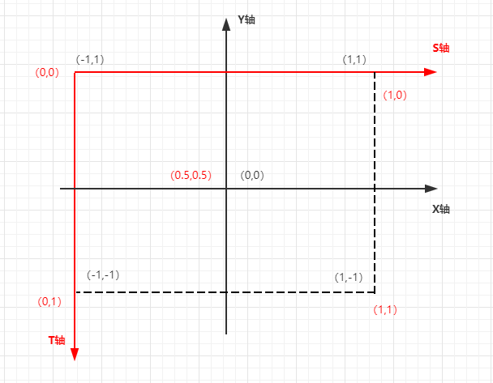

本篇博客了解一下2D纹理，并完成一个绘制显示一张图片的Renderer。

### 2D纹理

2D纹理是OpenGL ES中最基本和常用的纹理形式。2D纹理本质上其实：`是一个图像数据的二维数组`。一个纹理的单独数据元素称作`"纹素(Texel,texture pixels)纹理像素简写"`。用2D纹理渲染时，纹理坐标用作纹理图像中的索引。2D纹理的纹理坐标用一对2D坐标`(s,t)`指定，有时也 称作`(u,v)`坐标。

纹理坐标在x和y轴上，范围为0到1之间（注意我们使用的是2D纹理图像）。使用纹理坐标获取纹理颜色叫做采样(Sampling)。纹理坐标起始于(0, 0)，也就是纹理图片的左下角，终始于(1, 1)，即纹理图片的右上角。下面的图片展示了我们是如何把纹理坐标映射到三角形上的。


我们为三角形指定了3个纹理坐标点。如上图所示，我们希望三角形的左下角对应纹理的左下角，因此我们把三角形左下角顶点的纹理坐标设置为(0, 0)；三角形的上顶点对应于图片的上中位置所以我们把它的纹理坐标设置为(0.5, 1.0)；同理右下方的顶点设置为(1, 0)。我们只要给顶点着色器传递这三个纹理坐标就行了，接下来它们会被传片段着色器中，它会为每个片段进行纹理坐标的插值。

纹理坐标看起来就像这样：

```
float texCoords[] = {
    0.0f, 0.0f, // 左下角
    1.0f, 0.0f, // 右下角
    0.5f, 1.0f // 上中
};
```

对纹理采样的解释非常宽松，它可以采用几种不同的插值方式。所以我们需要自己告诉OpenGL该怎样对纹理**采样**。

#### 纹理环绕方式

纹理坐标的范围通常是从(0, 0)到(1, 1)，那如果我们把纹理坐标设置在范围之外会发生什么？OpenGL默认的行为是重复这个纹理图像（我们基本上忽略浮点纹理坐标的整数部分），但OpenGL提供了更多的选择：

| 环绕方式           | 描述                                                         |
| :----------------- | :----------------------------------------------------------- |
| GL_REPEAT          | 对纹理的默认行为。重复纹理图像。                             |
| GL_MIRRORED_REPEAT | 和GL_REPEAT一样，但每次重复图片是镜像放置的。                |
| GL_CLAMP_TO_EDGE   | 纹理坐标会被约束在0到1之间，超出的部分会重复纹理坐标的边缘，产生一种边缘被拉伸的效果。 |
| GL_CLAMP_TO_BORDER | 超出的坐标为用户指定的边缘颜色。                             |


前面提到的每个选项都可以使用glTexParameter*函数对单独的一个坐标轴设置（`s`、`t`（如果是使用3D纹理那么还有一个`r`）它们和`x`、`y`、`z`是等价的）：

```
glTexParameteri(GL_TEXTURE_2D, GL_TEXTURE_WRAP_S, GL_MIRRORED_REPEAT);
glTexParameteri(GL_TEXTURE_2D, GL_TEXTURE_WRAP_T, GL_MIRRORED_REPEAT);
```

第一个参数指定了纹理目标；我们使用的是2D纹理，因此纹理目标是GL_TEXTURE_2D。第二个参数需要我们指定设置的选项与应用的纹理轴。我们打算配置的是`WRAP`选项，并且指定`S`和`T`轴。最后一个参数需要我们传递一个环绕方式(Wrapping)，在这个例子中OpenGL会给当前激活的纹理设定纹理环绕方式为GL_MIRRORED_REPEAT。

#### 纹理过滤

纹理坐标不依赖于分辨率(Resolution)，它可以是任意浮点值，所以OpenGL需要知道怎样将纹理像素映射到纹理坐标。当你有一个很大的物体但是纹理的分辨率很低的时候这就变得很重要了。你可能已经猜到了，OpenGL也有对于纹理过滤(Texture Filtering)的选项。纹理过滤有很多个选项，但是现在我们只讨论最重要的两种：GL_NEAREST和GL_LINEAR。

GL_NEAREST（也叫邻近过滤，Nearest Neighbor Filtering）是OpenGL默认的纹理过滤方式。当设置为GL_NEAREST的时候，OpenGL会选择中心点最接近纹理坐标的那个像素。下图中你可以看到四个像素，加号代表纹理坐标。左上角那个纹理像素的中心距离纹理坐标最近，所以它会被选择为样本颜色：


GL_LINEAR（也叫线性过滤，(Bi)linear Filtering）它会基于纹理坐标附近的纹理像素，计算出一个插值，近似出这些纹理像素之间的颜色。一个纹理像素的中心距离纹理坐标越近，那么这个纹理像素的颜色对最终的样本颜色的贡献越大。下图中你可以看到返回的颜色是邻近像素的混合色：


那么这两种纹理过滤方式有怎样的视觉效果呢？让我们看看在一个很大的物体上应用一张低分辨率的纹理会发生什么吧（纹理被放大了，每个纹理像素都能看到）：


GL_NEAREST产生了颗粒状的图案，我们能够清晰看到组成纹理的像素，而GL_LINEAR能够产生更平滑的图案，很难看出单个的纹理像素。GL_LINEAR可以产生更真实的输出，但有些开发者更喜欢8-bit风格，所以他们会用GL_NEAREST选项。

#### 多级渐远纹理

想象一下，假设我们有一个包含着上千物体的大房间，每个物体上都有纹理。有些物体会很远，但其纹理会拥有与近处物体同样高的分辨率。由于远处的物体可能只产生很少的片段，OpenGL从高分辨率纹理中为这些片段获取正确的颜色值就很困难，因为它需要对一个跨过纹理很大部分的片段只拾取一个纹理颜色。在小物体上这会产生不真实的感觉，更不用说对它们使用高分辨率纹理浪费内存的问题了。

OpenGL使用一种叫做多级渐远纹理(Mipmap)的概念来解决这个问题，它简单来说就是一系列的纹理图像，后一个纹理图像是前一个的二分之一。多级渐远纹理背后的理念很简单：距观察者的距离超过一定的阈值，OpenGL会使用不同的多级渐远纹理，即最适合物体的距离的那个。由于距离远，解析度不高也不会被用户注意到。同时，多级渐远纹理另一加分之处是它的性能非常好。让我们看一下多级渐远纹理是什么样子的：


手工为每个纹理图像创建一系列多级渐远纹理很麻烦，幸好OpenGL有一个glGenerateMipmaps函数，在创建完一个纹理后调用它OpenGL就会承担接下来的所有工作了。

| 过滤方式                  | 描述                                                         |
| :------------------------ | :----------------------------------------------------------- |
| GL_NEAREST_MIPMAP_NEAREST | 使用最邻近的多级渐远纹理来匹配像素大小，并使用邻近插值进行纹理采样 |
| GL_LINEAR_MIPMAP_NEAREST  | 使用最邻近的多级渐远纹理级别，并使用线性插值进行采样         |
| GL_NEAREST_MIPMAP_LINEAR  | 在两个最匹配像素大小的多级渐远纹理之间进行线性插值，使用邻近插值进行采样 |
| GL_LINEAR_MIPMAP_LINEAR   | 在两个邻近的多级渐远纹理之间使用线性插值，并使用线性插值进行采样 |

就像纹理过滤一样，我们可以使用glTexParameteri将过滤方式设置为前面四种提到的方法之一：

```
glTexParameteri(GL_TEXTURE_2D, GL_TEXTURE_MIN_FILTER, GL_LINEAR_MIPMAP_LINEAR);
glTexParameteri(GL_TEXTURE_2D, GL_TEXTURE_MAG_FILTER, GL_LINEAR);
```

### 代码实现

首先，定义顶点坐标和纹理坐标

```Java
/**
 * 顶点坐标
 * (x,y,z)
 */
private float[] POSITION_VERTEX = new float[]{
        0f, 0f, 0f,     //顶点坐标V0
        1f, 1f, 0f,     //顶点坐标V1
        -1f, 1f, 0f,    //顶点坐标V2
        -1f, -1f, 0f,   //顶点坐标V3
        1f, -1f, 0f     //顶点坐标V4
};

/**
 * 纹理坐标
 * (s,t)
 */
private static final float[] TEX_VERTEX = {
        0.5f, 0.5f, //纹理坐标V0
        1f, 0f,     //纹理坐标V1
        0f, 0f,     //纹理坐标V2
        0f, 1.0f,   //纹理坐标V3
        1f, 1.0f    //纹理坐标V4
};
```

这里顶点坐标和纹理坐标是一一对应的，只是因为二者坐标原点不同，坐标值也不同，如下图。



```java
/**
 * 索引，最终绘制时通过索引从顶点数据中取出对应顶点，再按照指定的方式进行绘制
 */
private static final short[] VERTEX_INDEX = {
        0, 1, 2,  //V0,V1,V2 三个顶点组成一个三角形
        0, 2, 3,  //V0,V2,V3 三个顶点组成一个三角形
        0, 3, 4,  //V0,V3,V4 三个顶点组成一个三角形
        0, 4, 1   //V0,V4,V1 三个顶点组成一个三角形
};
```


```Java
/**
 * 顶点着色器
 */
private String vertextShader =
                "#version 300 es\n" +
                "layout (location = 0) in vec4 vPosition;\n" +
                "layout (location = 1) in vec2 aTextureCoord;\n" +
                "//矩阵\n" +
                "uniform mat4 u_Matrix;\n"+
                "//输出纹理坐标(s,t)\n" +
                "out vec2 vTexCoord;\n" +
                "void main() { \n" +
                "     gl_Position  = u_Matrix * vPosition;\n" +
                "     gl_PointSize = 10.0;\n" +
                "     vTexCoord = aTextureCoord;\n" +
                "}\n";


```

片段着色器应该接下来会把输出变量`vTexCoord`作为输入变量。

片段着色器也应该能访问纹理对象，但是我们怎样能把纹理对象传给片段着色器呢？GLSL有一个供纹理对象使用的内建数据类型，叫做采样器(Sampler)，它以纹理类型作为后缀，比如`sampler1D`、`sampler3D`，或在我们的例子中的`sampler2D`。我们可以简单声明一个`uniform sampler2D`把一个纹理添加到片段着色器中，稍后我们会把纹理赋值给这个uniform。

```Java
/**
 * 片段着色器
 */
private String fragmentShader =
                "#version 300 es\n" +
                "precision mediump float;\n" +
                "uniform sampler2D uTextureUnit;\n" +
                "//接收刚才顶点着色器传入的纹理坐标(s,t)\n" +
                "in vec2 vTexCoord;\n" +
                "out vec4 vFragColor;\n" +
                "void main() {\n" +
                "     vFragColor = texture(uTextureUnit,vTexCoord);\n" +
                "}\n";
```

我们使用GLSL内建的texture函数来采样纹理的颜色，它第一个参数是纹理采样器，第二个参数是对应的纹理坐标。texture函数会使用之前设置的纹理参数对相应的颜色值进行采样。这个片段着色器的输出就是纹理的（插值）纹理坐标上的(过滤后的)颜色。

```Java
public static int loadTexture(Context context, int resourceId) {
    final int[] textureIds = new int[1];
    //创建一个纹理对象
    GLES30.glGenTextures(1, textureIds, 0);
    if (textureIds[0] == 0) {
        Log.e(TAG, "Could not generate a new OpenGL textureId object.");
        return 0;
    }
    final BitmapFactory.Options options = new BitmapFactory.Options();
    //这里需要加载原图未经缩放的数据
    options.inScaled = false;
    final Bitmap bitmap = BitmapFactory.decodeResource(context.getResources(), resourceId, options);
    if (bitmap == null) {
        Log.e(TAG, "Resource ID " + resourceId + " could not be decoded.");
        GLES30.glDeleteTextures(1, textureIds, 0);
        return 0;
    }
    // 绑定纹理到OpenGL
    GLES30.glBindTexture(GLES30.GL_TEXTURE_2D, textureIds[0]);

    //设置默认的纹理过滤参数
    GLES30.glTexParameteri(GLES30.GL_TEXTURE_2D, GLES30.GL_TEXTURE_MIN_FILTER, GLES30.GL_LINEAR_MIPMAP_LINEAR);
    GLES30.glTexParameteri(GLES30.GL_TEXTURE_2D, GLES30.GL_TEXTURE_MAG_FILTER, GLES30.GL_LINEAR);

    // 加载bitmap到纹理中
    GLUtils.texImage2D(GLES30.GL_TEXTURE_2D, 0, bitmap, 0);

    // 生成MIP贴图
    GLES30.glGenerateMipmap(GLES30.GL_TEXTURE_2D);

    // 数据如果已经被加载进OpenGL,则可以回收该bitmap
    bitmap.recycle();

    // 取消绑定纹理
    GLES30.glBindTexture(GLES30.GL_TEXTURE_2D, 0);

    return textureIds[0];
}
```

最终展示：

