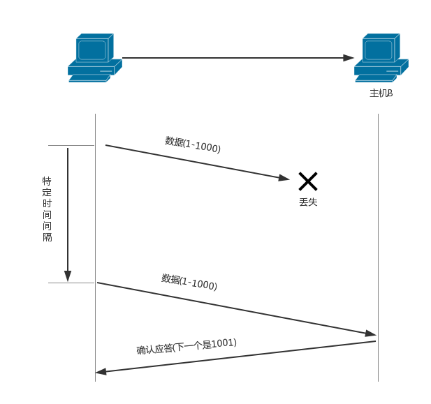
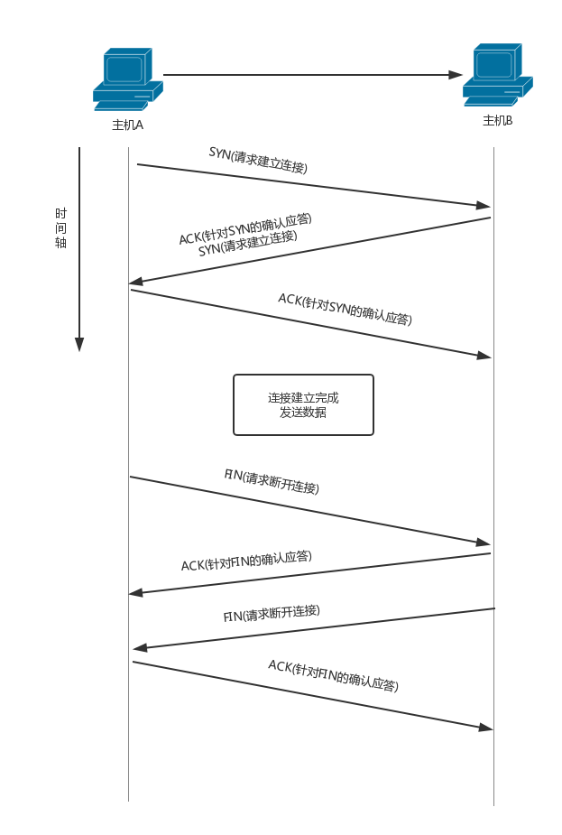
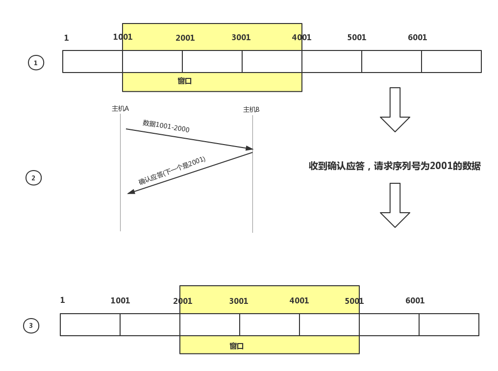

TCP通过检验和、序列号、确认应答、重发控制、连接管理以及窗口控制等机制实现可靠性传输。

## 通过序列号与确认应答提高可靠性
TCP通过肯定的**确认应答(ACK)**实现可靠的数据传输。当发送端将数据发出后会等待对端的确认应答。如果有确认应答，说明数据已经成功到达对端。反之，则数据丢失的可能性很大。

没有收到确认应答并不意味着数据一定丢失。也又可能是对方已经收到了数据，只是返回的确认应答在途中丢失。这种情况也会导致发送端没有收到确认应答而认为数据没有到达目的地，最终重发数据。

主机B已经收到了1-1000的数据，再有相同的数据到达时会丢弃相同数据。

有很多因素会导致确认应答延迟到达，源发送主机只要按照重发机制重发数据即可。但对于目标主机来说，这是一种“灾难”。它会反复收到相同的数据。而为了对上层应用提供可靠的传输，必须得放弃重复的数据包。因此就要使用一种能够识别是否已经接收数据，又能判断是否需要接收的机制。

上述这些确认应答、重发机制以及重复控制等功能都可以通过序列号实现。**序列号**是按顺序给发送的数据的每一个字节(8位字节)都标上号码的编号。接收端查询接收数据TCP首部中的序列号和数据的长度，将自己下一步应该接收的序号作为确认应答返送回去。就这样，通过序列号和确认应答号，TCP就可以实现可靠传输。

> 序列号的初始值并非为0。而是在建立连接后由随机数生成。而后的计算则是对每一字节加一。

## 重发超时的确定

重发超时是指在重发数据之前，等待确认应答到来的那个特定时间。如果超过了这个时间仍未收到确认应答，发送端将进行数据重发。

在Unix以及Windows系统中，超时都是以0.5秒为单位进行控制，因此重发超时都是0.5的整数倍。由于最初的数据包还不知道往返时间，所以其重发超时一般设置在6秒左右。

数据重发之后若还是收不到确认应答，则进行再次发送。此时，等待应答的时间将会以2倍、4倍的指数函数延长。

此外，数据也不会无限、反复地重发。达到一定重发次数之后，如果仍然没有任何确认应答返回，就会判断为网络或对端主机发生异常，强制关闭连接。并且通知应用通信异常强行终止。

## 连接管理(三次握手四次挥手)

TCP提供面向有连接的通信传输。面向有连接是指在数据通信开始之前先做好通信两端之间的准备工作。

TCP在数据通信之前，通过TCP首部发送一个SYN包作为建立连接的请求等待确认应答。如果对端发来确认应答，则认为可以进行数据通信。如果对端的确认应答未能到达，就不会进行数据通信。此外，在通信结束时会进行断开连接的处理(FIN包)。

## TCP以段发送数据

在建立TCP连接的同时，也可以确定发送数据包的单位，称其为**“最大消息长度”(MSS)**。最理想的情况是IP中不被分片处理的最大数据长度。

TCP在传输大量数据时，是以MSS的大小将数据进行分割发送。进行重发时也是以MSS为单位。(在上面的两张图中，传输数据都是1-1000，表示MSS的大小为1000)

MSS是在三次握手的时候，在两端主机之间被计算得出。两端的主机在发出建立连接的请求时，会在TCP首部中写入MSS选项，告诉对方自己的接口能够适应的MSS的大小。然后会在两者之间选择一个较小的值投入使用。

## 利用窗口控制提高速度

TCP以一个段为单位，每发一个段进行一次确认应答的处理。这样的传输方式有一个缺点。那就是包的往返时间越长通信性能就越低。

为了解决这个问题，TCP引入了窗口这个概念。即时在往返时间较长的情况下，它也能控制网络性能的下降。

如图所示，确认应答不再是以每个分段，而是以更大的单位进行确认时，转发时间将被大幅度缩短。也就是说，发送端主机在发送了一个段以后不必一直等待确认应答，而是继续发送。

**窗口大小**就是指无需等待确认应答而可以继续发送数据的最大值。上图中窗口大小为3个段。

如下图所示，黄色部分表示窗口。这个窗口中的数据即便没有收到应答确认也可以被发送出去。不过，在整个窗口的确认应答没有到达之前，如果其中部分数据出现丢包，那么发送端仍然需要重传。在收到确认应答的情况下，将窗口滑动到确认应答中的序列号的位置。这样可以顺序得将多个段同时发送提高通信性能。这种机制也被称为窗口滑动机制。

## 窗口控制与重发控制

在使用窗口控制中，如果出现段丢失该怎么办？

首先考虑确认应答未能返回的情况。在这种情况下，数据已经到达对端，是不需要进行重发的。使用了窗口机制，某些确认应答即便丢失也无需重发。可以通过下一个确认应答进行确认。

在来考虑一下某个报文段丢失的情况，如下图所示，接收主机如果收到一个自己应该接收的序号以外的数据时，会针对当前为止收到数据返回确认应答。当一段报文段丢失后，发送端回一直收到序号为1001的确认应答，这个确认应答好像在提醒发送端“我想接受的是1001开始的数据”。因此，在窗口比较大，又出现报文段丢失的情况下，同一个序号的确认应答将会被重复不断的返回。而发送端主机如果连续三次接收到同一个确认应答，就会将其对应的数据进行重发。这种机制比之前提到的超时管理更加高效，因此也被称为**高速重发控制**。

## 流控制(窗口大小)
发送端根据自己的实际情况发送数据。但是，接收端可能收到的是一个毫无关系的数据包又可能会在处理其他问题上花费一些时间。因此在为这个数据包做其他处理时会耗费一些时间，甚至在高负荷的情况下无法接收任何数据。如此一来，如果接收端将本应该接收的数据丢弃的话，就又会触发重发机制，导致网络流量的无端浪费。

TCP提供一种机制可以让发送端根据接收端的实际接收能力控制发送数据的数量。这就是流控制。具体操作就是接收端主机向发送端主机通知自己可以接收数据的大小，于是发送端会发送不超过这个限度的数据。该大小限度就被称作窗口大小。

TCP首部中，专门有一个字段用来通知窗口大小。接收主机将自己可以接收的缓冲区大小放入到这个字段中通知给发送端。这个字段的值越大，说明网络的吞吐量越大。当接收端的这个缓冲区一旦面临数据溢出时，窗口大小的值也会随之被设置成一个更小的值发送给发送端，从而控制数据发送量。

## 拥塞控制

有了TCP的窗口控制，收发主机之间即使不再以一个数据段为单位发送确认应答，也能够连续发送大量数据包。然而，如果在通信刚开始的时候就发送大量数据，也可能会引发其他问题。

一般来说，计算机网络都处在一个共享的环境。因此也有可能会因为其他主机之间的通信使得网络拥堵。在网络出现拥堵时，如果突然发送一个较大量的数据，极有可能导致整个网络的瘫痪。

TCP为了防止该问题的出现，在通信一开始的时候就会通过一个叫做慢启动的算法得出的数值，对发送数据量进行控制。

首先为了在发送端调节所要发送数据的量，定义了一个叫做“拥塞窗口”的概念。于是在慢启动的时候，将这个拥塞窗口的大小设置为1个数据段(1MSS)发送数据。之后每收到一次确认应答，拥塞窗口的值就加1。在发送数据包时，将拥塞窗口的大小与接收端主机通知的窗口大小做比较，然后按照它们当中较小的那个值，发送比其还小的数据量。
