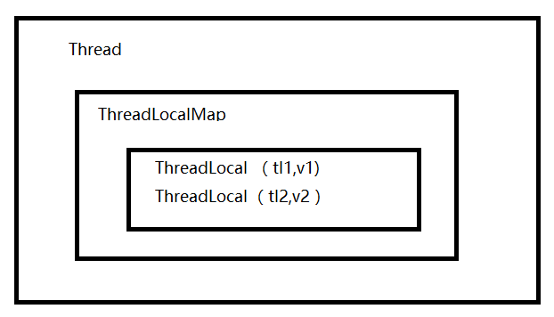

在面试中，ThreadLocal是一个经常会被问到的知识点，所以今天就好好分析一下它的实现原理。(基于JDK1.8)

## 什么是ThreadLocal

ThreadLocal是一个数据结构，类似于HashMap，可以保存key:value键值对，但是一个ThreadLocal只能保存一个，并且各个线程之间的数据互不干扰。

看下它的`set(T value)`和`get()`方法的源码

```
   public void set(T value) {
        Thread t = Thread.currentThread();
        ThreadLocalMap map = getMap(t);
        if (map != null)
            map.set(this, value);
        else
            createMap(t, value);
    }
    
    
    
    public T get() {
        Thread t = Thread.currentThread();
        ThreadLocalMap map = getMap(t);
        if (map != null) {
            ThreadLocalMap.Entry e = map.getEntry(this);
            if (e != null) {
                @SuppressWarnings("unchecked")
                T result = (T)e.value;
                return result;
            }
        }
        return setInitialValue();
    }
    
    ThreadLocalMap getMap(Thread t) {
       return t.threadLocals;
    }

```

可以看到每个线程中都会有一个`ThreadLocal`数据结构，set方法是将值保存到当前线程中的`threadLocals`变量中，get方法是从当前线程中的`threadLocals`变量中获取。所以对于线程1中的数据在线程2中是无法访问的，保证了线程之间的互不干扰。

那接下来就看其中的关键类`ThreadLocalMap`是什么了。

## ThreadLocalMap


ThreadLocalMap是ThreadLocal的一个静态内部类。它也是Thread类的一个属性。

```
  static class ThreadLocalMap {
  
       static class Entry extends WeakReference<ThreadLocal<?>> {
            Object value;

            Entry(ThreadLocal<?> k, Object v) {
                super(k);
                value = v;
            }
        }
        
        
        /**
         * 初始化大小，必须是二的幂.
         */
        private static final int INITIAL_CAPACITY = 16;

        /**
         * The table, resized as necessary.
         * table.length MUST always be a power of two.
         */
        private Entry[] table;

        /**
         * The number of entries in the table.
         */
        private int size = 0;

        /**
         * The next size value at which to resize.
         */
        private int threshold; // Default to 0
 
               
	    ThreadLocalMap(ThreadLocal<?> firstKey, Object firstValue) {
            table = new Entry[INITIAL_CAPACITY];
            int i = firstKey.threadLocalHashCode & (INITIAL_CAPACITY - 1);
            table[i] = new Entry(firstKey, firstValue);
            size = 1;
            setThreshold(INITIAL_CAPACITY);
        }
}
```
在ThreadLocal中，初始化了一个大小为16的Entry数组，Entry对象用来保存key-value键值对，只不过在这里key永远都是ThreadLocal对象(`map.set(this, value);`)。

Entry继承的是WeakReference，并且Entry中没有next字段，所以不会形成链表。


Thread、ThreadLocal和ThreadLocalMap的关系



### set

```
private void set(ThreadLocal<?> key, Object value) {
    Entry[] tab = table;
    int len = tab.length;
    int i = key.threadLocalHashCode & (len-1);

    for (Entry e = tab[i];
         e != null;
         e = tab[i = nextIndex(i, len)]) {
        ThreadLocal<?> k = e.get();

        if (k == key) {
            e.value = value;
            return;
        }

        if (k == null) {
            replaceStaleEntry(key, value, i);
            return;
        }
    }

    tab[i] = new Entry(key, value);
    int sz = ++size;
    if (!cleanSomeSlots(i, sz) && sz >= threshold)
        rehash();
}

```

## 内存泄漏

由于Entry是继承WeakReference，这就导致了在ThreadLocal没有外部强引用时，发生GC时就会被回收，如果创建ThreadLocal的线程一直持续运行，那么这个Entry对象中的value就有可能一直得不到回收，发生内存泄露。

### 如何避免内存泄露


remove方法，如果使用ThreadLocal的set方法之后，没有显示的调用remove方法，就有可能发生内存泄露，所以养成良好的编程习惯十分重要，使用完ThreadLocal之后，记得调用remove方法。

```
ThreadLocal<String> localName = new ThreadLocal();
try {
    localName.set("哈哈");
} finally {
    localName.remove();
}
```