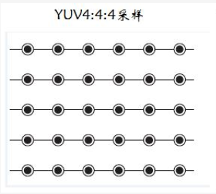

最近在准备做Android Camera2相关应用，刚好也碰上了YUV格式相关的问题，所以还是写一篇博客理解YUV格式数据。

## 介绍

*YUV*是一种颜色空间，基于*YUV*的颜色编码是流媒体的常用编码方式。

*YUV*是编译true-color颜色空间（color space）的种类，Y'UV, YUV, YCbCr，YPbPr等专有名词都可以称为*YUV*，彼此有重叠。**“Y”表示明亮度（Luminance、Luma），“U”和“V”则是色度、浓度（Chrominance、Chroma）**，Y′UV, YUV, YCbCr, YPbPr所指涉的范围，常有混淆或重叠的情况。

YUV格式有两大类：planar和packed。

- 平面格式（planar formats） ：对于planar的YUV格式，先连续存储所有像素点的Y，紧接着存储所有像素点的U，随后是所有像素点的V，如 YYYY YYYY UU VV。
- 紧缩格式（packed formats）：对于packed的YUV格式，每个像素点的Y,U,V是连续交替存储的，如YUV YUV YUV YUV，这种排列方式跟 RGB 很类似。

## 历史

Y'UV的发明是由于彩色电视与黑白电视的过渡时期。黑白视频只有Y（Luma，Luminance）视频，也就是灰阶值。到了彩色电视规格的制定，是以YUV/[YIQ](https://zh.wikipedia.org/wiki/YIQ)的格式来处理彩色电视图像，把UV视作表示彩度的C（Chrominance或Chroma），如果忽略C信号，那么剩下的Y（Luma）信号就跟之前的黑白电视频号相同，这样一来便解决彩色电视机与黑白电视机的兼容问题。Y'UV最大的优点在于只需占用极少的带宽。

因为UV分别代表不同颜色信号，所以直接使用R与B信号表示色度的UV。 也就是说UV信号告诉了电视要偏移某象素的的颜色，而不改变其亮度。 或者UV信号告诉了显示器使得某个颜色亮度依某个基准偏移。 UV的值越高，代表该像素会有更饱和的颜色。

彩色图像记录的格式，常见的有RGB、YUV、CMYK等。彩色电视最早的构想是使用RGB三原色来同时传输。这种设计方式是原来黑白带宽的3倍，在当时并不是很好的设计。RGB诉求于人眼对色彩的感应，YUV则着重于视觉对于亮度的敏感程度，Y代表的是亮度，UV代表的是彩度（因此黑白电影可省略UV，相近于RGB），分别用Cr和Cb来表示，因此YUV的记录通常以Y:UV的格式呈现。

将一张图片的Y、U、V数据单独显示就会如下图所示：

## 常见YUV格式

YUV的存储格式其实与其采样的方式密切相关，主流的采样方式有三种，YUV4:4:4，YUV4:2:2，YUV4:2:0。
$$
以黑点表示采样该像素点的Y分量，以空心圆圈表示采用该像素点的UV分量
$$

### YUV444

4:4:4表示完全取样，每个像素点都采样单独的 YUV 分量信息，包含了最全面的 YUV 信息。

### YUV422

在 YUV444 编码的基础上采用 2 * 1 的矩阵进行二次取样，也就是在水平方向上隔一列采样一次 UV 信息，在垂直方向上进行完全取样，每两个Y共用一组UV分量。

- YUYV格式

  字节排列 : YUYV YUYV YUYV YUYV

- UYVY 格式 

  字节排列 : UYVY UYVY UYVY UYVY

- YUV422P格式 

  字节排列 :YYYY YYYY UUUU VVVV

### YUV420

解决 YUV444 占用空间过大问题，也是最常用的采样格式。在 YUV444 格式的基础上使用 2 * 2 矩阵对像素点进行二次取样，4 个像素点具有单独 Y 分量且共享同一个 UV 信息，总 6 字节。一帧图像占用总空间 (W * H + W * H / 2) bytes，比 YUV444 少一半空间。

- I420格式
  字节排列 YYYY YYYY UU VV，全部都是平面型排列
- NV21格式
  字节排列 YYYY YYYY UV UV，Y 平面和 UV 平面， UV 内部是紧凑型
- YV12格式
  字节排列 YYYY YYYY VV UU，平面型，V 在 U 前面

更多YUV格式参看：[V4L2文档翻译（十）](https://blog.csdn.net/airk000/article/details/25032901)

### 4 ：2： 2 和4：2：0 转换

最简单的方式：

YUV4:2:2 ---> YUV4:2:0  Y不变，将U和V信号值在行(垂直方向)在进行一次隔行抽样

 YUV4:2:0 ---> YUV4:2:2  Y不变，将U和V信号值的每一行分别拷贝一份形成连续两行数据

## YUV_420_888

YUV_420_888是在Android Camera2直播开发中遇到的一个Android内部的YUV格式，当时也是在这个格式上面纠结好久，直播的视频流想用YUV420P格式的数据，但却不清楚这个YUV_420_888到底对应的是NV21或者YUV420P还是其他，网上对这个格式的讲解也比较少。在搜索一番之后终于搞定，在这里记录一下。

下面这两篇博客介绍了YUV_420_888以及如何解析，讲的很清晰，这里还是不自己去写了。

[android camera2 拿到的yuv420数据到底是什么样的？](https://link.juejin.im/?target=https%3A%2F%2Fblog.csdn.net%2Fj12345678901%2Farticle%2Fdetails%2F78110640)

[Android: Image类浅析(结合YUV_420_888)](https://link.juejin.im/?target=https%3A%2F%2Fwww.polarxiong.com%2Farchives%2FAndroid-Image%25E7%25B1%25BB%25E6%25B5%2585%25E6%259E%2590-%25E7%25BB%2593%25E5%2590%2588YUV_420_888.html)