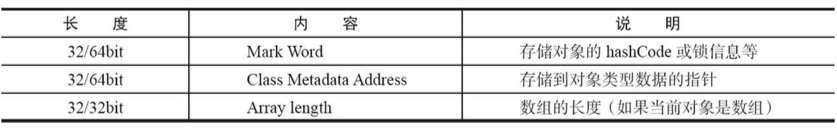
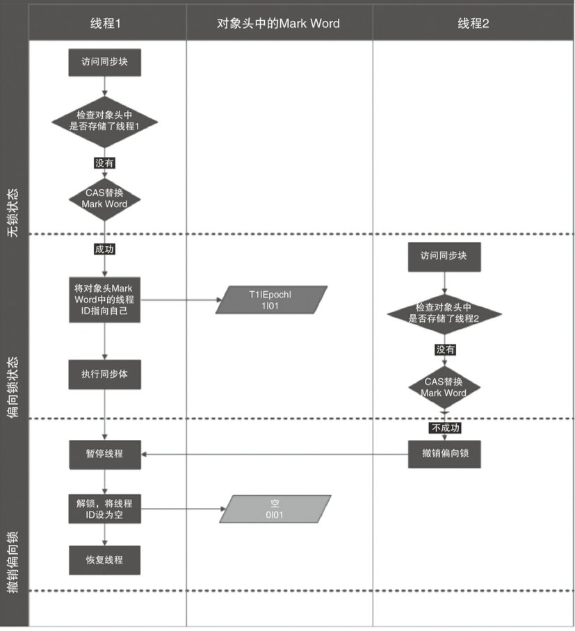

在java中每一个对象都可以作为锁：

1. 对于普通方法，锁是当前实例对象
2. 对于静态同步方法，锁是当前类的class对象
3. 对于同步方法，锁是synchronized括号里配置的对象。


## synchronized实现原理
JVM是基于进入Monitor对象(`monitorenter`)和退出Monitor对象(`monitorexit`)来实现方法同步和代码同步。

```
static void Sort(int [] array){

		synchronized (array){
			//now sort elements in array
		}
	}
```

上面这一段代码通过javap编译后生成字节码：


`monitorenter`指令是在编译后插入到代码块的开始位置，`monitorexit`插入到结束和异常处。任何对象都有一个`monitor`与之关联，当有一个`monitor`被劫持后，它将处于锁定状态。线程执行到`monitorenter`时，将会尝试获取对象所对应的`monitor`的所有权，即尝试获取对象的锁。

## Java对象头

HotSpot虚拟机中，对象在内存中的布局分为三块区域：对象头、实例数据和对齐填充。


synchronized用的锁是存在Java对象头中的。如果对象是数组类型，则虚拟机使用3个字宽(Word)存储对象头，如果对象是非数组类型，则用2字宽存储对象头。



其中Mark Word里默认存储对象的HashCode、分代年龄和锁标记位。32位JVM的Mark Word默认存储结构如下图。

锁状态    | 25bit       | 4bit        |1bit是否是偏向锁 |2bit锁标志位
------   | -------     |-----------  |---------------|-----------
无锁状态  | 对象的hashCode|对象分代年龄  |       0       | 01

在运行期间，Mark Word里存储的数据会随着锁标志位的变化而变化。Mark Word可能变化为存储以下四种数据:


## JDK对锁的优化

简单来说在JVM中`monitorenter`和`monitorexit`字节码依赖于底层的操作系统的Mutex Lock来实现的，但是由于使用Mutex Lock需要将当前线程挂起并从用户态切换到内核态来执行，这种切换的代价是非常昂贵的；然而在现实中的大部分情况下，同步方法是运行在单线程环境（无锁竞争环境）如果每次都调用Mutex Lock那么将严重的影响程序的性能。

在Java SE 1.6中对锁的实现引入了大量的优化，如锁粗化（Lock Coarsening）、锁消除（Lock Elimination）、轻量级锁（Lightweight Locking）、偏向锁（Biased Locking）、适应性自旋（Adaptive Spinning）等技术来减少锁操作的开销。

1. 锁粗化（Lock Coarsening）：也就是减少不必要的紧连在一起的unlock，lock操作，将多个连续的锁扩展成一个范围更大的锁。
2. 锁消除（Lock Elimination）：通过运行时JIT编译器的逃逸分析来消除一些没有在当前同步块以外被其他线程共享的数据的锁保护，通过逃逸分析也可以在线程本地Stack上进行对象空间的分配（同时还可以减少Heap上的垃圾收集开销）。
3. 轻量级锁（Lightweight Locking）：这种锁实现的背后基于这样一种假设，即在真实的情况下我们程序中的大部分同步代码一般都处于无锁竞争状态（即单线程执行环境），在无锁竞争的情况下完全可以避免调用操作系统层面的重量级互斥锁，取而代之的是在monitorenter和monitorexit中只需要依靠一条CAS原子指令就可以完成锁的获取及释放。当存在锁竞争的情况下，执行CAS指令失败的线程将调用操作系统互斥锁进入到阻塞状态，当锁被释放的时候被唤醒.
4. 偏向锁（Biased Locking）：是为了在无锁竞争的情况下避免在锁获取过程中执行不必要的CAS原子指令，因为CAS原子指令虽然相对于重量级锁来说开销比较小但还是存在非常可观的本地延迟。
5. 适应性自旋（Adaptive Spinning）：当线程在获取轻量级锁的过程中执行CAS操作失败时，在进入与monitor相关联的操作系统重量级锁（mutex semaphore）前会进入忙等待（Spinning）然后再次尝试，当尝试一定的次数后如果仍然没有成功则调用与该monitor关联的semaphore（即互斥锁）进入到阻塞状态。


## 锁的升级

在Java SE 1.6中为了减少获得锁和释放锁所带来的性能消耗，引入了“偏向锁”和“轻量级锁”，所以在JDK1.6里锁一共有四种状态，无锁状态，偏向锁状态，轻量级锁状态和重量级锁状态，它会随着竞争情况逐渐升级。锁可以升级但不能降级，意味着偏向锁升级成轻量级锁后不能降级成偏向锁。这种锁升级却不能降级的策略，目的是为了提高获得锁和释放锁的效率。

###  偏向锁
在大多数情况下，锁不仅不存在多线程竞争，而且总是由同一个线程多次获得，为了让线程获得锁的代价更低而引入了偏向锁。

当一个线程访问同步块并获取锁时，会在对象头和栈帧中的锁记录中存储锁偏向的线程ID，以后该线程在进入和退出同步块时不需要进行CAS操作来加锁和解锁，只需要简单测试一下对象头的Mark Word里是否存储着指向当前线程的偏向锁。如果测试成功，表示线程已经获得锁。如果测试失败，则需要再测试一下Mark Word中偏向锁的标示是否被设置为1(表示当前是偏向锁)：如果没有设置，则使用CAS竞争锁，如果设置了，则尝试使用CAS将对象头中的偏向锁指向当前线程。

#### 偏向锁的撤销

偏向锁使用了一种等到竞争出现才释放锁的机制，所以当其他线程尝试竞争偏向锁时，持有偏向锁的线程才会释放锁。偏向锁的撤销，需要等待全局安全点（在这个时间点上没有字节码正在执行），它会首先暂停拥有偏向锁的线程，然后检查持有偏向锁的线程是否活着，如果线程不处于活动状态，则将对象头设置成无锁状态，如果线程仍然活着，拥有偏向锁的栈会被执行，遍历偏向对象的锁记录，栈中的锁记录和对象头的Mark Word要么重新偏向于其他线程，要么恢复到无锁或者标记对象不适合作为偏向锁，最后唤醒暂停的线程。
下图中的线程1演示了偏向锁初始化的流程，线程2演示了偏向锁撤销的流程。



#### 膨胀过程

当前线程执行CAS获取偏向锁失败（这一步是偏向锁的关键），表示在该锁对象上存在竞争并且这个时候另外一个线程获得偏向锁所有权。当到达全局安全点（safepoint）时获得偏向锁的线程被挂起，并从偏向锁所有者的私有Monitor Record列表中获取一个空闲的记录，并将Object设置LightWeight Lock状态并且Mark Word中的LockRecord指向刚才持有偏向锁线程的Monitor record，最后被阻塞在安全点的线程被释放，进入到轻量级锁的执行路径中，同时被撤销偏向锁的线程继续往下执行同步代码。

### 轻量级锁

轻量级锁加锁：线程在执行同步块之前，JVM会先在当前线程的栈桢中创建用于存储锁记录的空间，并将对象头中的Mark Word复制到锁记录中，官方称为Displaced Mark Word。然后线程尝试使用CAS将对象头中的Mark Word替换为指向锁记录的指针。如果成功，当前线程获得锁，如果失败，表示其他线程竞争锁，当前线程便尝试使用自旋来获取锁。

轻量级锁解锁：轻量级解锁时，会使用原子的CAS操作来将Displaced Mark Word替换回到对象头，如果成功，则表示没有竞争发生。如果失败，表示当前锁存在竞争，锁就会膨胀成重量级锁。下图是两个线程同时争夺锁，导致锁膨胀的流程图。


因为自旋会消耗CPU，为了避免无用的自旋(比如获得锁的线程被阻塞住了)，一旦锁升级成重量级锁，就不会再恢复成轻量级锁状态。当锁处于这个状态下，其他线程试图获取锁时，都会被阻塞住，当持有锁的线程释放锁之后会唤醒这些线程，被唤醒的线程会进行下一轮的夺锁之争。

## 锁的优缺点对比


