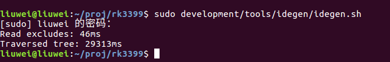

在这里我们默认大家已经下载好了Android系统的源代码，关于如何下载，网上有很多详尽的教程，我这里就不再过多的赘述，不会的同学可以自行百度。

> 使用Android Studio导入系统源代码需要对代码进行一定的编译操作，如果有些同学使用的是Windows系统，可以尝试在Cygwin下进行编译，或者将在Linux下编译生成的三个产物拷贝到Windows的源代码根目录下，也可以起到一样的效果。

这里需要执行以下四条命令：

1. "source build/envsetup.sh" (source可以用 . 代替，即". build/envsetup.sh")

2. "lunch"，并选择要编译的项目。

3. "make idegen -j4" (这里的 -j4 表示用4线程来编译，可以不加)

4. "sudo development/tools/idegen/idegen.sh"

下面进行分步讲解：

1. 进入系统源码的根目录(即可以看到frameworks、kernel等等文件夹的那一级目录)，执行". build/envsetup.sh"命令

   

2. 继续执行"lunch"命令，并选择你想要编译的那个项目.我的系统是FireFly Rk3399开发版提供的系统，可编译的比较多。

   

   选择9，编译rk3399_firefly-userdebug

   

3. 前面两步是对编译环境进行配置，接下来执行"make idegen -j4"

   

4. 看到以上输出以后，执行"sudo
   development/tools/idegen/idegen.sh"，并继续等待，这个过程可能比较长，不要着急



完成以上四个步骤之后，会发现在源码根目录下出现了三个新的文件(也有可能是两个)

1. android.iml (记录项目所包含的module、依赖关系、SDK版本等等，类似一个XML文件)

2. android.ipr (工程的具体配置，代码以及依赖的lib等信息，类似于Visual Studio的sln文件)

3. android.iws (主要包含一些个人的配置信息，也有可能在执行上述操作后没有生成，这个没关系，在打开过一次项目之后就会自动生成了)

 "android.iml"和"android.ipr"一般是"只读"的属性，我们这里建议大家，把这两个文件改成可读可写，否则，在更改一些项目配置的时候可能会出现无法保存的情况，执行如下两条命令即可。

```
sudo chmod 777 android.iml

sudo chmod 777 android.ipr

```

如果你的电脑性能足够好(内存大于16G，代码下载在SSD上)，那么可以直接打开Android Studio，点击"Open an existing Android Studio project"选项，找到并选中刚刚生成的"android.ipr"文件，点击OK，就可以开始导入项目了。 第一次导入，这个过程可能会持续很久，几十分钟或者超过一个小时。不过成功之后，以后再打开项目就会快很多了。

​        如果电脑性能一般的话，我建议，可以在导入项目前，手动对"android.iml"文件进行一下修改，可以使我们导入的时间尽可能的缩短一些。

​        首先，要保证"android.iml"文件已经添加了"可写入"的属性(上文中已经介绍了如何修改文件属性)。

​        接下来，使用文本编辑器打开"android.iml"文件，并执行以下修改(仅代表我的个人习惯，也可以根据同学们的喜好自己调整)：

1. 搜索关键字"orderEntry"，我一般会将所有带有这个关键字的标签项全部删除，仅保留以下三行，大概如下

```
   ......

    </content>

    <orderEntry type="sourceFolder" forTests="false" />

    <orderEntry type="inheritedJdk" />

   <orderEntryProperties />

  </component>

</module>
```


2. 搜索”excludeFolder“关键字，对这里进行一些修改，将我们不需要看的代码Exclude掉。通过这个步骤，能极大地提升第一次加载项目的速度。

​        等项目加载完成后，我们还可以通过Android Studio对Exclude的Module进行调整，所以也不用害怕这里Exclude掉了有用的代码，或少Exclude了一部分代码，在项目加载完以后再进行调整就行了。

​        以下是我的配置，大家可以参考(由于我比较关注Framework以及Telephony相关的代码，所以重点保留了这两部分，而其他一些如kernel、bootloader的代码，我就Exclude掉了，同学们也可以根据自己的需求来进行修改)。

```
<excludeFolder url="file://$MODULE_DIR$/.repo" />

<excludeFolder url="file://$MODULE_DIR$/art" />

<excludeFolder url="file://$MODULE_DIR$/bionic" />

<excludeFolder url="file://$MODULE_DIR$/bootable" />

<excludeFolder url="file://$MODULE_DIR$/build" />

<excludeFolder url="file://$MODULE_DIR$/compatibility" />

<excludeFolder url="file://$MODULE_DIR$/dalvik" />

<excludeFolder url="file://$MODULE_DIR$/developers" />

<excludeFolder url="file://$MODULE_DIR$/developers/samples" />

<excludeFolder url="file://$MODULE_DIR$/development" />

<excludeFolder url="file://$MODULE_DIR$/device/google" />

<excludeFolder url="file://$MODULE_DIR$/device/sample" />

<excludeFolder url="file://$MODULE_DIR$/docs" />

<excludeFolder url="file://$MODULE_DIR$/external" />

<excludeFolder url="file://$MODULE_DIR$/flashing-files" />

<excludeFolder url="file://$MODULE_DIR$/frameworks/base/docs" />

<excludeFolder url="file://$MODULE_DIR$/kernel" />

<excludeFolder url="file://$MODULE_DIR$/libcore" />

<excludeFolder url="file://$MODULE_DIR$/libnativehelper" />

<excludeFolder url="file://$MODULE_DIR$/out" />

<excludeFolder url="file://$MODULE_DIR$/pdk" />

<excludeFolder url="file://$MODULE_DIR$/platform_testing" />

<excludeFolder url="file://$MODULE_DIR$/prebuilt" />

<excludeFolder url="file://$MODULE_DIR$/prebuilts" />

<excludeFolder url="file://$MODULE_DIR$/shortcut-fe" />

<excludeFolder url="file://$MODULE_DIR$/test" />

<excludeFolder url="file://$MODULE_DIR$/toolchain" />

<excludeFolder url="file://$MODULE_DIR$/tools" />
```

​        完成之后，按照上面说的步骤，使用Android Studio选中"android.ipr"打开项目即可。