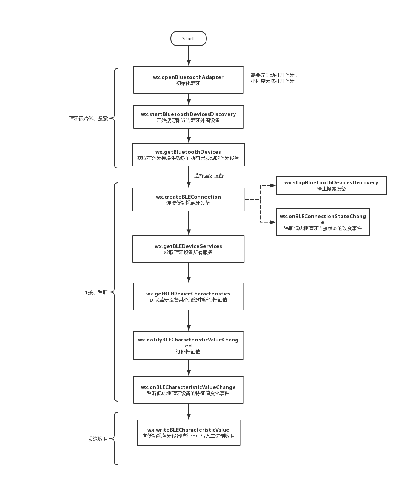
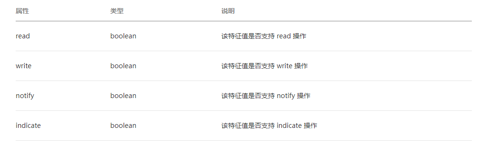

这几天完成了一个微信小程序的蓝牙操作功能，发现微信对蓝牙的操作与我们平时在Android上的蓝牙操作有一些不同，而且微信小程序在文档上有些东西并没有讲清楚，导致走了一些弯路，所以在这里分享下微信小程序的蓝牙开发流程。

图中展示的是微信小程序蓝牙操作的主要流程。

主要的流程跟我们在Android上开发流程一致。就是在连接流程中会有特征值的获取。

共有4种特征值。对应的特征值会有对应的操作。例如特征值可写的时候我们才能向对应特征值发送数据，否则失败。

在发送数据时小程序不会对写入数据包大小做限制，但系统与蓝牙设备会限制蓝牙4.0单次传输的数据大小，超过最大字节数后会发生写入错误，建议每次写入不超过20字节。

具体的函数请看[微信API](https://developers.weixin.qq.com/miniprogram/dev/api/device/bluetooth/wx.openBluetoothAdapter.html)