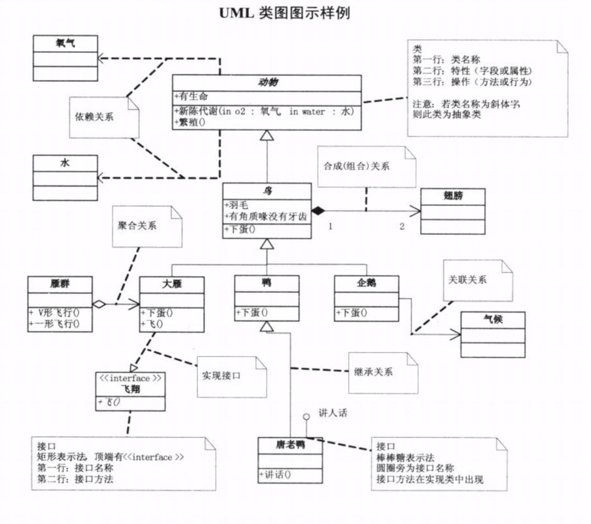
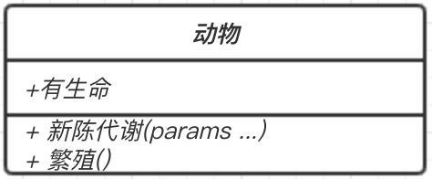
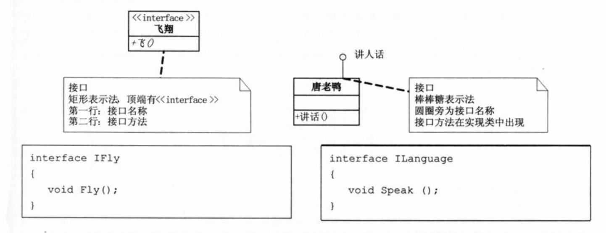
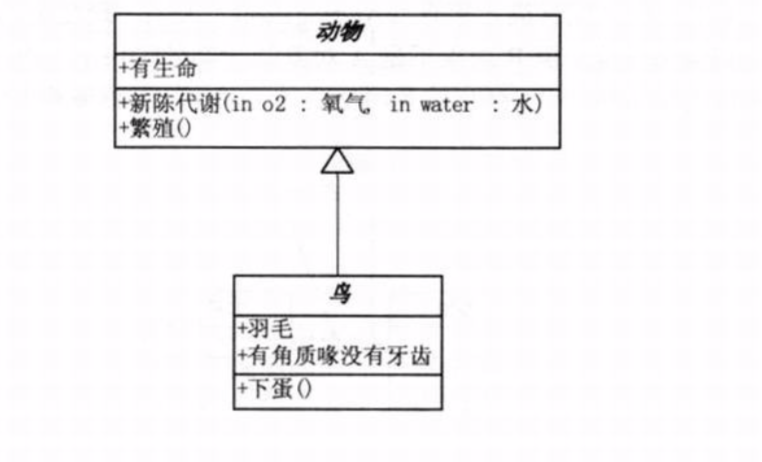
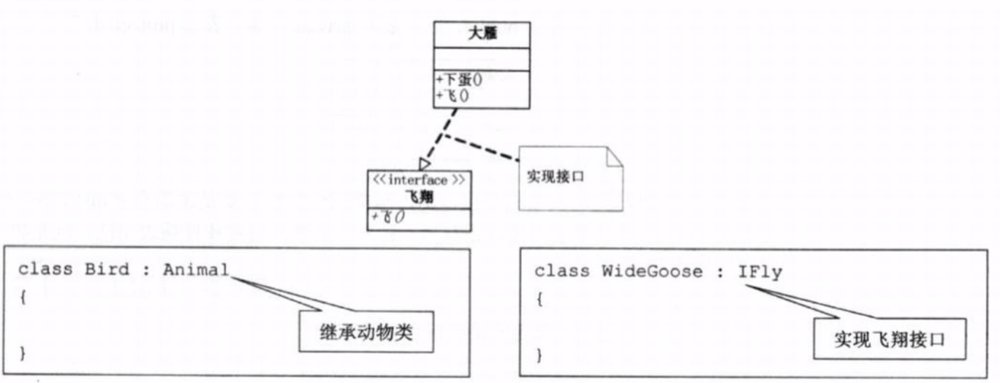
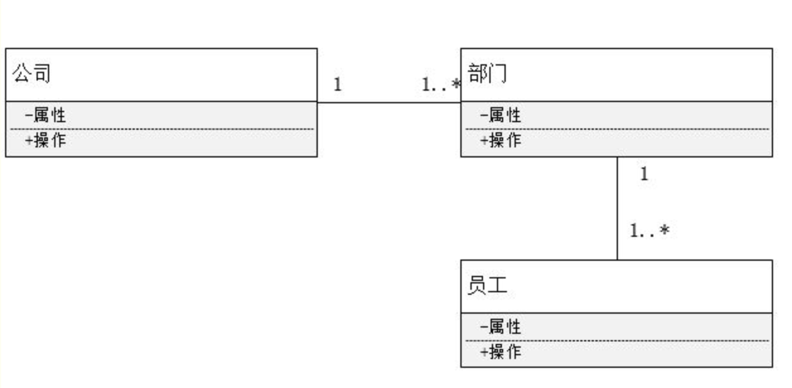
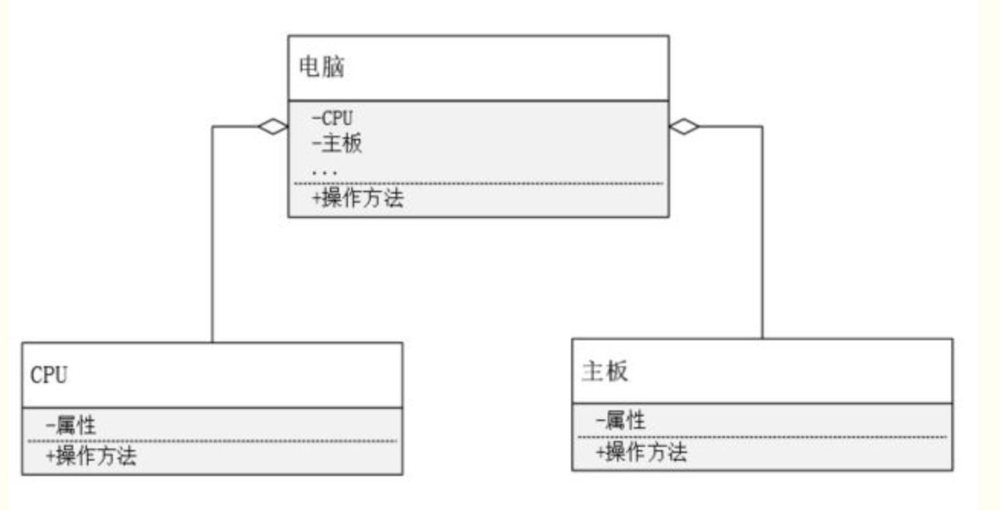
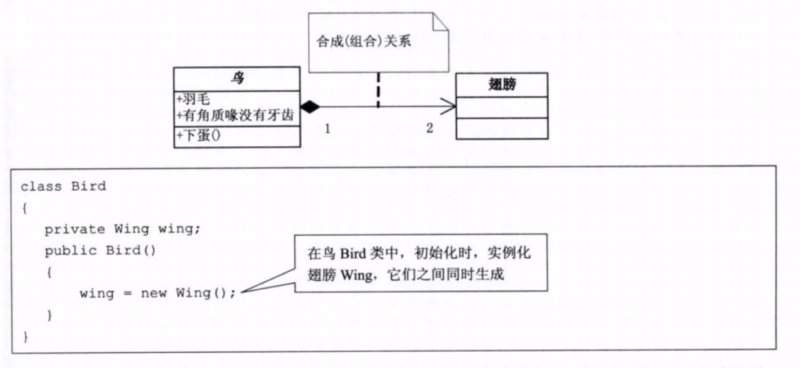
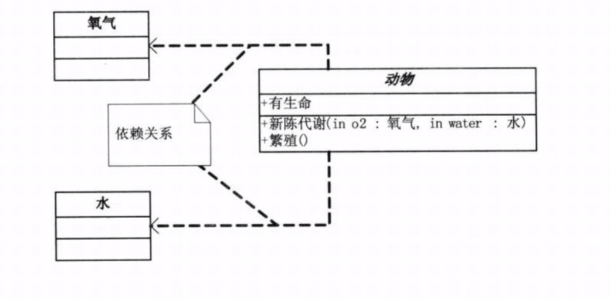

学习设计模式前先了解下UML类图，书里面会有很多地方用到，不了解UML看下去会很难受。这里主要是用《大话设计模式》中的UML部分。

先上图，截自《大话设计模式》。图中包含了UML类图中的基本图示法，我们再一一解释。

### 类

在上图中，动物的矩形框表示一个类（Class），框中分割成了三层，最上面一层表示类的名称，如果是抽象类，就使用斜体来表示。第二层是类的特性，一般为类的字段和属性。第三层是类的操作。

### 接口

接口的表示有两种。第一种为左下角 ‘飞翔’ 接口，在接口名称上有《interface》表示。第二种为棒棒糖表示法，正下方唐老鸭讲话的接口，有一个圆圈加直线表示。

## 类之间的关系

### 1、继承关系

继承关系使用空心三角形+实线来表示，如鸟类继承抽象类动物。

### 2、实现关系

实现关系用来规定接口和实现接口的类或组件之间的关系。接口可以看作是操作的集合，这些操作用于规定类或组件的服务。在UML中，**用一个带空心箭头的虚线来表示**。如图，大雁实现了飞翔的接口。

### 3、关联关系

关联关系表示两个类之间存在某种语义上的联系，比如一个公司有多个部门，一个部门有多个员工。关联关系是所有关系语义最弱的关联。关联可以是双向的，也可以是单向的。双向的关联可以有两个箭头或者没有箭头，单向的关联有一个箭头。

### 4、聚合关系

聚合关系是一种特殊的关联关系。聚合关系表示了类之间的整体与部分的关系。整体与部分之间并没有相同的生命周期，整体消亡后部分可依旧存在。在UML中**用带有空心菱形的实线表示，空心菱形指向代表整体的类**。比如在大雁和雁群就是聚合关系，每只大雁都属于一个雁群，每个雁群又有多只大雁。再比如电脑是由CPU、主板等组成的。

### 5、组合关系

组合关系也是部分和整体的关系，相对聚合关系，组合关系中的部分和整体联系更为紧密。整体与部分之间有相同的生命周期，整体消亡后部分也随之消亡。UML中**用带有实心菱形的实线表示**。比如，鸟和其翅膀就是组合关系，翅膀和鸟的生命周期是相同的。连线下的数字被称为基数，一只鸟是有两支翅膀的。如果一个类可能有无数个实例，就用n来表示。关联关系、聚合关系也可以有基数的。

### 6、依赖关系

有两个元素X、Y,如果修改X的定义可能会引起对Y的定义修改，则称Y依赖与元素X。比如说动物要生存必须要有空气和水，也就是动物依赖空气和水。在UML中**用虚线箭头来表示**。

