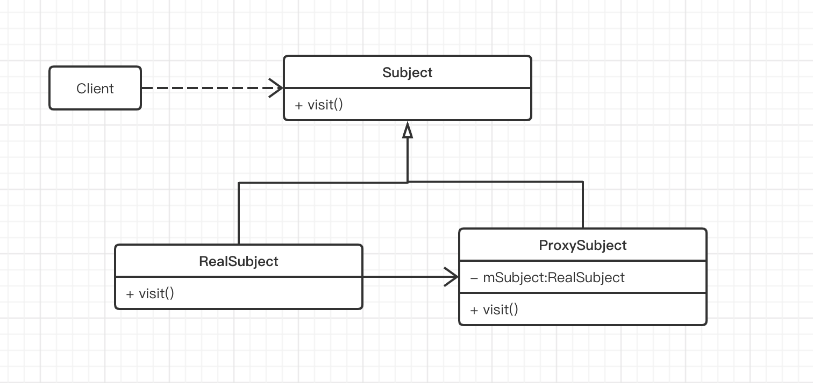

## 定义

为其它对象提供一种代理以控制对这个对象的访问

## 使用场景

当无法或不想直接访问某个对象或访问某个对象存在困难时可以通过一个代理对象来间接访问，为了保证客户端使用的透明性，委托对象与代理对象需要实现相同的接口。

## UML类图

Subject：抽象主题类

该类的主要职责是声明真实主题与代理的共同接口方法，该类既可以是一个抽象类也可以是接口。

RealSubject：真实主题类

该类也被称为被委托类或被代理类，该类定义了代理所表示的真实对象，由其执行具体的业务逻辑方法，而客户类则通过代理类间接得调用真实主题类中定义的方法。

ProxySubject：代理类

该类也称为委托类或代理类，该类持有一个对真实主题类的引用，在其所实现的接口方法中调用真实主题类中相应的接口方法执行，以此起到代理的作用。

Client：客户类，即使用代理类的类型。