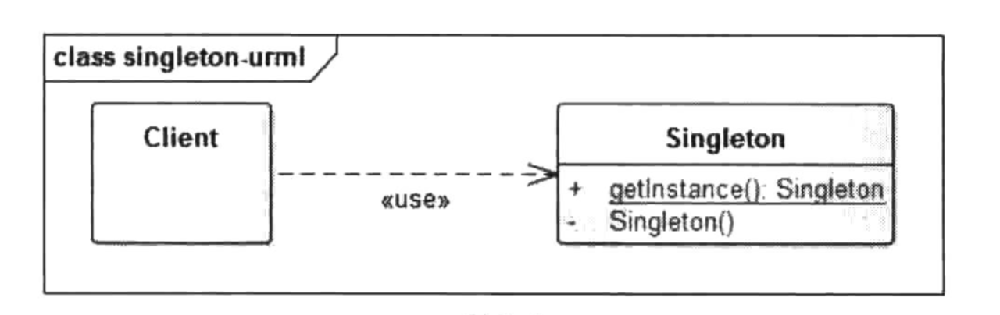

单例模式应该是我们在开发过程中使用的最多，最频繁的设计模式了。今天就再来学习一下，然后学习Android中单例模式使用--LayoutInflater。

## 单例模式

所谓单例，就是整个程序有且仅有一个实例。该类负责创建自己的对象，同时确保只有一个对象被创建。在Java，一般常用在工具类的实现或创建对象需要消耗资源。在Android中，创建一个对象需要的资源过多，如访问IO和数据库等资源，就要考虑使用单例模式。

UML类图如图：



### 懒汉模式

```java
public class Singleton {  
    private static Singleton instance;  
    private Singleton (){}  
  
    public static Singleton getInstance() {  
    if (instance == null) {  
        instance = new Singleton();  
    }  
    return instance;  
    }  
}
```

线程不安全，延迟初始化，严格意义上不是不是单例模式

### 饿汉模式

```java
public class Singleton {  
    private static Singleton instance = new Singleton();  
    private Singleton (){}  
    public static Singleton getInstance() {  
    return instance;  
    }  
}
```

线程安全，比较常用，但容易产生垃圾，因为一开始就初始化

### 双重锁模式

```java
public class Singleton {  
    private volatile static Singleton singleton;  
    private Singleton (){}  
    public static Singleton getSingleton() {  
    if (singleton == null) {  
        synchronized (Singleton.class) {  
        if (singleton == null) {  
            singleton = new Singleton();  
        }  
        }  
    }  
    return singleton;  
    }  
}
```

线程安全，延迟初始化。这种方式采用双锁机制，安全且在多线程情况下能保持高性能。

### 静态内部类单例模式

```java
public class Singleton { 
    private Singleton(){
    }
    public static Singleton getInstance(){  
        return Inner.instance;  
    }  
    private static class Inner {  
        private static final Singleton instance = new Singleton();  
    }  
} 
```

只有第一次调用getInstance方法时，虚拟机才加载 Inner 并初始化instance ，只有一个线程可以获得对象的初始化锁，其他线程无法进行初始化，保证对象的唯一性。目前此方式是所有单例模式中最推荐的模式，但具体还是根据项目选择。


### 枚举单例模式

```swift
public enum Singleton {
    INSTANCE;
}
```

默认枚举实例的创建是线程安全的，并且在任何情况下都是单例。


那么枚举类型日常用例是这样子的：

```java
public enum Singleton  {
    INSTANCE 
 
    //doSomething 该实例支持的行为
      
    //可以省略此方法，通过Singleton.INSTANCE进行操作
    public static Singleton get Instance() {
        return Singleton.INSTANCE;
    }
}
```

枚举单例模式在《Effective Java》中推荐的单例模式之一。但枚举实例在日常开发是很少使用的，就是很简单以导致可读性较差。

在以上所有的单例模式中，推荐静态内部类单例模式。主要是非常直观，即保证线程安全又保证唯一性。

## Android中的单例模式--LayoutInflater

在Android系统中，我们经常会通过Context获取系统级别的服务，如WindowsManagerService等，更常用的是一个LayoutInflater类，这些服务会在合适的时候以单例的形式注册在系统中，在我们需要的时候就通过Context的getSystemService(String name)获取。我们以LayoutInflater为例来说明。

在Listview中LayoutInflater相关代码：

```java
LayoutInflater inflater;
inflater = (LayoutInflater) this.context.getSystemService(Context.LAYOUT_INFLATER_SERVICE);

@Override
public View getView(int position, View convertView, ViewGroup parent) {
	ViewHolder viewHolder = null;
	if(convertView==null){
		convertView = inflater.inflate(mResourceId, parent,false);
		...
	}	
}
```

可以看到我们使用Context类的getSystemService()获取到了LayoutInflater实例对象，我们追踪到Context类看到，该类是抽象类。

```java
public abstract class Context {
}
```

那么getView中使用的Context对象的具体实现类是什么呢？其实在Application、Activity、Service中都会存在一个Context对象，即Context的总个数为Activity个数+Service个数+1。而ListView通常是显示在Activity中，那么我们就以Activity中的Context来分析。

我们知道，一个Activity的入口是ActivityThread中的main函数，在main函数中创建一个新的ActivityThread对象，并且启动消息循环（UI线程），创建新的Activity、新的Context对象，然后将该Context对象传递给Activity。下面看ActivityThread源代码。

```java
public static void main(String[] args) {
    
   ...
       
    Process.setArgV0("<pre-initialized>");
    //主线程消息循环
    Looper.prepareMainLooper();
    //创建一个新的ActivityThread对象
    ActivityThread thread = new ActivityThread();
    thread.attach(false);

    if (sMainThreadHandler == null) {
        sMainThreadHandler = thread.getHandler();
    }
    
    ...
        
    Looper.loop();
}
```


```java
private void attach(boolean system) {
    sCurrentActivityThread = this;
    mSystemThread = system;
    //不是系统应用的情况
    if (!system) {
        ViewRootImpl.addFirstDrawHandler(new Runnable() {
            @Override
            public void run() {
                ensureJitEnabled();
            }
        });
        android.ddm.DdmHandleAppName.setAppName("<pre-initialized>",
                                                UserHandle.myUserId());
        RuntimeInit.setApplicationObject(mAppThread.asBinder());
        //通过AIDL，获取AMS的代理对象IActivityManager
        final IActivityManager mgr = ActivityManager.getService();
        try {
            //关联mAppThread，将AMS和我们的应用进程application进行连接
            mgr.attachApplication(mAppThread);
        } catch (RemoteException ex) {
            throw ex.rethrowFromSystemServer();
        }
        
    } else {
       
    }
}
```

在attach函数中，在非系统应用情况下，会通过Binder机制与AMS通信，最终调用handleLaunchActivity函数。

Activity的启动流程如下:


```java
private void handleLaunchActivity(ActivityClientRecord r, Intent customIntent, String reason) {

    Activity a = performLaunchActivity(r, customIntent);
    
}

private Activity performLaunchActivity(ActivityClientRecord r, Intent customIntent) {
     ContextImpl appContext = createBaseContextForActivity(r);
     Activity activity = null;
     try {
            java.lang.ClassLoader cl = appContext.getClassLoader();
            //创建新Activity
            activity = mInstrumentation.newActivity(
                    cl, component.getClassName(), r.intent);
           
     } catch (Exception e) {
           
     }
    
    try {
            Application app = r.packageInfo.makeApplication(false, mInstrumentation);
            if (activity != null) {
                appContext.setOuterContext(activity);
                activity.attach(appContext, this, getInstrumentation(), r.token,
                        r.ident, app, r.intent, r.activityInfo, title, r.parent,
                        r.embeddedID, r.lastNonConfigurationInstances, config,
                        r.referrer, r.voiceInteractor, window, r.configCallback);
            }
        } catch (SuperNotCalledException e) {
            throw e;

        } catch (Exception e) {
           
        }
        return activity;
}
```


```java
private ContextImpl createBaseContextForActivity(ActivityClientRecord r) {

    //创建Context对象，实现类为ContextImpl
    ContextImpl appContext = ContextImpl.createActivityContext(
            this, r.packageInfo, r.activityInfo, r.token, displayId, r.overrideConfig);
   
    return appContext;
}
```

从上面的代码可以分析得知，Context的实现类为ContextImpl，继续分析ContextImpl类。在ContextImpl中使用getSystemService获取对应的系统服务。

```java
class ContextImpl extends Context {
     @Override
    public Object getSystemService(String name) {
        return SystemServiceRegistry.getSystemService(this, name);
    }

    @Override
    public String getSystemServiceName(Class<?> serviceClass) {
        return SystemServiceRegistry.getSystemServiceName(serviceClass);
    }
}
```

```java
final class SystemServiceRegistry {

    static {
     registerService(Context.LAYOUT_INFLATER_SERVICE, LayoutInflater.class,
                new CachedServiceFetcher<LayoutInflater>() {
            @Override
            public LayoutInflater createService(ContextImpl ctx) {
                return new PhoneLayoutInflater(ctx.getOuterContext());
            }});
    }
    
    private static <T> void registerService(String serviceName, Class<T> serviceClass,
            ServiceFetcher<T> serviceFetcher) {
        SYSTEM_SERVICE_NAMES.put(serviceClass, serviceName);
        SYSTEM_SERVICE_FETCHERS.put(serviceName, serviceFetcher);
    }
}
```

在静态代码中注册了LAYOUT_INFLATER_SERVICE。在第一次调用时，createService会创建服务对象，然后将服务以键值对的形式存储在一个HashMap中，用户后面只需要通过Key值就能获取到对应的服务，从而达到单例的效果。

## 深入理解LayoutInflater

```java
public abstract class LayoutInflater {
}
```

LayoutInflater是一个抽象类，而在上面的代码中，我们看到注册LAYOUT_INFLATER_SERVICE服务时，创建的是一个PhoneLayoutInflater，所以它才是真正的实现类。

```java
public class PhoneLayoutInflater extends LayoutInflater {
    //内置View的前缀，如TextView的完整路径为android.widget.TextView
    private static final String[] sClassPrefixList = {
        "android.widget.",
        "android.webkit.",
        "android.app."
    };
    public PhoneLayoutInflater(Context context) {
        super(context);
    }

    protected PhoneLayoutInflater(LayoutInflater original, Context newContext) {
        super(original, newContext);
    }
    
    
    @Override protected View onCreateView(String name, AttributeSet attrs) throws ClassNotFoundException {
        for (String prefix : sClassPrefixList) {
            try {
                View view = createView(name, prefix, attrs);
                if (view != null) {
                    return view;
                }
            } catch (ClassNotFoundException e) {
              
            }
        }
        return super.onCreateView(name, attrs);
    }

    public LayoutInflater cloneInContext(Context newContext) {
        return new PhoneLayoutInflater(this, newContext);
    }
}
```

PhoneLayoutInflater中的代码核心就是onCreateView方法，该方法是在传递进来的View名称前加上sClassPrefixList中的前缀，用来得到该内置View类的完整路径，最后在根据该路径来构建对应的View对象。

那么LayoutInflater 到底是怎么实现解析 XML 里面的 View，这个还得从Activity的 setContentView(view) 说起。

```java
public void setContentView(@LayoutRes int layoutResID) {
    getWindow().setContentView(layoutResID);
    initWindowDecorActionBar();
}
```

此处的 getWindow 返回的就是View的容器 PhoneWindow。mWinodw的创建是 Activity 的 attah方法中进行的。

```java
final void attach(Context context, ActivityThread aThread,
        Instrumentation instr, IBinder token, int ident,
        Application application, Intent intent, ActivityInfo info,
        CharSequence title, Activity parent, String id,
        NonConfigurationInstances lastNonConfigurationInstances,
        Configuration config, String referrer, IVoiceInteractor voiceInteractor,
        Window window, ActivityConfigCallback activityConfigCallback) {
    attachBaseContext(context);

    mFragments.attachHost(null /*parent*/);

    mWindow = new PhoneWindow(this, window, activityConfigCallback);
    mWindow.setWindowControllerCallback(this);
    mWindow.setCallback(this);
    mWindow.setOnWindowDismissedCallback(this);
    mWindow.getLayoutInflater().setPrivateFactory(this);
 }
```

我们再看PhoneWindow中的方法：

```java
    @Override
    public void setContentView(int layoutResID) {
        if (mContentParent == null) {
            installDecor();
        } else if (!hasFeature(FEATURE_CONTENT_TRANSITIONS)) {
            mContentParent.removeAllViews();
        }

        mLayoutInflater.inflate(layoutResID, mContentParent);
    }
```

最后还是调用 LaytouInflater 里面的方法了。

在看inflate方法

```java
public View inflate(@LayoutRes int resource, @Nullable ViewGroup root, boolean attachToRoot) {
    //首先把 XML 转换成 XML 资源
    final Resources res = getContext().getResources();
    final XmlResourceParser parser = res.getLayout(resource);
    try {
        // parser 代表 XML 解析器，root 代表父类布局 ，attachToRoot 代表是否添加到 root 视图 
        return inflate(parser, root, attachToRoot);
    } finally {
        parser.close();
    }
}
```

```java
 public View inflate(XmlPullParser parser, @Nullable ViewGroup root, boolean attachToRoot) {
        synchronized (mConstructorArgs) {
            final Context inflaterContext = mContext;
            final AttributeSet attrs = Xml.asAttributeSet(parser);
            Context lastContext = (Context) mConstructorArgs[0];
            mConstructorArgs[0] = inflaterContext;
            View result = root;

            try {
                // Look for the root node.
                int type;
                while ((type = parser.next()) != XmlPullParser.START_TAG &&
                        type != XmlPullParser.END_DOCUMENT) {
                    // Empty
                }
                //获取 xml 资源的第一个字符串
                final String name = parser.getName();
                //如果是merge的话，则直接解析root下面的视图树
                if (TAG_MERGE.equals(name)) {
                    if (root == null || !attachToRoot) {
                        throw new InflateException("<merge /> can be used only with a valid "
                                + "ViewGroup root and attachToRoot=true");
                    }

                    rInflate(parser, root, inflaterContext, attrs, false);
                } else {
                    //根据 xml 的 tag 来解析 layout 的根视图。name 就是要 
                    //解析的视图的类名。如 LinearLayout。
                    final View temp = createViewFromTag(root, name, inflaterContext, attrs);

                    ViewGroup.LayoutParams params = null;
                        params = root.generateLayoutParams(attrs);
                        if (!attachToRoot) {
    
                            temp.setLayoutParams(params);
                        }
                    }
                   rInflate(parser, temp, attrs, true);

                
                    if (root != null && attachToRoot) {
                        root.addView(temp, params);
                    }

                    if (root == null || !attachToRoot) {
                        result = temp;
                    }
                }

        }
            return result;
        }
    }

```

此方法做了以下事情：
1、根据 id，生成 XmlPullParser
2.如果是 merge ，则直接解析 merge 下的所有子View，这也说明了 为什么 merge 标签为什么会减少一层视图的原因，因为根本没有进入 else 的逻辑。
3.如果不是 merge，则进入 else，调用 createViewFromTag 来解析根视图，并赋值给temp
4.调用 rInflate ，解析 temp 下面的视图，并将这些视图添加到 temp 中。


首先看createViewFromTag：

```java
View createViewFromTag(View parent, String name, Context context, AttributeSet attrs,
        boolean ignoreThemeAttr) {
    if (name.equals("view")) {
        name = attrs.getAttributeValue(null, "class");
    }
    

    try {
        View view;// 最后要返回的 View
        if (mFactory2 != null) {
            view = mFactory2.onCreateView(parent, name, context, attrs);
        } else if (mFactory != null) {
            view = mFactory.onCreateView(name, context, attrs);
        } else {
            view = null;
        }

        if (view == null && mPrivateFactory != null) {
            view = mPrivateFactory.onCreateView(parent, name, context, attrs);
        }

        if (view == null) { // 如果 Factory 都没有设置过，最后在生成 View
            final Object lastContext = mConstructorArgs[0];
            mConstructorArgs[0] = context;
            try {
                if (-1 == name.indexOf('.')) { // 系统控件 
                    view = onCreateView(parent, name, attrs);
                } else {// 非系统控件，自定义的 View 
                    view = createView(name, null, attrs);
                }
            } finally {
                mConstructorArgs[0] = lastContext;
            }
        }

        return view;
    }

}
```

当 name 没有包含 ”.“ 的时候，我们认为他是内置布局组件。

比如：

```xml
<TextView
    android:layout_width="wrap_content"
    android:layout_height="wrap_content"/>
```

而自定义View则需要写完整的路径。

```xml
<com.test.TextView
    android:layout_width="wrap_content"
    android:layout_height="wrap_content"/>
```

所以实际上onCreate只是像我们上面说的添加了前缀。

```java
protected View onCreateView(String name, AttributeSet attrs)
        throws ClassNotFoundException {
    return createView(name, "android.view.", attrs);
}
```

最终还是调用createView方法。

```java
public final View createView(String name, String prefix, AttributeSet attrs)
        throws ClassNotFoundException, InflateException {
    Constructor<? extends View> constructor = sConstructorMap.get(name);
    Class<? extends View> clazz = null;

    try {
        Trace.traceBegin(Trace.TRACE_TAG_VIEW, name);

        if (constructor == null) {
            // Class not found in the cache, see if it's real, and try to add it
            //如果 prefix 不为空，则需要填写完整路径
            clazz = mContext.getClassLoader().loadClass(
                    prefix != null ? (prefix + name) : name).asSubclass(View.class);
            
            if (mFilter != null && clazz != null) {
                boolean allowed = mFilter.onLoadClass(clazz);
                if (!allowed) {
                    failNotAllowed(name, prefix, attrs);
                }
            }
            //获取构造函数
            constructor = clazz.getConstructor(mConstructorSignature);
            constructor.setAccessible(true);
            //将构造函数存入缓存
            sConstructorMap.put(name, constructor);
        } else {
        、、、
         Object[] args = mConstructorArgs;
        args[1] = attrs;

        //通过反射构造View
        final View view = constructor.newInstance(args);
  }
```

createView相对简单，如果有前缀，那么构造View的完整路径，并将该类加载到虚拟机中，然后获取该类的构造函数并缓存，再通过构造函数创建该View对象，最后将该对象返回。

而我们的窗口是一颗视图树，LayoutInflater需要解析完这棵树，就交给rInflate方法。


```java
 void rInflate(XmlPullParser parser, View parent, Context context,
            AttributeSet attrs, boolean finishInflate) throws XmlPullParserException, IOException {

        //获取树的深度，深度优先遍历
        final int depth = parser.getDepth();
        int type;

        while (((type = parser.next()) != XmlPullParser.END_TAG ||
                parser.getDepth() > depth) && type != XmlPullParser.END_DOCUMENT) {

            if (type != XmlPullParser.START_TAG) {
                continue;
            }

            final String name = parser.getName();
            
            if (TAG_REQUEST_FOCUS.equals(name)) {
                parseRequestFocus(parser, parent);
            } else if (TAG_TAG.equals(name)) {
                parseViewTag(parser, parent, attrs);
            } else if (TAG_INCLUDE.equals(name)) {
                if (parser.getDepth() == 0) {
                    throw new InflateException("<include /> cannot be the root element");
                }
                parseInclude(parser, context, parent, attrs);
            } else if (TAG_MERGE.equals(name)) {
                throw new InflateException("<merge /> must be the root element");
            } else {
                final View view = createViewFromTag(parent, name, context, attrs);
                final ViewGroup viewGroup = (ViewGroup) parent;
                final ViewGroup.LayoutParams params = viewGroup.generateLayoutParams(attrs);
                rInflateChildren(parser, view, attrs, true);
                viewGroup.addView(view, params);
            }
        }

        if (finishInflate) {
            parent.onFinishInflate();
        }
    }

```

分为 3 步：
1.获取树的高度，深度优先遍历
2.while 循环，挨个元素进行解析
3.根据元素名进行解析，递归调用进行解析，将解析到的 View 添加到 ViewGroup 中。

当调用了Activity的onResume方法后，通过setContextView设置的内容就会出现在我们视野中。


