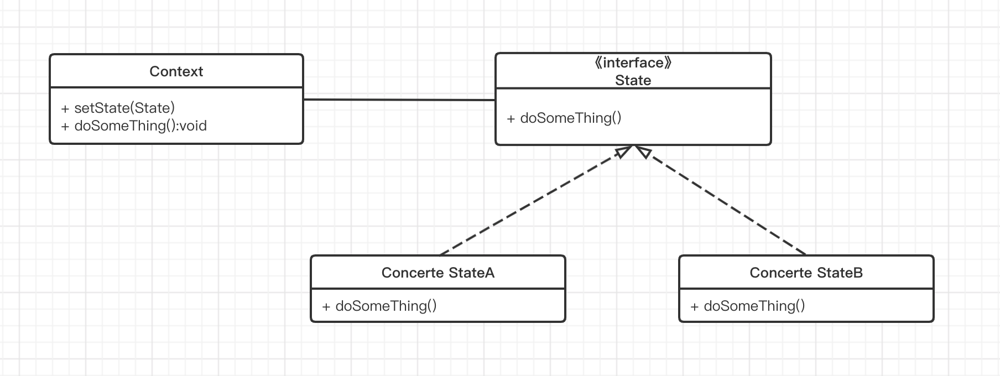

## 介绍

状态模式中的行为是由状态来决定的，不同的状态下有不同的行为。状态模式和策略模式的结构几乎完全一样，但它们的目的、本质完全不一样。状态模式的行为是平行的、不可替换的，策略模式的行为是彼此独立的、可相互替换的。用一句话表述，状态模式把对象的行为包装在不同的状态对象里，每一个状态对象都有一个共同的抽象状态基类。状态模式的意图是让一个对象在其内部状态改变时，其行为也随之改变。

## 使用场景

1. 一个对象的行为取决于它的状态，并且它必须在运行时根据状态改变它的行为。
2. 代码中包含大量与对象状态有关的条件语句，例如，一个操作中包含庞大的多分支语句（if-else或switch-case），且这些分支依赖于该对象的状态。


## UML类图



- Context：环境类，定义客户感兴趣的接口，维护一个State子类的实例，这个实例定义了对象的当前状态。
- State：抽象状态类或状态接口，定义一个或一组接口，表示该状态下的行为。
- Concerte StateA 、Concerte StateB：具体状态类，每一个具体的状态类实现抽象State中定义的接口，从而达到不同状态下的不同行为。

## 示例代码

以电视遥控器为例演示状态模式的实现。

```kotlin
    // 电视操作接口
    interface TVState {
        fun nextChannel()
        fun prevChannel()
        fun turnUp()
        fun turnDown()
    }

    //关机状态，此时只有开机状态是有效的
    class PowerOffState : TVState {
        override fun nextChannel() {
            Log.d(TAG, "已经关机啦")
        }

        override fun prevChannel() {
            Log.d(TAG, "已经关机啦")
        }

        override fun turnUp() {
            Log.d(TAG, "已经关机啦")
        }

        override fun turnDown() {
            Log.d(TAG, "已经关机啦")
        }
    }

    //开机状态，此时触发开机功能不做操作
    class PowerOnState : TVState {
        override fun nextChannel() {
            Log.d(TAG, "下一频道")
        }

        override fun prevChannel() {
            Log.d(TAG, "上一频道")
        }

        override fun turnUp() {
            Log.d(TAG, "调高音量")
        }

        override fun turnDown() {
            Log.d(TAG, "调低音量")
        }
    }

    interface PowerController {
        fun powerOn()
        fun powerOff()
    }

    //电视遥控器，相当于上面UML图中的Context
    public class TVController : PowerController {
        lateinit var mTVState: TVState
        private fun setTVState(tvState: TVState) {
            mTVState = tvState
        }

        override fun powerOn() {
            setTVState(PowerOnState())
            Log.d(TAG, "开机啦！")
        }

        override fun powerOff() {
            setTVState(PowerOffState())
            Log.d(TAG, "关机啦！")
        }

        fun nextChannel() {
            mTVState.nextChannel()
        }

        fun prevChannel() {
            mTVState.prevChannel()
        }

        fun turnUp() {
            mTVState.turnUp()
        }

        fun turnDown() {
            mTVState.turnDown()
        }

    }

    fun main(args: Array<String>) {
        val tvController = TVController()
        tvController.powerOn()
        tvController.nextChannel()
        tvController.prevChannel()
        tvController.turnDown()
        tvController.turnUp()
        tvController.powerOff()
        tvController.turnUp() // 不会生效
    }
```

运行结果：

```
开机啦！
下一频道
上一频道
调低音量
调高音量
关机啦！
已经关机啦
```

## 总结

状态模式的关键点在于不同的状态下对于同一个行为有不同的相应，这其实就是一个将if-else用多态来实现的一个具体示例。

### 优点

State模式将所有与一个特定的状态相关的行为都放入一个状态对象中，它提供了一个更好的方法来组织与特定状态相关的代码，将繁琐的状态判断转换成结构清晰的状态类族，在避免代码膨胀的同事也保证可可扩展性和可维护性。

### 缺点

状态模式的使用必然会增加系统类和对象的个数。


> 《Android源码设计模式解析与实战》学习笔记

