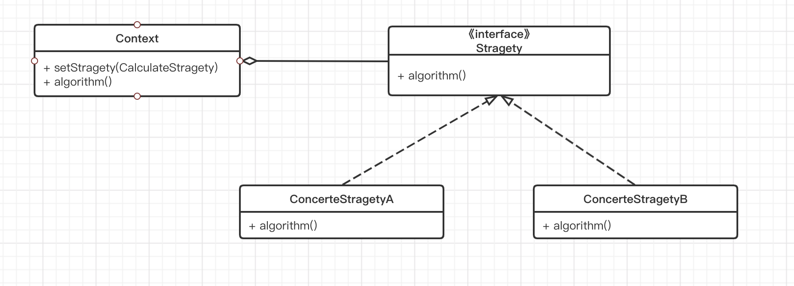

---

title: 设计模式-策略模式
date: 2021-03-02 09:08:42
categories: 
- 设计模式
tags:
- 设计模式
---

## 定义

策略模式定义了一系列的算法，并将每一个算法封装起来，而且使它们可以互相替换。策略模式让算法独立于使用它的客户而独立变化。

## 使用场景

- 针对同一类型问题的多种处理方式，仅仅是具体行为有差别时。
- 需要安全地封装多种同一类型的操作时。
- 出现同一抽象类有多个子类，而又需要使用if-else或switch-case来选择具体子类时。

## UML类图

Context：用来操作策略的上下文环境

Stragety：策略的抽象

ConcreteStragetyA、ConcreteStragetyB：具体的策略实现




## 示例

以乘坐公共交通为例，公共交通采用分段计费，乘坐距离越远，价格越高。

```kotlin
   //计算接口
    interface CalculateStrategy {
        //按照距离来计算价格
        fun calculatePrice(km: Int): Int
    }

    class BusStrategy : CalculateStrategy {
        //十公里1元，超过10公里每加1元乘5公里
        override fun calculatePrice(km: Int): Int {
            //超过10公里的总距离
            val extraTotal = km - 10
            //超过的距离是5公里的倍数
            val extraFactor = extraTotal / 5
            //超过的距离对5公里取余
            val fraction = extraTotal % 5
            //计算价格
            var price = 1 + extraFactor * 1

            return if (fraction > 0)
                ++price
            else
                price
        }
    }

    class SubwayStrategy : CalculateStrategy {
        //6公里内3元，6-12公里4元，12-22公里5元，22-32公里6元
        override fun calculatePrice(km: Int): Int {
            return if (km <= 6) {
                3
            } else if (km > 6 && km < 12) {
                4
            } else if (km > 12 && km < 22) {
                5
            } else if (km > 22 && km < 32) {
                6
            } else {
                7
            }
        }
    }

    class TranficCalculate {
        lateinit var mStrategy: CalculateStrategy
        fun setStrategy(strategy: CalculateStrategy) {
            mStrategy = strategy
        }

        fun calculatePrice(km: Int) {
            mStrategy.calculatePrice(km)

        }

        fun main(){
            val calculate = TranficCalculate()
            calculate.setStrategy(BusStrategy())
            //计算乘坐公交16公里的价格
            calculate.calculatePrice(15)
        }

    }
```

这种方案在隐藏实现的同时，可扩展性变得很强，当我们想增加计算出租车的计算策略的时候，只需要增加出租车计算策略类，然后将该策略设置给TranficCalculate即可。


## 总结

策略模式主要用来分离算法，在相同的行为抽象下有不同的具体实现策略。这个模式很好的演示了开闭原则，也就是定义抽象，注入不同的实现，从而达到很好的可扩展性。

### 优点

- 结构清晰明了、使用简单直观
- 耦合度相对而言较低，扩展方便
- 操作封装也更为彻底，数据更为安全

### 缺点

- 随着策略的增多，子类也会变得繁多


> 《Android源码设计模式解析与实战》学习笔记