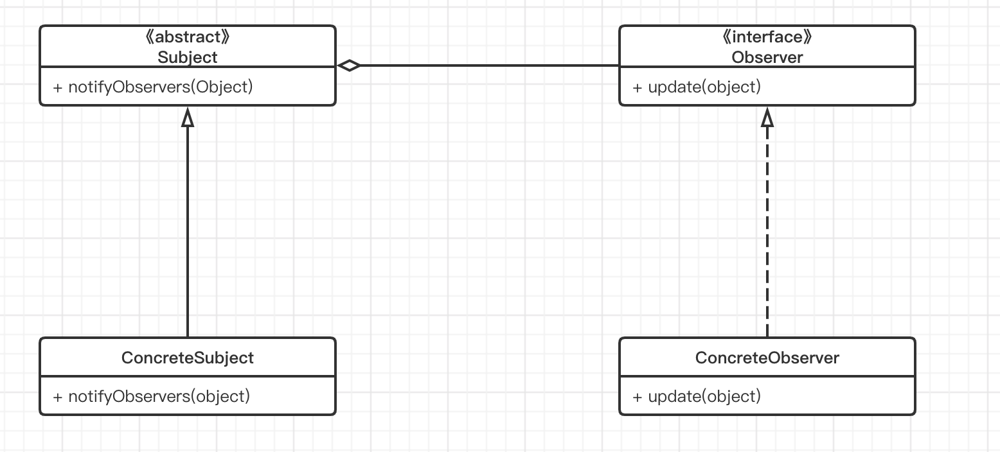

## 定义

定义对象间一种一对多的依赖关系，使得每当一个对象改变状态，则所有依赖于它的对象都会得到通知并被自动更新。

## 使用场景

- 关联行为场景，需要注意的是，关联行为是可拆分的，而不是“组合关系”
- 事件多级触发场景
- 跨系统的消息交换场景，如消息队列、事件总线的处理机制

## UML类图



- Subject：抽象对象，也是被观察(Observable)的角色，抽象主题角色把所有观察者对象的引用保存在一个集合里，每个主题都可以有任意数量的观察者，抽象主题提供一个接口，可以增加和删除观察者对象。
- ConcreteSubject：具体主题，该角色将有关状态存入具体观察者对象，在具体主题的内部状态改变时，给所有注册过的观察者发出通知，具体主题角色有叫做具体被观察者(ConcreteObservable)角色。
- Observer：抽象观察者，该角色是观察者的抽象类，它定义了一个更新接口，使得在得到猪头的更改通知时更新自己。
- ConcreteObserver：具体的观察者，该角色实现抽象观察者角色所定义的更新接口，以便在主题的状态发生改变时更新自己的状态。

## Android源码

Android中使用观察者模式的地方很多，在这里以我们常用的RecyclerView为例。当我们往RecyclerView中添加数据后，都会调用Adapter的notifyDataSetChanged方法，其中就使用观察者模式的方式，接下来研究它的实现源码。

```java
public abstract static class Adapter<VH extends ViewHolder> {
      private final AdapterDataObservable mObservable = new AdapterDataObservable();
      private boolean mHasStableIds = false;
      
      
      public void registerAdapterDataObserver(@NonNull AdapterDataObserver observer) {
          mObservable.registerObserver(observer);
      }

      public void unregisterAdapterDataObserver(@NonNull AdapterDataObserver observer) {
          mObservable.unregisterObserver(observer);
      }
      
      public final void notifyDataSetChanged() {
            mObservable.notifyChanged();
      }
}
```

```java
 static class AdapterDataObservable extends Observable<AdapterDataObserver> {
        public boolean hasObservers() {
            return !mObservers.isEmpty();
        }

        public void notifyChanged() {
            // since onChanged() is implemented by the app, it could do anything, including
            // removing itself from {@link mObservers} - and that could cause problems if
            // an iterator is used on the ArrayList {@link mObservers}.
            // to avoid such problems, just march thru the list in the reverse order.
          //调用每个观察者的onChanged方法通知它们被观察者发生了改变
            for (int i = mObservers.size() - 1; i >= 0; i--) {
                mObservers.get(i).onChanged();
            }
        }
}
```

那么这些观察者从哪里来的？这些观察者是在RecyclerView通过setAdapter方法设置的。

```java
public void setAdapter(@Nullable Adapter adapter) {
        // bail out if layout is frozen
        setLayoutFrozen(false);
        setAdapterInternal(adapter, false, true);
        processDataSetCompletelyChanged(false);
        requestLayout();
    }

private void setAdapterInternal(@Nullable Adapter adapter, boolean compatibleWithPrevious,
            boolean removeAndRecycleViews) {
  			// 如果已经有了Adapter，那么先注销该Adapter对应的观察者
        if (mAdapter != null) {
            mAdapter.unregisterAdapterDataObserver(mObserver);
            mAdapter.onDetachedFromRecyclerView(this);
        }
        if (!compatibleWithPrevious || removeAndRecycleViews) {
            removeAndRecycleViews();
        }
        mAdapterHelper.reset();
        final Adapter oldAdapter = mAdapter;
        mAdapter = adapter;
        if (adapter != null) {
          	//将观察者注册到Adapter中，实际注册到mObservable(见上面)
            adapter.registerAdapterDataObserver(mObserver);
            adapter.onAttachedToRecyclerView(this);
        }
        if (mLayout != null) {
            mLayout.onAdapterChanged(oldAdapter, mAdapter);
        }
        mRecycler.onAdapterChanged(oldAdapter, mAdapter, compatibleWithPrevious);
        mState.mStructureChanged = true;
    }
```

这样注册也就完成了，只要我们调用notifyDataSetChanged，就会调用AdapterDataObservable的notifyChanged方法，这个函数会调用所有观察者（AdapterDataObserver）的onChanged方法。

onChanged实际调用的RecyclerViewDataObserver中的onChanged方法。

```java
private class RecyclerViewDataObserver extends AdapterDataObserver {
        RecyclerViewDataObserver() {
        }

        @Override
        public void onChanged() {
            assertNotInLayoutOrScroll(null);
            mState.mStructureChanged = true;

            processDataSetCompletelyChanged(true);
            if (!mAdapterHelper.hasPendingUpdates()) {
                requestLayout();
            }
        }
}
```

在onChanged方法中调用requestLayout方法重新布局，更新用户界面。


## 总结

### 优点

- 观察者和被观察者之间是抽象耦合，应对业务变化；
- 增强系统灵活性、可扩展性。

### 缺点

在应用观察者模式时需要考虑开发效率和运行效率，程序包括一个被观察者、多个观察者，开发和调试会比较复杂，而且在Java中消息的通知默认是顺序执行，一个观察者卡顿，会影响整体执行效率，在这种情况下，一般采用异步的方式。

